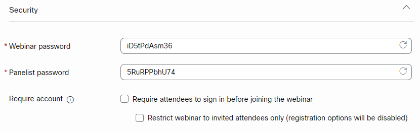
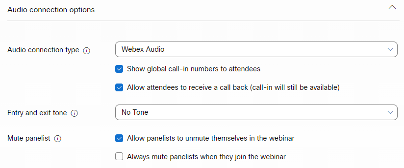
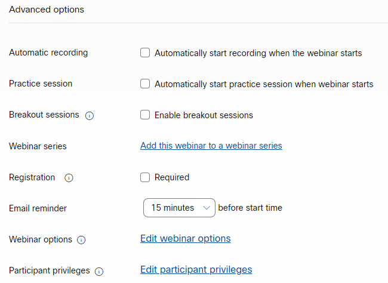
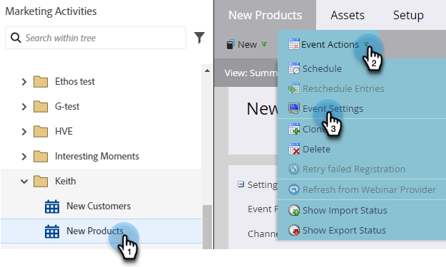
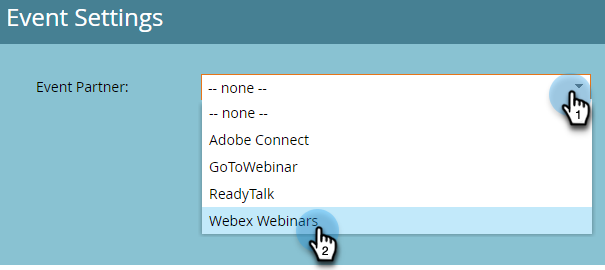
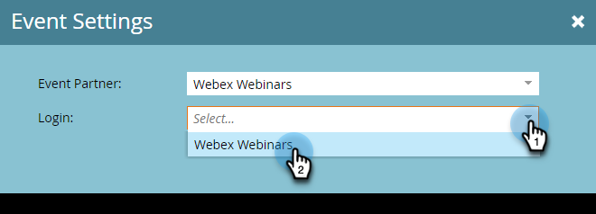
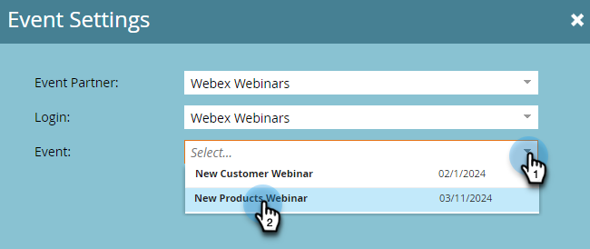
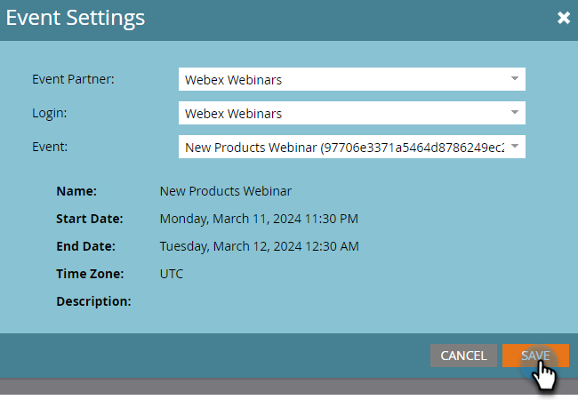

# [!DNL Webex] を使用したイベントの作成 {#create-an-event-with-webex}

Webex でウェビナーを作成したら、イベントを Marketo Engage と同期する必要があります。

>[!PREREQUISITES]
>
>* [&#x200B; [!DNL Webex]  を  [!DNL LaunchPoint]  サービスとして追加](/help/marketo/product-docs/administration/additional-integrations/add-webex-as-a-launchpoint-service.md)
>* [新しいイベントプログラムの作成](/help/marketo/product-docs/demand-generation/events/understanding-events/create-a-new-event-program.md)
>* 適切な[フローアクション](/help/marketo/product-docs/core-marketo-concepts/smart-campaigns/flow-actions/add-a-flow-step-to-a-smart-campaign.md)を設定して、エンゲージメントをトラック

## ウェビナーのスケジュール設定 {#schedule-your-webinar}

イベントをスケジュール設定し、[Webex](https://www.webex.com/){target="_blank"} で推奨される設定を選択します。Marketo に表示できる情報は、ウェビナー名、開始日時／終了日時、タイムゾーン、説明のみです。Webex ウェビナーに関する追加情報について詳しくは、[こちら](https://help.webex.com/ja-jp/landing/ld-7srxjs-WebexWebinars/Webex-Webinars){target="_blank"}を参照してください。

### 基本情報 {#basic-information}

* **[!UICONTROL イベント名] -**&#x200B;この名前が Marketo で表示できます。
* **[!UICONTROL 「リストに載せない」チェックボックス]**
* **トピック**：これはイベント名で、Marketo で表示できます。
* **日時**：開始日／終了日、開始時刻／終了時刻、期間およびタイムゾーンはすべて Marketo で表示できます。
* **最大出席者数**：最大出席者数によって、サポートされる Webex 機能が決まります。
* **出席者向けの web キャストビュー**：ウェビナーをすべての出席者にライブストリーミングするには、これをオンにします。
* **パネリスト**：ウェビナーでパネリストになる特定の人物を招待します。
* **ウェビナーの議題**：パネリストに送信するメール招待状に概要を記載する場合は、ここに入力します。

### セキュリティ {#security}

* **ウェビナーパスワード** -（オプション）このフィールドを使用する場合は、これを必ず確認メールに含めてください。
* **パネリストパスワード** -（オプション）このフィールドを使用する場合は、これを必ずウェビナーの議題に含めてください。
* **アカウントが必要**：出席者を Webex アカウントを持つユーザにのみ制限します。

### オーディオ接続オプション {#audio-connection-options}

* **オーディオ接続タイプ**：ウェビナー参加者がウェビナーのオーディオ部分に参加する方法を選択します。
* **エントリと離脱のトーン**：ウェビナーに誰かがエントリまたは離脱する際にユーザに聞かせるサウンドを選択します（電話のオーディオ接続が必要です）。
* **パネリストをミュート**：目的のパネリストのミュート設定を選択します。

### 詳細オプション {#advanced-options}

* **自動録画**：ウェビナーを自動的に録画するには、これをオンにします。
* **プラクティスセッション**：ウェビナーの開始時にプラクティスセッションを開始するには、これをオンにします。
* **ブレイクアウトセッション**：ブレイクアウトセッションでは、ウェビナーの開始前にパネリストと出席者を事前に割り当てたり、ウェビナー中に参加を許可したりできます。
* **ウェビナーシリーズ**：ウェビナーシリーズに追加すると、ウェビナーが公開されているかどうかに関係なく、人物がウェビナーを視聴できます。
* **登録**：出席者は出席前に登録し、ホストの承認を受ける必要があります。
* **メールリマインダー**：ウェビナー開始の 15 分前から 2 日前までの範囲でメールリマインダーを選択します。
* **ウェビナーオプション**：ウェビナーの参加者が使用できる機能を決定します。
* **参加者権限**：参加者権限によって、ウェビナー参加者が使用できるアクションが決まります。

>[!NOTE]
>
>Marketo と Webex 統合では、Webex からの確認メールの送信をサポートできません。確認メールは Marketo から送信する必要があります。イベントをスケジュール設定したら、イベント情報を Marketo の確認メールにコピーし、そのメールを&#x200B;_オペレーショナル_&#x200B;に設定してください。

## イベントと Marketo Engage の同期 {#sync-your-event-with-marketo-engage}

1. Marketo で、目的のイベントプログラムを見つけて選択します。**イベントアクション**&#x200B;ドロップダウンで、「**イベント設定**」を選択します。

   

   >[!NOTE]
   >
   >選択するイベントのチャネルタイプは、**ウェビナー**&#x200B;である必要があります。

1. **イベントパートナー**&#x200B;ドロップダウンで、「**Webex ウェビナー**」を選択します。

   

1. **ログイン**&#x200B;ドロップダウンで、Webex ログインを選択します。

   

1. **イベント**&#x200B;ドロップダウンで、Webex イベントを選択します。

   

1. ウェビナーの詳細が入力されます。「**保存**」をクリックします。

   

これで、Webex のイベントが Marketo のイベントプログラムと同期されます。ウェビナーに新規登録した人物は、新規ステータスが「登録済み」に設定されたときに、_プログラムステータスを変更_&#x200B;フローステップによってウェビナープロバイダーにプッシュされます。その他のステータスではプッシュされません。_プログラムステータスを変更_&#x200B;フローステップ #1 と&#x200B;_メールを送信_&#x200B;フローステップ #2 を必ず設定してください。

## 注意事項 {#things-to-note}

* ネストされたメールプログラムを使用して確認メールを送信しないでください。代わりに、イベントプログラムのスマートキャンペーンを使用します。

* Marketo にデータが表示されるまでには、最大 48 時間かかる場合があります。しばらく待っても何も表示されない場合は、イベントプログラムの「**概要**」タブの&#x200B;**イベントアクション**&#x200B;ドロップダウンで「**ウェビナープロバイダーから更新**」をクリックします。
