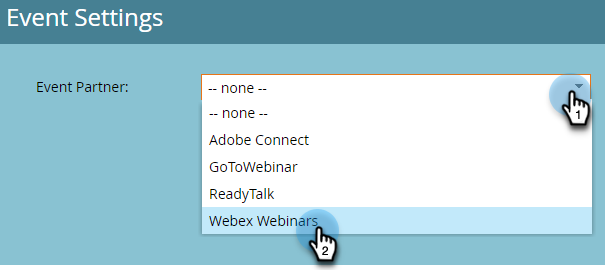

# Webex を使用したイベントの作成 {#create-an-event-with-webex}

Webex でウェビナーを作成した後、イベントをMarketo Engageと同期する必要があります。

>[!PREREQUISITES]
>
>* [Webex を LaunchPoint サービスとして追加](/help/marketo/product-docs/administration/additional-integrations/add-webex-as-a-launchpoint-service.md)
>* [新しいイベントプログラムの作成](/help/marketo/product-docs/demand-generation/events/understanding-events/create-a-new-event-program.md)
>* 適切な[フローアクション](/help/marketo/product-docs/core-marketo-concepts/smart-campaigns/flow-actions/add-a-flow-step-to-a-smart-campaign.md)を設定して、エンゲージメントをトラック

## ウェビナーのスケジュール設定 {#schedule-your-webinar}

イベントをスケジュールし、 [Webex](https://www.webex.com/){target="_blank"}. Only the following information is viewable in Marketo: webinar name, start/end date & time, time zone, and description. Additional information about Webex Webinars [can be found here](https://help.webex.com/en-us/landing/ld-7srxjs-WebexWebinars/Webex-Webinars){target="_blank"}.

### 基本情報 {#basic-information}

* **トピック**：これはイベント名で、Marketoで表示できます。
* **日時**：開始/終了日、開始/終了時間、期間およびタイムゾーンは、Marketoですべて表示できます。
* **最大出席者数**：サポートされる Webex 機能は、出席者の最大数によって決まります。
* **出席者向けの Web キャスト表示**：オンにすると、すべての出席者に対してオンラインセミナがライブにストリーミングされます。
* **パネリスト**：特定の人をウェビナーのパネルリストに招待します。
* **ウェビナーの予定**：パネルリストに送信する電子メールの招待状のコンテキストを提供する場合は、この値を設定します。

### セキュリティ {#security}

* **ウェビナーのパスワード**: （オプション）このフィールドを使用する場合、確認 E メールに必ず含めてください。
* **パネリストのパスワード**: （オプション）このフィールドを使用する場合は、必ずウェビナーのアジェンダに含めてください。
* **アカウントが必要**：参加者を Webex アカウントを持つユーザーのみに制限します。

### オーディオ接続オプション {#audio-connection-options}

* **オーディオの接続タイプ**：ウェビナー参加者がウェビナーのオーディオ部分に参加する方法を選択します。
* **入口と出口のトーン**：ユーザーがウェビナーに入るか離れるときに使用するサウンドを選択します（電話のオーディオ接続が必要です）。
* **パネリストをミュート**：目的のパネルリストミュート設定を選択します。

### 詳細オプション {#advanced-options}

* **自動記録**：オンにすると、オンラインセミナが自動的に記録されます。
* **練習セッション**：オンにして、ウェビナーの開始時にプラクティスセッションを開始します。
* **ブレークアウトセッション**：分類セッションを使用すると、ウェビナーの開始前にパネリストと参加者を事前に割り当てたり、ウェビナー中に参加を許可したりできます。
* **ウェビナーシリーズ**：ウェビナーシリーズに追加すると、公開されているかどうかに関わらず、ユーザーがウェビナーを表示できます。
* **登録**：出席者が出席する前にホストの承認を登録し、受け取る必要があります。
* **電子メールリマインダー**：ウェビナーが開始してから 2 日までの 15 分の間の電子メールリマインダーを選択します。
* **ウェビナーオプション**：ウェビナーの参加者が使用できる機能を決定します。
* **参加者権限**：参加者権限は、ウェビナー参加者が使用できるアクションを決定します。

>[!NOTE]
>
>Marketo と Webex 統合では、Webex からの確認メールの送信をサポートできません。確認メールは Marketo から送信する必要があります。イベントをスケジュール設定したら、イベント情報を Marketo の確認メールにコピーし、そのメールを&#x200B;_オペレーショナル_&#x200B;に設定してください。

## イベントをMarketo Engageと同期 {#sync-your-event-with-marketo-engage}

1. Marketoで、目的のイベントプログラムを探して選択します。 Adobe Analytics の **イベントアクション** ドロップダウンで、「 **イベント設定**.

   

   >[!NOTE]
   >
   >選択するイベントのチャネルタイプは、**ウェビナー**&#x200B;である必要があります。

1. Adobe Analytics の **イベントパートナー** ドロップダウンで、「 **Webex ウェビナー**.

   

1. Adobe Analytics の **ログイン** 」ドロップダウンから、Webex ログインを選択します。

   

1. Adobe Analytics の **イベント** 」ドロップダウンから、Webex イベントを選択します。

   

1. ウェビナーの詳細が表示されます。 「**保存**」をクリックします。

   

Webex イベントがMarketoイベントプログラムと同期されました。 ウェビナーに登録した担当者は、 _プログラムステータスの変更_ フローステップ（新しいステータスが「登録済み」に設定されている場合） その他のステータスではプッシュされません。必ず _プログラムステータスの変更_ フローステップ#1および _メールの送信_ フローステップ#2.

## 注意事項 {#things-to-note}

* ネストされた電子メールプログラムを使用して確認メールを送信しないでください。 代わりに、イベントプログラムのスマートキャンペーンを使用してください。

* Marketoにデータが表示されるまでに最大 48 時間かかる場合があります。 その長い間待ってもまだ何も表示されない場合は、 **ウェビナープロバイダから更新** （内） **イベントアクション** 次に示すドロップダウン **概要** イベントプログラムの「 」タブをクリックします。
