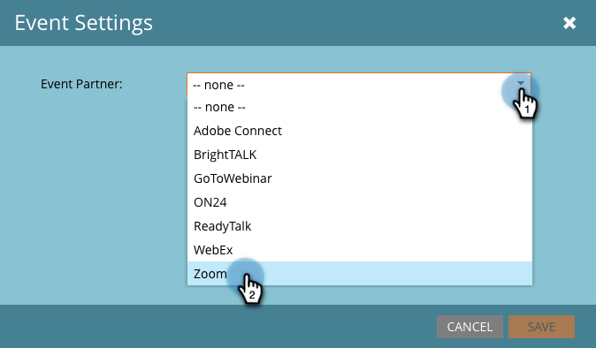
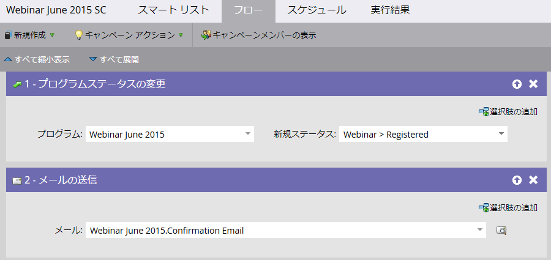

# ズーム{#create-an-event-with-zoom}を使用してイベントを作成

>[!PREREQUISITES]
>
>* [LaunchPointサー追加ビスとしてズーム](/help/marketo/product-docs/administration/additional-integrations/add-zoom-as-a-launchpoint-service.md)
>* [新しいイベントプログラムの作成](/help/marketo/product-docs/demand-generation/events/understanding-events/create-a-new-event-program.md)
>* 適切な[フローアクション](/help/marketo/product-docs/core-marketo-concepts/smart-campaigns/flow-actions/add-a-flow-step-to-a-smart-campaign.md)を設定して、エンゲージメントを追跡します。

まず、ズーム機能を使用してウェビナーを作成します。 ズームの作成時の特定の設定はMarketorで使用され、一部の設定はZoomでのみ使用されます。

Marketoイベントを作成し、ズームウェビナーを関連付けると、登録情報と出欠情報を共有できるようになります。 ウェビナーの作成については、[ズームウェビナーの概要](https://support.zoom.us/hc/en-us/articles/200917029-Getting-Started-With-Webinar)を参照してください。

ウェビナーの次の情報を入力すると、アダプタを介してMarketoに取り込まれます。 この情報に変更を加えた場合、変更をMarketerに表示するには、「イベントアクション」の下の「ウェビナープロバイダーから更新」リンクをクリックする必要があります。

**タイトルと説明**

* **ウェビナー名**  — ウェビナーの名前を入力します。この名前は、Marketorで表示できます。

* **説明** （オプション） — ウェビナーの説明を入力します。説明はマーケティング担当者に表示できます。

**日付と時刻**

* **開始日** -開始日を入力します。これは、Marketoで表示できます。

* **開始時間** -開始時間を入力します。これは、Marketoで表示できます。

* **期間**  — 期間を入力します。開始の時間と終了時間は、Marketorで表示できます。

* **タイムゾーン**  — 目的のタイムゾーンを選択します。これは、Marketoで表示できます。

* **定期的なウェビナー** — チェックボックスをオフにしておきます。

* **登録**  — 登録を必要とする場合は、このチェックボックスをオンにします。Marketorのフォーム/ランディングページを使用して、ズームにプッシュされる登録情報を取得します。

>[!NOTE]
>
>マーケティング担当者は、現在、ウェビナーの繰り返しをサポートしていません。 各Marketorイベントとズームウェビナーの間に、1つのセッションを設定する必要があります。

>[!TIP]
>
>統合に影響を与えない、ズームで設定する追加のフィールドがあります。 これらのフィールドの詳細については、[ズームウェビナーヘルプセンター](https://support.zoom.us/hc/en-us/sections/200324965-Video-Webinar)を参照してください。

さあ、マーケットに飛び込もう！

1. イベントを選択します。 「**イベントアクション**」をクリックし、「**イベント設定**」を選択します。

   

   >[!NOTE]
   >
   >選択するイベントのチャネルタイプは、**ウェビナー**&#x200B;でなければなりません。

1. **イベント** **パートナー**&#x200B;リストから&#x200B;**ズーム**&#x200B;を選択します。

   

1. イベントに関連付けるズームアカウントを選択します。

   

1. ウェビナーを選択します。

   

1. 「**保存**」をクリックします。

   

   素晴らしい！ これで、イベントはズームによって同期され、スケジュールされます。

   >[!NOTE]
   >
   >Marketorが送信するフィールドは次のとおりです。名、姓、電子メールアドレス。

   >[!TIP]
   >
   >この一意のURLを確認電子メールに入力するには、電子メールで次のトークンを使用します。`{{member.webinar url}}`. 確認URLが送信されると、このトークンは、ユーザー固有の確認URLに自動的に解決されます。
   >
   >確認の電子メールを&#x200B;**操作**&#x200B;に設定し、登録済みで登録を取り消している可能性のあるユーザーが、確認情報を引き続き受け取るようにします。

   ウェビナーにサインアップした人は、「新しいステータス」が「登録済み」に設定されている場合、**プログラムステータスの変更**&#x200B;フローステップ経由でウェビナープロバイダーにプッシュされます。 その他の状態では、その人を押しのけることはありません。 また、**プログラムステータスの変更**&#x200B;のフロー手順#1と&#x200B;**電子メール**&#x200B;の送信のフロー手順#2を必ず行ってください。

   

   >[!CAUTION]
   >
   >確認電子メールを送信する際に、ネストされた電子メールプログラムを使用しないでください。 代わりに、イベントプログラムのスマートキャンペーンを使用します。

   >[!TIP]
   >
   >データがマーケティング担当者に表示されるまで、最大48時間かかる場合があります。 それでも何も表示されない状態が続くのを待った後で、イベントーの&#x200B;**概要**&#x200B;タブにあるイベントの操作メニューから、「ウェビナープロバイダーから更新&#x200B;**」を選択します。**
