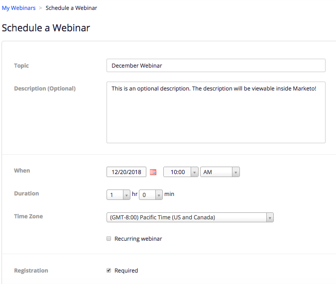
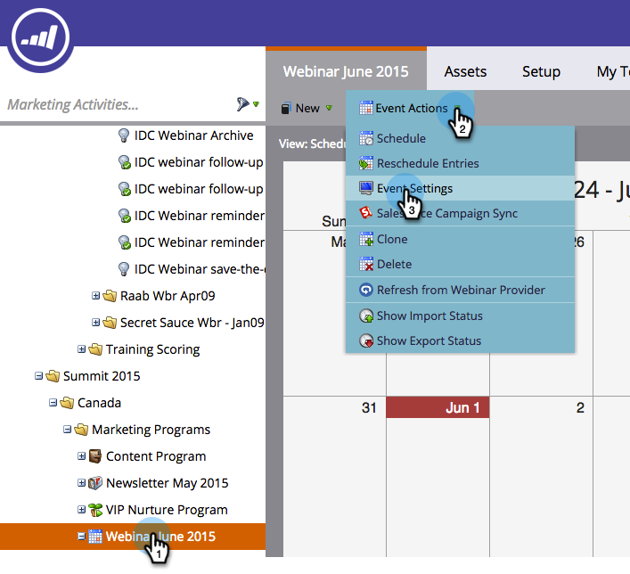
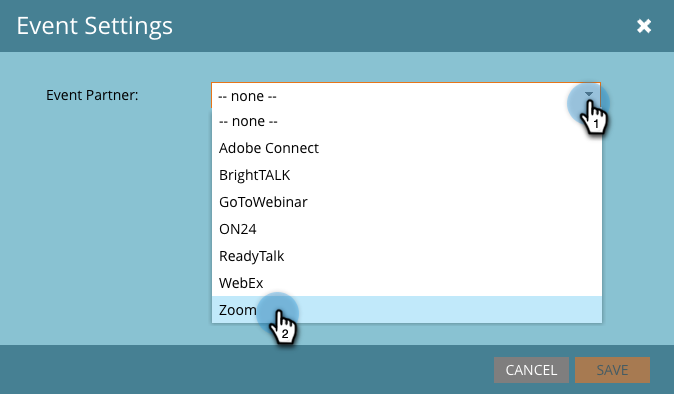
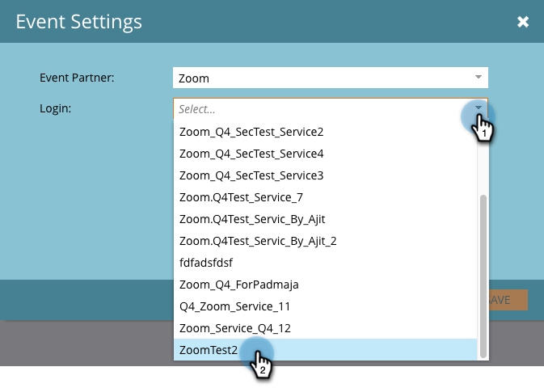
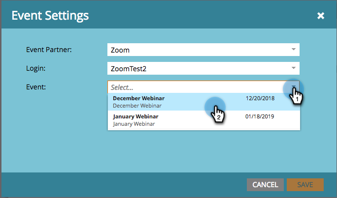
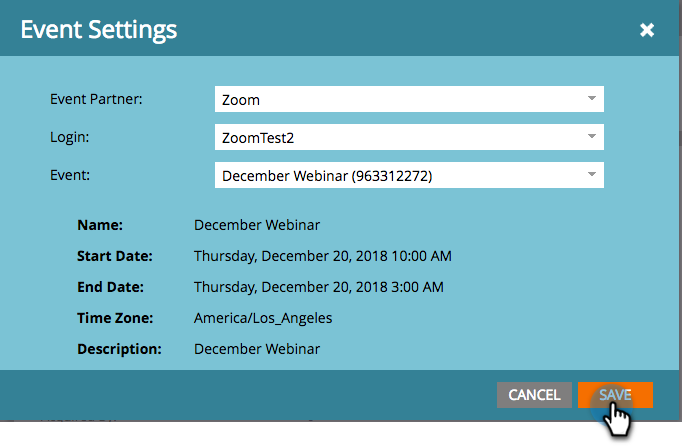
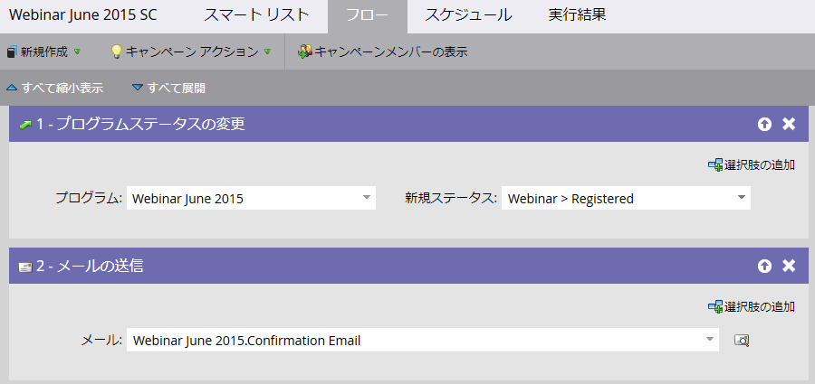

# [!DNL Zoom] を使用したイベントの作成 {#create-an-event-with-zoom}

>[!PREREQUISITES]
>
>* [ [!DNL Zoom]  を  [!DNL LaunchPoint]  サービスとして追加](/help/marketo/product-docs/administration/additional-integrations/add-zoom-as-a-launchpoint-service.md)
>* [新しいイベントプログラムの作成](/help/marketo/product-docs/demand-generation/events/understanding-events/create-a-new-event-program.md)
>* 適切な[フローアクション](/help/marketo/product-docs/core-marketo-concepts/smart-campaigns/flow-actions/add-a-flow-step-to-a-smart-campaign.md)を設定して、エンゲージメントをトラック

まず、[!DNL Zoom] でウェビナーを作成します。 [!DNL Zoom] の作成機能の設定には、Marketo で使用されるものと、[!DNL Zoom] でのみ使用されるものがあります。

Marketo イベントを作成してそれに [!DNL Zoom] ウェビナーを関連付けると、システムは登録情報と出席情報を共有できるようになります。 ウェビナーの作成については、[ [!DNL Zoom]  ウェビナーの基本を学ぶ](https://support.zoom.us/hc/ja/articles/200917029-Getting-Started-With-Webinar)を参照してください。

ウェビナーに関する次の情報を入力すると、アダプターを介して Marketo に取り込まれます。 この情報に変更を加えた場合、Marketo で変更を表示するには、イベントアクションで「ウェビナープロバイダーから更新」リンクをクリックする必要があります。

**タイトルと説明**

* **ウェビナー名** — ウェビナーの名前を入力します。 この名前が Marketo で表示されます。

* **説明**（オプション） - ウェビナーの説明を入力します。 説明は Marketo で表示されます。

**日時**

* **開始日** – 開始日を入力します。 これは Marketo で表示できます。

* **開始時間** - 開始時間を入力します。 これは Marketo で表示できます。

* **所要時間** – 所要時間を入力します。 開始時間と終了時間は Marketo で表示されます。

* **タイムゾーン** – 該当するタイムゾーンを選択します。 これは Marketo で表示できます。

* **定期ミーティング** – チェックは外したままにします。

* **登録** – このボックスにチェックを入れて、登録を必須にします。 Marketo のフォーム／ランディングページを使用して、[!DNL Zoom] にプッシュされる登録情報を取り込みます。

>[!NOTE]
>
>Marketo は現在、定期的なウェビナーをサポートしていません。 各 Marketo イベントと [!DNL Zoom] ウェビナーの間に 1 つのセッションを設定する必要があります。

>[!TIP]
>
>[!DNL Zoom] には、連携に影響を与えないように設定するフィールドが追加されています。 これらのフィールドについて詳しくは、[[!DNL Zoom]  ウェビナーヘルプセンター](https://support.zoom.us/hc/ja/sections/200324965-Video-Webinar)を参照してください。

次に、Marketoに進みます。

1. イベントを選択します。 「**[!UICONTROL イベントアクション]**」から、「**[!UICONTROL イベント設定]**」を選択します。

   

   >[!NOTE]
   >
   >選択するイベントのチャネルタイプは、**ウェビナー**&#x200B;である必要があります。

1. **[!UICONTROL イベントパートナー]**&#x200B;リストから「**[!UICONTROL Zoom]**」を選択します。

   

1. イベントを関連付ける [!DNL Zoom] アカウントを選択します。

   

1. ウェビナーを選択します。

   

1. 「**[!UICONTROL 保存]**」をクリックします。

   

   イベントは[!DNL Zoom]によって同期され、スケジュールされています。

   >[!NOTE]
   >
   >Marketo が送信するフィールドは、姓、名、メールアドレスです。

   >[!TIP]
   >
   >登録後の確認メールにこの固有 URL を挿入するには、メールに `{{member.webinar url}}` トークンを使います。 確認 URL が送信されるときに、このトークンは各リード固有の確認 URL に自動的に変換されます。
   >
   >配信停止やマーケティング中断したリードにも届くように、確認メールは&#x200B;**オペレーショナル**&#x200B;メールに設定してください。

   ウェビナーに新規登録したリードは、[!UICONTROL 新規ステータス]が「登録」に設定されたときに、**[!UICONTROL プログラムステータスを変更]**&#x200B;フローステップによってウェビナープロバイダーにプッシュされます。 その他のステータスではプッシュされません。 また、**[!UICONTROL プログラムステータスの変更]** フローステップを#1し、**[!UICONTROL 電子メールの送信]** フローステップを#2します。

   

   >[!CAUTION]
   >
   >ネストされたメールプログラムを使用して確認メールを送信しないでください。 代わりに、上に示しているように、イベントプログラムのスマートキャンペーンを使用します。

   >[!TIP]
   >
   >Marketo にデータが表示されるまでには、最大 48 時間かかる場合があります。 しばらく待っても何も表示されない場合は、イベントの「**概要**」タブのイベントアクションメニューから「**ウェビナープロバイダーから更新**」を選択し、画面の右下にある更新アイコンをクリックします。
