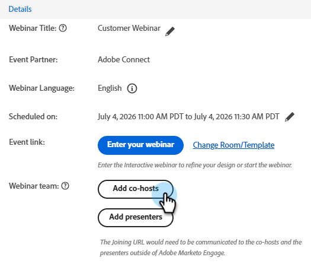

# ウェビナーチームの追加 {#add-a-webinar-team}

インタラクティブウェビナーのウェビナーチームは、Adobe Connect でのウェビナーの配信を成功させるのに貢献するすべてのロールで構成されます。プレゼンターと共同主催者の両方が含まれます。

>[!NOTE]
>
>Marketo Engage でのプレゼンターと共同主催者は、Adobe Connect でのウェビナー配信中のプレゼンターとホストのロールに正確にマッピングします。共同主催者はレイアウトとポッドを変更できますが、プレゼンターは変更できません。

プレゼンターはウェビナーエクスペリエンスの配信に参加する外部のロールですが、共同主催者はプレゼンターとして機能するだけでなく、ウェビナー配信の管理面も処理できます。共同主催者は、内部と外部の両方になることができます。外部の共同主催者は、Marketo のインタラクティブウェビナーイベントプログラムにはアクセスできませんが、Adobe Connect での配信中にホストの権限を持ちます。内部の共同主催者は、Marketo のインタラクティブウェビナーイベントプログラムと、配信中のホストの権限の両方にアクセスできます。これにより、インタラクティブウェビナープログラムの元の作成者がインタラクティブウェビナーのユーザセットに含まれなくなった場合や、Marketo ユーザでさえなくなった場合に、内部の共同主催者がインタラクティブウェビナーイベントプログラムを主導できます。

>[!PREREQUISITES]
>
>[インタラクティブウェビナーの作成](/help/marketo/product-docs/demand-generation/events/interactive-webinars/create-an-interactive-webinar.md)

## 共同主催者の追加 {#add-a-co-host}

1. インタラクティブウェビナーの概要ページで、「**共同主催者を追加**」をクリックします。

   

1. 内部ユーザまたは外部ユーザを追加できます。この例では、外部を選択します。

   

   >[!NOTE]
   >
   >「**内部インタラクティブウェビナーユーザー**」を選択した場合は、「**使用可能なホスト**」ドロップダウンをクリックし、Marketo Engageでインタラクティブウェビナーユーザーとして追加されたユーザーのリストから選択するだけです。 既存のホストは、すでにホストであるため、このドロップダウンには表示されません。

1. 目的の共同主催者の名、姓、メールアドレスを入力します。「**追加**」をクリックします。

   

1. 新しい共同主催者が「ウェビナー」チームセクションに表示されます。

   

## プレゼンターの追加 {#add-a-presenter}

1. インタラクティブウェビナーの概要ページで、「**プレゼンターを追加**」をクリックします。

   

1. 目的のプレゼンターの名、姓、メールアドレスを入力します。「**追加**」をクリックします。

   

   >[!NOTE]
   >
   >ウェビナー配信中にプレゼンターの情報が Adobe Connect に提供されるので、ウェビナー配信のエントリ時にユーザが入力しなくても、適切な詳細を自動的に入力できます。

1. 新しいプレゼンターが「ウェビナー」チームセクションに表示されます。

   

>[!TIP]
>
>ウェビナーチームを追加した後、各ユーザの横にあるコピーアイコンをクリックして、参加 URL をコピー（共有）できます。

>[!MORELIKETHIS]
>
>[インタラクティブウェビナーの作成](/help/marketo/product-docs/demand-generation/events/interactive-webinars/create-an-interactive-webinar.md)
