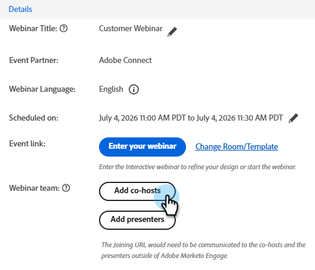
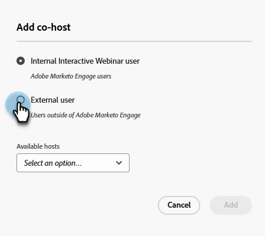
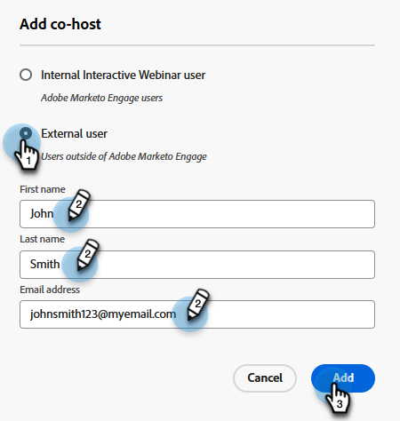
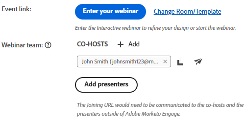
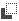
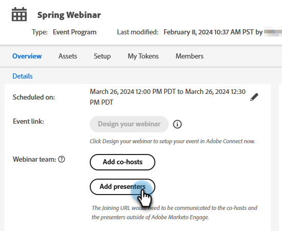
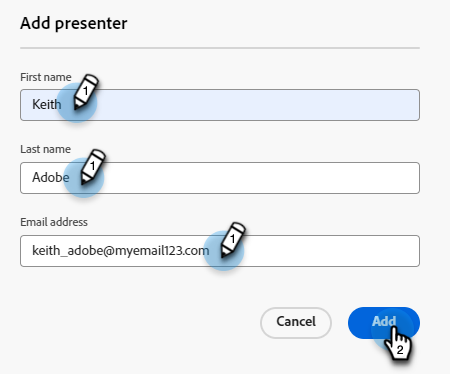
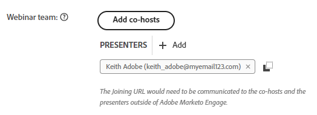

# ウェビナーチームの追加 {#add-a-webinar-team}

インタラクティブウェビナーのウェビナーチームは、Adobe Connect でのウェビナーの配信を成功させるのに貢献するすべてのロールで構成されます。 プレゼンターと共同主催者の両方が含まれます。

>[!PREREQUISITES]
>
>* [インタラクティブウェビナーの作成](/help/marketo/product-docs/demand-generation/events/interactive-webinars/create-an-interactive-webinar.md){target="_blank"}
>
>* [インタラクティブウェビナーのデザイン](/help/marketo/product-docs/demand-generation/events/interactive-webinars/designing-interactive-webinars.md){target="_blank"}

プレゼンターはウェビナーエクスペリエンスの配信に参加する外部のロールですが、共同主催者はプレゼンターとして機能するだけでなく、ウェビナー配信の管理面も処理できます。 共同主催者は、内部と外部の両方になることができます。 外部の共同主催者は、Marketo のインタラクティブウェビナーイベントプログラムにはアクセスできませんが、Adobe Connect での配信中にホストの権限を持ちます。 内部の共同主催者は、Marketo のインタラクティブウェビナーイベントプログラムと、配信中のホストの権限の両方にアクセスできます。 これにより、インタラクティブウェビナープログラムの元の作成者がインタラクティブウェビナーのユーザセットに含まれなくなった場合や、Marketo ユーザでさえなくなった場合に、内部の共同主催者がインタラクティブウェビナーイベントプログラムを主導できます。

>[!NOTE]
>
>Marketo Engage でのプレゼンターと共同主催者は、Adobe Connect でのウェビナー配信中のプレゼンターとホストのロールに正確にマッピングします。 共同主催者はレイアウトとポッドを変更できますが、プレゼンターは変更できません。

## 共同主催者の追加 {#add-a-co-host}

1. インタラクティブウェビナーの概要ページで、「**共同主催者を追加**」をクリックします。

   

1. 内部ユーザまたは外部ユーザを追加できます。 この例では、外部を選択します。

   

   >[!NOTE]
   >
   >**内部インタラクティブウェビナーユーザー**&#x200B;を選択した場合、「**利用可能なホスト**」ドロップダウンをクリックし、Marketo Engageでインタラクティブウェビナーユーザーとして追加されたユーザーのリストから選択する必要があります。 既存の主催者は既に主催者なので、このドロップダウンには表示されません。

1. 目的の共同主催者の名、姓、メールアドレスを入力します。 「**追加**」をクリックします。

   

1. 新しい共同主催者が「ウェビナー」チームセクションに表示されます。

   

>[!NOTE]
>
>  アイコンはコホスト参加URLをコピーし、 アイコンはコホスティングに招待メールを送信します。

## プレゼンターの追加 {#add-a-presenter}

1. インタラクティブウェビナーの概要ページで、「**プレゼンターを追加**」をクリックします。

   

1. 目的のプレゼンターの名、姓、メールアドレスを入力します。 「**追加**」をクリックします。

   

   >[!NOTE]
   >
   >ウェビナー配信中にプレゼンターの情報が Adobe Connect に提供されるので、ウェビナー配信のエントリ時にユーザが入力しなくても、適切な詳細を自動的に入力できます。

1. 新しいプレゼンターが「ウェビナー」チームセクションに表示されます。

   

>[!NOTE]
>
>  アイコンはプレゼンターの参加URLをコピーし、 アイコンはプレゼンターに招待メールを送信します。

>[!MORELIKETHIS]
>
>[インタラクティブウェビナーの作成](/help/marketo/product-docs/demand-generation/events/interactive-webinars/create-an-interactive-webinar.md){target="_blank"}
