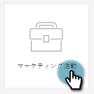
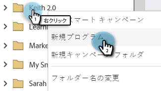
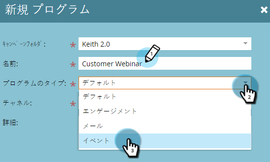
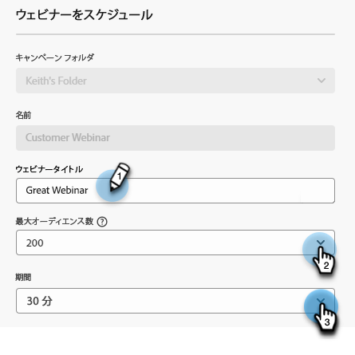
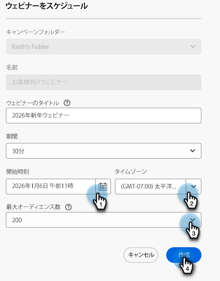

# インタラクティブなウェビナーの作成 {#create-an-interactive-webinar}

インタラクティブな Web セミナーを簡単な手順で作成します。

1. 「**マーケティングアクティビティ**」に移動します。

   

1. 目的のフォルダーを右クリックし、「 」を選択します。 **新規プログラム**.

   

1. プログラムに名前を付けます。 「プログラムタイプ」で、「 **イベント**.

   

1. チャネルドロップダウンをクリックし、「 」を選択します。 **ウェビナー**.

   

1. 選択 **インタラクティブ Web セミナー** をクリックし、 **次へ**.

   

   >[!NOTE]
   >
   >パートナーウェビナーの情報は、こちらをご覧ください。

1. ウェビナーの最大オーディエンスサイズと、その持続期間を設定します。

   

1. ウェビナーの日時をスケジュールし、 **作成**.

   

インタラクティブ Web セミナーが作成されます。 今こそ～する時だ [デザインする](/help/marketo/product-docs/demand-generation/events/interactive-webinars/designing-interactive-webinars.md).

