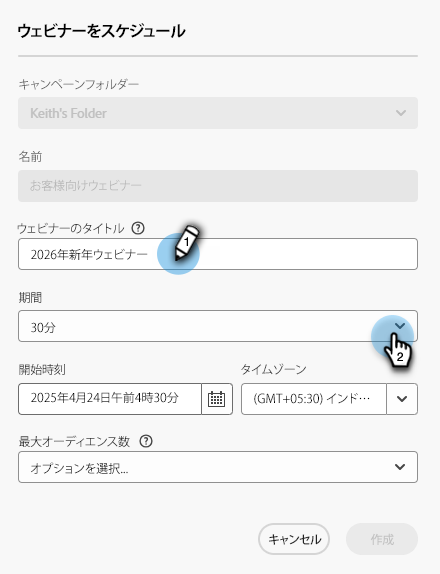
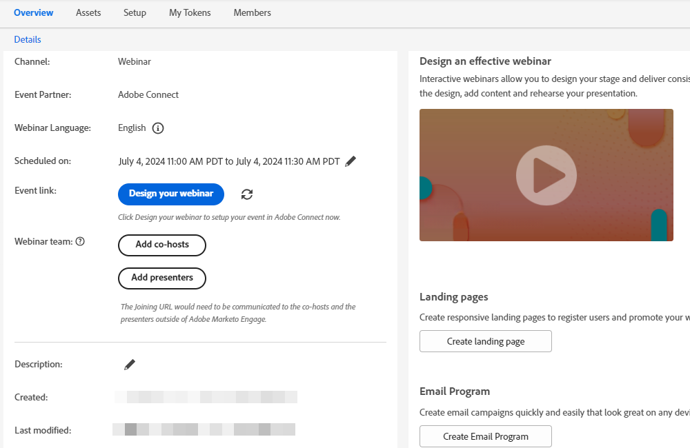

# インタラクティブウェビナーの作成 {#create-an-interactive-webinar}

インタラクティブウェビナーを簡単な手順で作成します。

1. 「**マーケティングアクティビティ**」に移動します。

   

1. 目的のフォルダーを右クリックし、「**新規プログラム**」を選択します。

   

1. プログラムに名前を付けます。プログラムタイプで、「**イベント**」を選択します。

   

1. 「チャネル」ドロップダウンをクリックし、「**ウェビナー**」を選択します。

   

1. 「**インタラクティブウェビナー**」を選択し、「**次へ**」をクリックします。

   

   >[!NOTE]
   >
   >パートナーウェビナーの情報は、こちらを参照してください。

1. ウェビナーの最大オーディエンスサイズと開催時間を設定します。

   

1. ウェビナーの日時をスケジュールし、「**作成**」をクリックします。

   

インタラクティブウェビナーが作成されます。次はいよいよ[ウェビナーの設計](/help/marketo/product-docs/demand-generation/events/interactive-webinars/designing-interactive-webinars.md)です。

