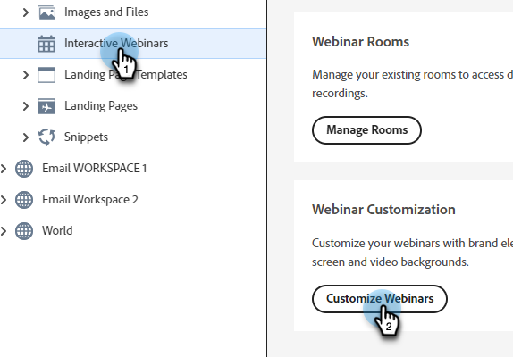
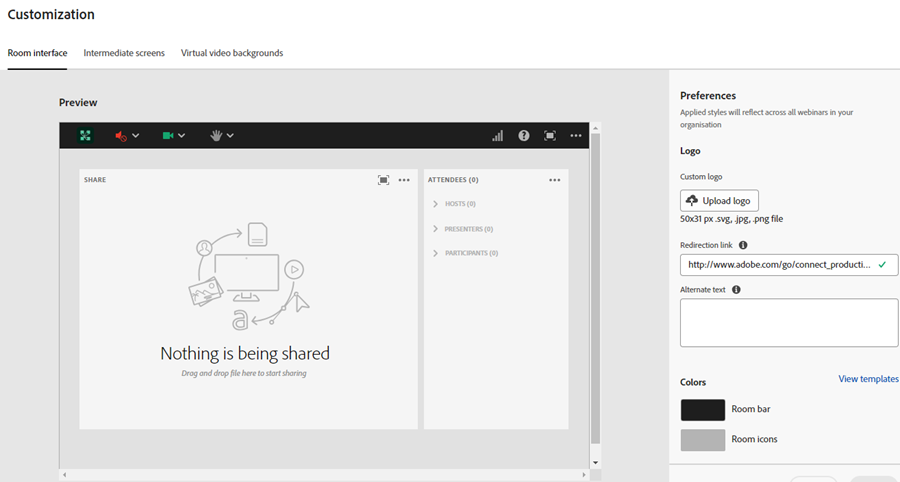
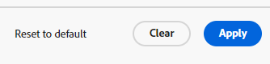
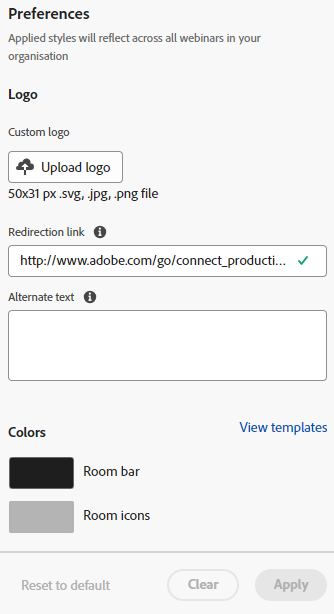
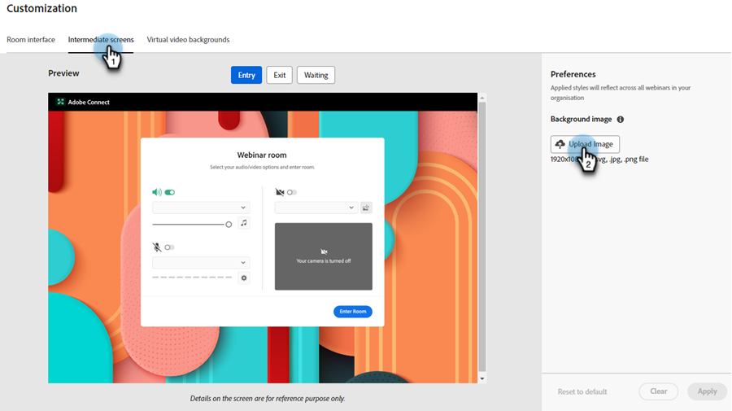
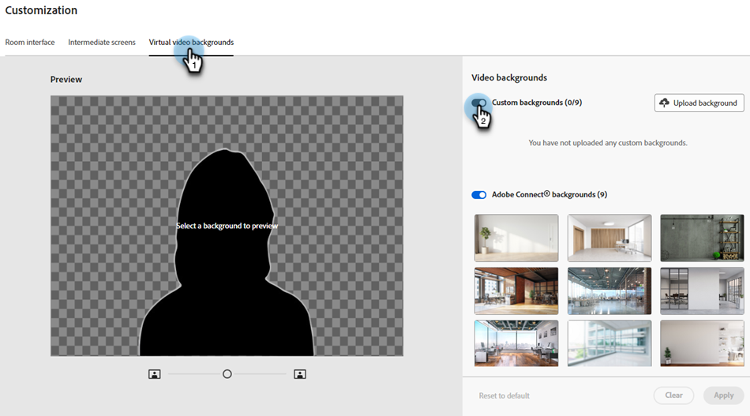
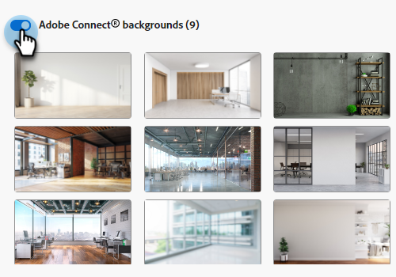

# インタラクティブウェビナーのカスタマイズ {#interactive-webinars-customization}

ウェビナーをカスタマイズすることは、参加者により魅力的で効果的な体験を提供するために不可欠です。

インタラクティブウェビナーでは、ウェビナー環境をニーズに合わせてカスタマイズするための、いくつかのカスタマイズオプションを提供しています。 組織のブランディングを反映させるために、様々な画面の外観をカスタマイズします。

次のオプションをカスタマイズできます。

* 部屋のブランドカラー
* カスタム背景：入口、出口、待機中の各画面で組織を表します
* ロゴ
* バーチャルビデオの背景

## 権限の付与 {#grant-permissions}

組織内のユーザーがインタラクティブウェビナーをカスタマイズする前に、Marketo Engage管理者が最初に目的の役割へのアクセス権を追加する必要があります。

1. Marketo Engage で、「**[!UICONTROL 管理者]**」をクリックします。

   

1. 「**[!UICONTROL ユーザーと役割]**」をクリックし、「**[!UICONTROL 役割]**」タブをクリックします。

   

1. 権限を追加する役割をダブルクリックします。

   

1. クリックして&#x200B;**[!UICONTROL Access Design Studio]**&#x200B;を開きます。

   

1. 「**[!UICONTROL インタラクティブウェビナーのカスタマイズにアクセス]**」チェックボックスを選択します。

   

## インタラクティブなウェビナー画面のカスタマイズ {#customize-interactive-webinar-screens}

1. **Design Studio** に移動します。

   

1. **インタラクティブウェビナー**&#x200B;をクリックし、**ウェビナーをカスタマイズ**&#x200B;を選択します。

   

1. 部屋のインターフェイス、即時の画面、またはバーチャルビデオの背景をカスタマイズできます。

   

## 部屋のインターフェイスのカスタマイズ {#customize-the-room-interface}

ロゴ、クリック可能なリダイレクションリンク、カラーを変更することで、セッションルームの外観をカスタマイズできます。 変更内容は、組織内のすべてのイベントとルームに反映されます。

部屋の外観をカスタマイズするには、メニューバーから「部屋インターフェイス」タブを選択します。

1. 右側のパネルで、次の環境設定をカスタマイズします。

   

   **カスタムロゴ**:「ロゴをアップロード」を選択し、デバイスから画像を参照します。 画像サイズは50 x 31 ピクセルを超えてはならず、異なるファイル形式（.svg、.gif、.jpg、.png）にすることができます。 ロゴは変更または削除できます。

   **リダイレクションリンク**：参加者がロゴをクリックした後にリダイレクトするURLを追加します。

   **代替テキスト**：アクセシビリティ機能を使用して、出席者用の代替テキストを追加します。

   **色**：ルームバー、ルームアイコン、ルームバックグラウンド、ポッドバー、およびポッドタイル/アイコンの色を選択して、様々なセクションの色を変更します。

   16進数オプションを使用して16進数カラーコードを入力することもできます。

   **[!UICONTROL テンプレートを表示]**&#x200B;を選択して、部屋のテーマを変更します。

   変更を加えた後、プレビューでロゴとカラーを確認できます。

1. **[!UICONTROL 適用]**&#x200B;を選択して変更を保存します。 既定の設定にリセットするには、**[!UICONTROL 既定にリセット]**&#x200B;をクリックします。

   

### 中間画面のカスタマイズ {#customize-intermediate-screens}

背景画像を変更して、入口、出口、待機画面のルックアンドフィールを変更します。 変更は、組織内のすべてのイベントとルームに反映されます。

部屋の外観をカスタマイズするには、メニューバーから「中間画面」タブを選択します。

1. 右側のパネルから、**画像をアップロード**&#x200B;を選択して背景画像をカスタマイズし、ロゴの画像を参照します。 画像サイズは1920 x 1080 ピクセルを超えてはならず、異なるファイル形式（.svg、.gif、.jpg、.png）にすることができます。 必要に応じて、ロゴを変更または削除できます。

   

   >[!NOTE]
   >
   >アップロードした画像は、「入口」、「出口」、「待機中」の各画面に適用されます。

1. **[!UICONTROL 適用]**&#x200B;を選択して変更を保存します。 既定の設定にリセットするには、**[!UICONTROL 既定にリセット]**&#x200B;をクリックします。

### バーチャルビデオの背景をカスタマイズ {#Customize-virtual-video-backgrounds}

イベント中に組織が定義した背景を使用して、カメラのビデオフィードの背景に組織のロゴやブランドイメージを表示します。 組織のバーチャル背景を追加するには、メニューバーから「バーチャルビデオの背景」タブを選択します。 カスタムの背景、Adobe Connectの背景、またはその両方のみを表示できます。

**カスタム背景**

1. 切り替えスイッチをクリックして、イベントやルームでカスタム背景を許可します。

   

1. 「**背景をアップロード**」を選択して、カスタム背景をアップロードします。 画像サイズは1920 x 1080 ピクセルを超えてはならず、異なるファイル形式（.svg、.gif、.jpg、.png）にすることができます。

カスタムの背景画像にカーソルを合わせて、ビデオの背景から削除します。

変更を加えた後、プレビューで背景を表示します。

プレビュー画面のスライダーを使用してズームインまたはズームアウトし、ユーザーがカメラに近い場合や遠い場合にバーチャル背景がどのように表示されるかをテストできます。 背景にテキストがある場合は、表示されたままにするのに役立ちます。

1. **[!UICONTROL 適用]**&#x200B;を選択して変更を保存します。 既定の設定にリセットするには、**[!UICONTROL 既定にリセット]**&#x200B;をクリックします。

**Adobe Connectの背景**

Adobe Connectには、使用できるデフォルトの背景が9つ用意されています。 プレビューでも確認できます。

切り替えスイッチを使用して、イベントや部屋でこれらのデフォルトの背景を利用できるようにします。

**適用**&#x200B;を選択して変更を保存するか、**デフォルトにリセット**&#x200B;してデフォルト設定にリセットします。

### カスタマイズ可能なテーマの作成 {#create-customizable-themes}

* 管理者は、カスタムロゴ、カラー、動画の背景を使用してテーマを作成および管理できます。

* ホストは、ルームの作成中にテーマを選択するか、ルーム情報ページ（**ルームのトップバー** > **その他のメニュー** > **ルーム情報を表示**）から後で更新できます。

[&#x200B; テーマ &#x200B;](https://helpx.adobe.com/adobe-connect/connect-central-admin/connect-central-ui-customization-basics.html){target="_blank"}の詳細
