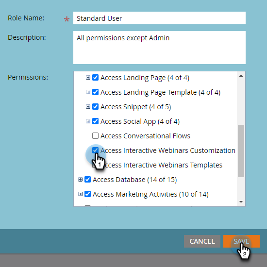

# インタラクティブウェビナーのカスタマイズ {#interactive-webinars-customization}

ウェビナーのカスタマイズは、参加者にとってより魅力的で効果的なエクスペリエンスを作成するために重要です。

インタラクティブウェビナーには、ニーズに合わせてウェビナー環境をカスタマイズするためのカスタマイズオプションがいくつか用意されています。 様々な画面の外観をカスタマイズして、組織のブランディングを反映します。

次のオプションをカスタマイズできます。

* 部屋のブランドカラー
* エントリ、離脱および待機中の画面に表示される組織を表すためのカスタム背景
* ロゴ
* 仮想ビデオの背景

## インタラクティブウェビナー画面のカスタマイズ {#customize-interactive-webinar-screens}

1. **Design Studio** に移動します。

   

1. **インタラクティブウェビナー** をクリックし、「**ウェビナーをカスタマイズ**」を選択します。

   

1. ルームインターフェイス、即時画面、仮想ビデオの背景をカスタマイズできます。

   

### 部屋のインタフェースをカスタマイズする {#customize-the-room-interface}

ロゴ、クリック可能なリダイレクトリンクおよび色を変更することで、セッションルームの外観をカスタマイズできます。 変更は、組織内のすべてのイベントとルームに反映されます。

部屋の外観をカスタマイズするには、メニューバーから [ 部屋インタフェース ] タブを選択します。

1. 右側のパネルで、次の環境設定をカスタマイズします。

   

   **カスタムロゴ**:「ロゴをアップロード」を選択し、デバイスから画像を参照します。 画像サイズは 50 x 31 ピクセルを超えないようにし、.svg、.gif、.jpg、.png などの様々なファイル形式を使用できます。 ロゴは変更または削除できます。

   **リダイレクトリンク**：参加者がロゴをクリックした後にリダイレクトする URL を追加します。

   **代替テキスト**：アクセシビリティ機能を使用して、出席者に代替テキストを追加します。

   **カラー**: ルームバー、ルームアイコン、ルームの背景、ポッドバー、ポッドタイル/アイコンのカラーを選択して、様々なセクションのカラーを変更します。

   また、「16 進数」オプションを使用して 16 進数のカラーコードを入力することもできます。

   **[!UICONTROL ビューテンプレート]** を選択して、部屋のテーマを変更します。

   変更を加えた後、プレビューでロゴと色を確認できます。

1. 「**[!UICONTROL 適用]**」を選択して、変更を保存します。 デフォルトの設定にリセットするには、「**[!UICONTROL デフォルトにリセット]**」をクリックします。

   

### 中間画面のカスタマイズ {#customize-intermediate-screens}

背景画像を変更して、エントリ、終了、および待機中の画面のルックアンドフィールを変更します。 変更は、組織内のすべてのイベントとルームに反映されます。

部屋の外観をカスタマイズするには、メニューバーから「中間スクリーン」タブを選択します。

1. 右側のパネルから、「画像をアップロード **を選択して背景画像をカスタマイズし** ロゴの画像を参照します。 画像サイズは 1920 x 1080 ピクセルを超えないようにし、.svg、.gif、.jpg、.png など、様々なファイル形式にすることができます。 必要に応じて、ロゴを変更または削除できます。

   

   >[!NOTE]
   >
   >アップロードされた画像は、エントリ画面、終了画面、待機画面に適用されます。

1. 「**[!UICONTROL 適用]**」を選択して、変更を保存します。 デフォルトの設定にリセットするには、「**[!UICONTROL デフォルトにリセット]**」をクリックします。

### 仮想ビデオの背景のカスタマイズ {#Customize-virtual-video-backgrounds}

イベント中に組織が定義した背景を使用して、カメラビデオフィードの背景に組織のロゴまたはブランド画像を表示します。 組織の仮想背景を追加するには、メニューバーの「仮想ビデオ背景」タブを選択します。 カスタム背景、Adobe Connect背景またはその両方のみを表示するように選択できます。

**カスタム背景**

1. 切り替えスイッチをクリックして、イベントと部屋にカスタムの背景を許可します。

   

1. **背景をアップロード** を選択して、カスタムの背景をアップロードします。 画像サイズは 1920 x 1080 ピクセルを超えないようにし、.svg、.gif、.jpg、.png など、様々なファイル形式にすることができます。

カスタム背景画像の上にマウスポインターを置くと、ビデオ背景から削除できます。

変更を加えた後、背景をプレビューで表示します。

プレビュー画面のスライダーを使用してズームインまたはズームアウトし、ユーザーがカメラに近かったり遠かったりする場合の仮想背景の見え方をテストできます。 背景にテキストがある場合は、テキストが表示されたままになるのを確認するのに役立ちます。

1. 「**[!UICONTROL 適用]**」を選択して、変更を保存します。 デフォルトの設定にリセットするには、「**[!UICONTROL デフォルトにリセット]**」をクリックします。

**Adobe Connectの背景**

Adobe Connectには、すぐに使用できる 9 つのデフォルトの背景が用意されています。 プレビューで外観を確認できます。

切り替えスイッチを使用して、イベントやルームでのこれらのデフォルトの背景の使用を制御します。

「**適用**」を選択して変更を保存するか、「**デフォルトにリセット**」を選択してデフォルト設定にリセットします。
