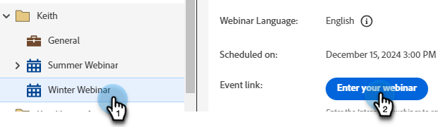
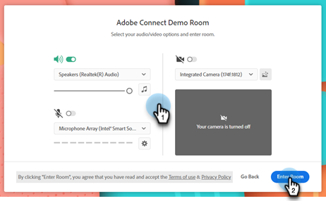
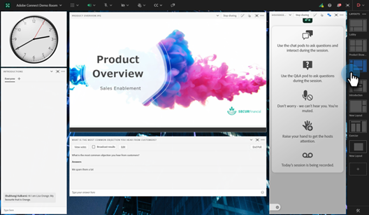
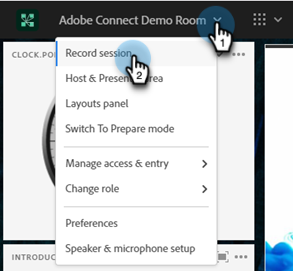
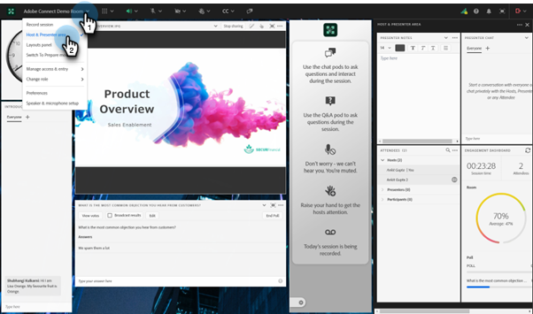
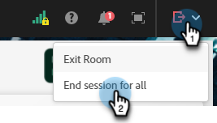
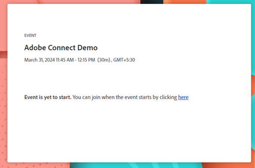
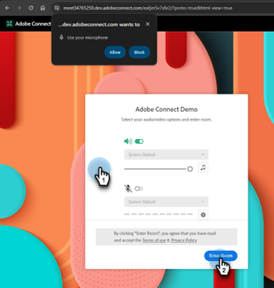
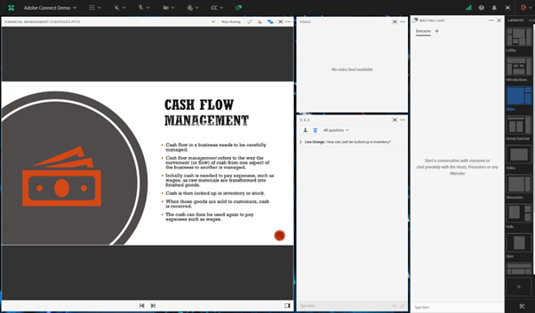
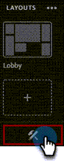

# インタラクティブウェビナーの配信 {#deliver-an-interactive-webinar}

インタラクティブウェビナーを終了します。 プレゼンテーションについて知っておくべきことを説明します。

1. イベントを選択し、**ウェビナーを入力**&#x200B;をクリックします。

   

   >[!NOTE]
   >
   >スケジュールされた開始時間の少なくとも15分前に行うことをお勧めします。

1. 共同ホストまたはプレゼンターの場合は、ウェビナー用に受信したメールのパーソナライズされたリンクをクリックします。

1. オーディオ／ビデオ環境設定を選択して、「**ルームに入る**」をクリックしします。

   

1. 初期ジョイナーに表示するレイアウトを選択します。

   

   >[!NOTE]
   >
   >参加者は、スケジュールされた開始の15分前まで部屋に入ることができ、アクティブなレイアウトが表示されます。 彼らのために「ロビー」レイアウトをデザインすることをお勧めします。

   >[!TIP]
   >
   >Broadcast Controlsを有効にして、仮想のグリーン ルームに入ります。 これにより、ホストとプレゼンターは、部屋の参加者にオーディオとビデオをブロードキャストすることなく、プライベートに話し、お互いを見ることができます。 セッションの前後に最適で、ウェビナーの後に音声や動画をテストしたり、概要を述べたりできます。

1. 必要に応じてセッションを記録できます。 ルームメニューから「**セッションを記録**」を選択します。 録画は、後で同じメニューから停止できます。

   

1. セッションは指定された時間に開始されます。

1. 部屋名をクリックします。 ドロップダウンで、**ホストとプレゼンターの領域**&#x200B;を選択して、プレゼンテーション チームのバックステージとチャットしたりメモを共有したりします。 画面の右側に「ホストとプレゼンター」領域が開きます。 ホスト/共同ホストとプレゼンターのみが画面のこの部分を見ることができます。

   

1. セッションが完了したら、赤い矢印アイコンをクリックし、**すべてのセッションを終了**&#x200B;を選択します。

   

   >[!CAUTION]
   >
   >「出口部屋」をクリックすると、部屋を出るだけです。 ウェビナーは&#x200B;**ではなく**&#x200B;終了します。

   >[!TIP]
   >
   >[&#x200B; イベントのパフォーマンスと録画](/help/marketo/product-docs/demand-generation/events/interactive-webinars/event-workflows.md){target="_blank"}について詳しく説明します。

## 参加者のエクスペリエンス {#participant-experience}

参加者は、イベントに登録した後に受信したパーソナライズされたリンクをクリックして、ウェビナーに参加できます。

1. 予定された開始の15分以上前にイベントリンクを起動した参加者には、イベントの開始を待つことを知らせるランディングページが表示されます。

   

1. 参加者は、オーディオの環境設定を選択し、「ルームに入る」をクリックする必要があります。 初めてAdobe Connect ルームに参加する場合は、マイクの使用許可を求めるポップアップも表示されます。 Adobe Connectでは、参加者が後で会議室でマイクを使用できるようにするために、このアクセス権が必要です。

   

   >[!NOTE]
   >
   >アクセス権を指定せずに権限ポップアップを閉じることができます。 参加者は、マイクを有効にしようとすると、会議室でのアクセスを提供する必要があります。

## 設定と領域 {#settings-and-areas}

### ホストとプレゼンターエリア {#host-and-presenter-area}

「ホスト&amp;プレゼンターエリア」（バックステージとも呼ばれます）は、会議室の右側にあるプライベートエリアで、ホストとプレゼンターのみが見ることができます。 イベント前、イベント中、イベント後の共同作業に使用できます。 チャット、メモ、その他のポッドをホストとプレゼンター領域内のバックチャネルとして使用します。

アクセスするには、ルームのドロップダウンメニューから「**ホストとプレゼンター領域**」を選択します。 この領域について詳しくは、[次のビデオ &#x200B;](https://www.youtube.com/watch?v=11GkcvIUttY){target="_blank"}を参照してください。

### Broadcast Controls {#broadcast-controls}

Broadcast Controlは、インタラクティブウェビナーセッションに仮想グリーンルームを追加します。 ホストとプレゼンターは、部屋の参加者に放送することなく、個人的に話したり会ったりすることができます。 セッションの前にマイクとweb カメラをテストするのに最適な方法です。 プレゼンターは、公開の準備が整うまで、ホストとプレゼンター領域で共同作業を行うこともできます。 参加者がウェビナーから退出するのを忘れた場合に備えて、セッション後に講演者とプロデューサーが非公開で相互にブリーフィングする方法を提供します。

ブロードキャストコントロールは、グリーンルームを出た後に自動的に録画を開始するように設定できます。 これにより、ホストは録画を手動で開始および停止することを忘れずに済みます。 ブロードキャストを一時停止または停止すると、録画も一時停止または停止します。 すべて自動です。

ブロードキャストコントロール [の詳細については、このビデオ &#x200B;](https://www.youtube.com/watch?v=TcoCeEJoyjg){target="_blank"}を参照してください。

### 録音のチャット {#chats-in-recordings}

ユースケースによっては、イベント録画にインルームチャットを含めるか、除外することをお勧めします。

チャットポッド内の議論は常に記録されます。 したがって、チャットのディスカッションが録画視聴者（参加者とオンデマンド視聴者がライブイベントを投稿）に付加価値を与える場合は、部屋をデザインするときにチャットポッドを使用します。

チャットパネル内のディスカッションは記録されません。 また、チャットパネルは、レイアウト内のチャットポッドが占めていた不動産を解放します。 したがって、チャットのディスカッションが視聴者の録画に付加価値を与えない場合は、部屋のデザイン時にチャットポッドの代わりにチャットパネルを使用します。

[&#x200B; チャットパネル &#x200B;](https://helpx.adobe.com/jp/adobe-connect/using/notes-chat-q-a-polls.html#chat_panel){target="_blank"}の詳細をご覧ください。

### 準備モード {#prepare-mode}

準備モードを使用すると、ホストとプレゼンターは、セッションの実行中に舞台裏で会議室のレイアウトを作成または変更できますが、ホストが表示するまで、参加者は変更内容を見ることができません。 Prepare Mode機能は、ライブポッドを青で、非ライブポッドを白で強調表示します。

準備モードを使用するには：

1. レイアウトパネルの下部にあるレンチアイコンをクリックします。

   

1. レイアウトパネルで、調整するレイアウトを選択します。 必要に応じて、ポッドを移動、非表示、表示できます。 共有ポッドに新しいバージョンのプレゼンテーションをアップロードするなど、ポッドのコンテンツを更新することもできます。

1. 変更が完了したら、ドロップダウンメニューから「**準備モードを終了**」を選択するか、レンチアイコンをもう一度クリックします。

これにより、準備モードがオフになり、アクティブなレイアウトに戻ります。

準備モード [について詳しくは、このビデオ &#x200B;](https://www.youtube.com/watch?v=kUya84sx-E4){target="_blank"}を参照してください。

>[!NOTE]
>
>* ライブポッドに加えられた変更は、即座に参加者に反映されます。
>* [&#x200B; チャットパネル &#x200B;](https://helpx.adobe.com/jp/adobe-connect/using/notes-chat-q-a-polls.html#chat_panel){target="_blank"}は準備モードの一部ではなく、変更は即座に参加者に反映されます。

### アクセシビリティ {#accessibility}

Adobeは、インタラクティブウェビナーのアクセシビリティを向上させることで、障害を持つプレゼンターや参加者を取り込むように努めています。 このソフトウェアは、あらゆるタイプのユーザーのニーズを満たし、視覚的、聴覚的、機動性、またはその他の障害を持つ個人を含む世界標準に準拠するように継続的に強化されています。

Adobe Connectが[視覚的、聴覚的、および移動のニーズに対する支援を提供する方法について説明します](https://helpx.adobe.com/jp/adobe-connect/using/accessibility-features.html){target="_blank"}。

### クローズドキャプション {#closed-captions}

クローズドキャプションは、Adobe Connectルーム内の音声をテキストで表現したもので、聴覚障害のある参加者がイベントに参加するのに役立ちます。 オーディオコンテンツのリアルタイムキャプションをイベントに統合し、これらのキャプションをクローズドキャプション表示に表示できます。

[&#x200B; クローズドキャプションを有効にする](https://helpx.adobe.com/jp/adobe-connect/using/closed-captioning-html-client.html){target="_blank"}方法について説明します。

### ライブウェビナー {#simulated-live-webinars}

事前に録画されたウェビナーを、シミュレートされたライブウェビナー形式を使用して、ライブであるかのように表示します。 参加者はスケジュールされた時間に参加し、チャット、投票、Q&amp;Aなどのインタラクティブな機能を楽しみながら、リアルタイムでセッションを体験できます。シミュレートされたライブウェビナーは、記録されたコンテンツの信頼性と、ライブイベントのインタラクティブな体験を組み合わせたものです。

[&#x200B; シミュレートされたライブウェビナー](https://helpx.adobe.com/jp/adobe-connect/using/webinar/overview-of-simulated-live-webinars.html){target="_blank"}の詳細をご覧ください。
