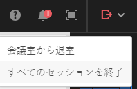

# インタラクティブな Web セミナーの設計 {#designing-interactive-webinars}

ニーズに合わせてウェビナーをデザインする方法を学びます。

1. イベントを選択し、 **ウェビナーのデザイン**.

   

1. 既存のウェビナールームを選択するか、新しく作成することができます。 この例では、新しく作成しているので、 **部屋を選択** ドロップダウンで「 」を選択します。 **新しいインタラクティブウェビナールーム**.

   

   >[!NOTE]
   >
   >部屋とは、会議を行うために使用されるオンラインスペースです。

1. テンプレートを選択します。

   

1. オンラインセミナのプレビューが表示されます。

   

1. 様々なレイアウトを選択してプレビューできます。 続行するには、 **テンプレートを使用**.

   

1. ウェビナーは、すぐに調整することも、後で調整することもできます。 今からやろう。 クリック **ウェビナーを今すぐ絞り込む**.

   

1. オーディオ/ビデオの環境設定を選択し、 **部屋に入る**.

   

1. これで、選択したテンプレートが編集可能になります。

   

1. 部屋とテンプレートの詳細については、次のセクションの「会議室のテンプレートとレイアウト」を参照してください。 [このAdobeのヘルプ記事](https://helpx.adobe.com/in/adobe-connect/using/creating-arranging-meetings.html#creating_and_arranging_meetings){target="_blank"}.

1. ウェビナーのデザインが完了したら、 **出口部屋**.

   

## デザイン要素 {#design-elements}

**テンプレート**:ウェビナーの提供の目的に基づいて部屋に提供される構造。 例えば、製品ショーケースのウェビナーをスケジュールする場合、画面の共有はデモを紹介する上で不可欠なコンポーネントになります。 このテンプレートは、ウェビナールームの設定時に、特定のタイプのウェビナーの効果的な配信に必要な必須コンポーネントを確実に配置します。

**レイアウト**:ウェビナーの成功を特定のテンプレート内に確実に配置するために必要な、様々な方法を指します。 1 つのテンプレートに複数のレイアウトを含めて、選択できます。 ウェビナーの基本的なコンポーネントは、テンプレート間で同じままになります。 選択した配置は、オンラインセミナを配信するユーザーやプレゼンターのスタイルやニーズに最適です。

**ポッド**:ウェビナー中に特定のアクティビティを実行するテンプレート内のコンポーネント。 例えば、投票ポッドで満たされる 1 つのアクティビティで参加者の応答をキャプチャするための投票の設定と配信を行います。 同様に、参加者とのチャットでメッセージを伝えたり、気軽にメッセージを操作したりすると、チャットポッドを通じて配信されるアクティビティになります。 共有、メモ、ビデオ、チャット、出席者リスト、ファイル、Web リンク、投票、Q&amp;A など、他の複数のポッドを使用できます。
