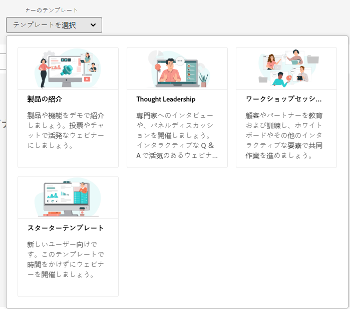
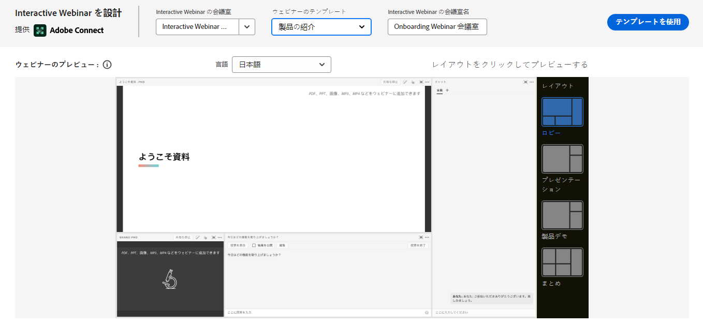
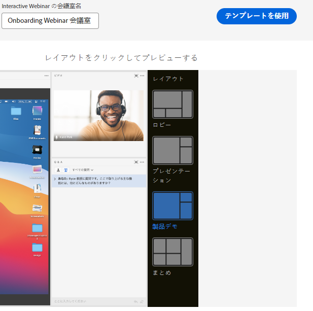
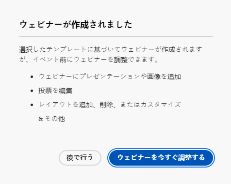
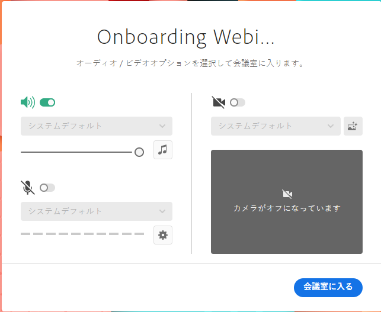
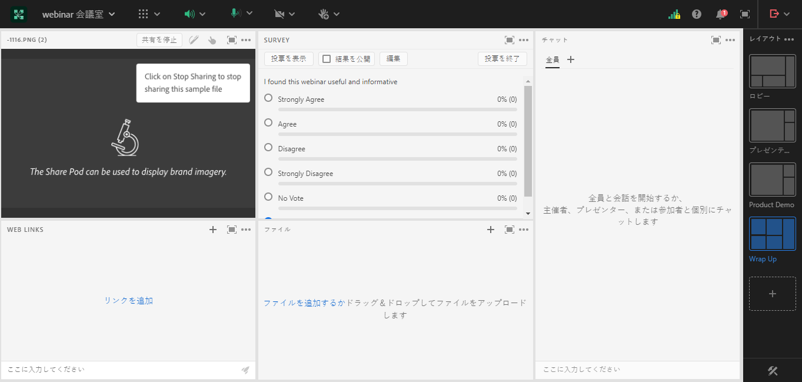
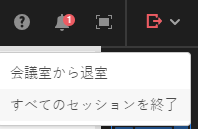

# インタラクティブウェビナーの設計 {#designing-interactive-webinars}

ニーズに合わせてウェビナーを設計する方法を説明します。

1. イベントを選択して、「**ウェビナーを設計**」クリックします。

   

1. 既存のウェビナールームを選択することも、新しく作成することもできます。 この例では、新しいウェビナールームを作成するので、**ルームを選択**&#x200B;ドロップダウンをクリックして、**新規インタラクティブウェビナールーム**&#x200B;を選択します。

   

   >[!NOTE]
   >
   >* ルームは、ミーティングを行うために使用されるオンラインスペースです。
   >
   >* 既存のウェビナールームを選択し、名前を変更する必要がある場合は、右側の「**ウェビナールーム名を変更**」ボタンをクリックします。
   >
   >* ドロップダウンには、以前に作成した既存のルームのみが表示され、他のホストのルームは表示されません。

1. テンプレートを選択します。

   

1. ウェビナープレビューが表示されます。

   

   >[!NOTE]
   >
   >デフォルトでは、「インタラクティブウェビナールーム名」フィールドに示されるルームの名前は、インタラクティブウェビナーイベントプログラムと同じ名前になります。 この名前はオーディエンスに表示されるので、ウェビナー自体のタイトルを反映するように変更できます。

   >[!TIP]
   >
   >ウェビナーは Marketo Engage インスタンスのデフォルト言語に設定されますが、プレビューの上のドロップダウンを使用して、ウェビナーごとに言語を変更できます。

1. 様々なレイアウトを選択してプレビューできます。 続行するには、「**テンプレートを使用**」をクリックします。

   

1. ウェビナーをすぐに調整することも、後で調整することもできます。 続行するには、**今すぐウェビナーを調整**&#x200B;をクリックしてください。

   

1. オーディオ／ビデオ環境設定を選択して、「**ルームに入る**」をクリックしします。

   

1. 選択したテンプレートが編集可能になりました。

   

1. 会議室とテンプレートについて詳しくは、[このAdobe ヘルプ記事](https://helpx.adobe.com/jp/adobe-connect/using/creating-arranging-meetings.html#creating_and_arranging_meetings){target="_blank"}の「会議室のテンプレートとレイアウト」の節を参照してください。

1. ウェビナーのデザインが完了したら、**会議室を終了**&#x200B;をクリックします。

   

## デザイン要素 {#design-elements}

**テンプレート**：配信されるウェビナーの目的に基づいてルームに提供される構造。 例えば、製品紹介ウェビナーをスケジュールする場合、画面共有がデモを見せるための必須のコンポーネントになります。 テンプレートは、特定のタイプのウェビナーの効果的な配信に必要な必須のコンポーネントが、ウェビナールームの設定中に確実に準備されるようにします。

**レイアウト**：ウェビナーの成功に必要な複数のコンポーネントを特定のテンプレートに配置する様々な方法のことを指します。 単一のテンプレートは、複数のレイアウトを持つことができ、そこから選択できます。 ウェビナーの必須コンポーネントは、テンプレート間で同じままです。 選択した配置は、ウェビナーを配信するユーザーやプレゼンターのスタイル／ニーズに最適です。

**ポッド**：ウェビナー中に特定のアクティビティを実行するテンプレート内のコンポーネント。 例えば、あるアクティビティでの参加者の反応を捉えるために投票を設定および配信することは、投票ポッドで処理できます。 同様に、メッセージを伝えたりカジュアルにやり取りしたりするための参加者とのチャットは、チャットポッドを通じて実現できるアクティビティです。 共有、メモ、ビデオ、チャット、参加者リスト、ファイル、Web リンク、投票、Q&amp;Aなど、他の複数のポッドを利用できます。

      **アンケート ポッド**：構造化されたフィードバック フォームをライブ セッション内で直接設計および配信できます。 調査ポッドは、複数の質問を一緒に提示できるようにすることで、既存の調査ポッド機能を拡張し、参加者のインサイトを収集するためのより合理的でまとまりのある方法を提供します。 [詳細情報](https://helpx.adobe.com/jp/adobe-connect/using/survey-pod.html){target="_blank"}

      **リソース ポッド**：以前のファイルとWeb リンク ポッドを置き換え、ライブセッション中にリソースを共有するための単一の統合方法を提供します。 [詳細情報](https://helpx.adobe.com/jp/adobe-connect/using/resources-pod.html){target="_blank"}

>[!MORELIKETHIS]
>
>[プレゼンターや共同司会者を追加する方法について詳しくは、こちらを参照してください](/help/marketo/product-docs/demand-generation/events/interactive-webinars/add-a-webinar-team.md){target="_blank"}
