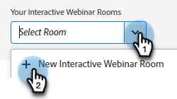
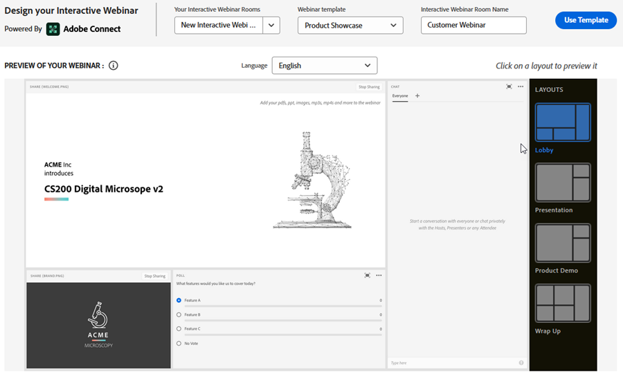

# インタラクティブな Web セミナーの設計 {#designing-interactive-webinars}

はじめに.

1. イベントを選択し、 **デザインウェビナー**.

   

1. 既存のウェビナールームを選択するか、新しく作成することができます。 この例では、新しく作成しているので、 **部屋を選択** ドロップダウンで「 」を選択します。 **新しいインタラクティブウェビナールーム**.

   

   >[!NOTE]
   >
   >部屋とは、会議の実施に使用するオンラインスペースです。

1. テンプレートを選択します。

   

1. オンラインセミナのプレビューが表示されます。

   

1. 様々なレイアウトを選択してプレビューできます。 続行するには、 **テンプレートを使用**.

   

1. ウェビナーは、すぐに調整することも、後で調整することもできます。 今からやろう。 クリック **ウェビナーを今すぐ絞り込む**.

   

1. オーディオ/ビデオの環境設定を選択し、 **部屋に入る**.

   

1. これで、選択したテンプレートが編集可能になります。

   

1. テキスト

https://helpx.adobe.com/in/adobe-connect/using/creating-arranging-meetings.html#creating_and_arranging_meetings??????

部屋：（正確には Connect のドキュメントから取得）ソース：https://helpx.adobe.com/in/adobe-connect/using/meeting-basics.html

Adobe Connectウェビナーは、複数のユーザーが使用できるライブインタラクティブなオンライン会議です。 部屋は、ウェビナーの実施に使用する永続的なオンラインの仮想空間です。 様々なディスプレイパネル（ポッド）やレイアウトが含まれます。 事前に作成された会議室レイアウトがいくつかあります。また、必要に応じて追加のカスタムレイアウトを作成して使用することもできます。 出席者は、コンピュータの画面やファイルの共有、チャット、オーディオやビデオの放送、インタラクティブなオンラインアクティビティへの参加を行うことができます。

テンプレート:

テンプレートとは、部屋に配信されるウェビナーの目的に基づいて部屋に提供される構造です。 例えば、マーケターが製品ショーケースウェビナーのスケジュールを設定したい場合、デモを表示するには、画面の共有が不可欠なコンポーネントになります。 このテンプレートは、ウェビナールームの設定時に、特定のタイプのウェビナーの効果的な配信に必要な必須コンポーネントを確実に配置します。

レイアウト:

Layout は、ウェビナーの成功を確実にするために必要な複数のコンポーネントが特定のテンプレートに配置される様々な方法を指します。 1 つのテンプレートに複数のレイアウトを設定し、マーケターが選択できるようにすることができます。 ウェビナーの基本的なコンポーネントは、テンプレート間で同じままになります。 マーケターが選択した配置は、オンラインセミナーを配信するマーケターやプレゼンターのニーズやスタイルに最適です。

ポッド:

ポッドとは、ウェビナー中に特定のアクティビティを実行するのに役立つ、テンプレート内のコンポーネントを指します。 例えば、投票ポッドで満たされる 1 つのアクティビティで参加者の応答をキャプチャするための投票の設定と配信を行います。 同様に、参加者とチャットしてメッセージを伝えたり、気軽にやり取りすることは、チャットポッドを通じて配信されるアクティビティになります。 共有、メモ、ビデオ、チャット、出席者リスト、ファイル、Web リンク、投票、Q&amp;A など、他の複数のポッドが Connect で使用できます。