# エンゲージメントダッシュボード {#engagement-dashboard}

Adobe Connectを活用したインタラクティブウェビナーでは、さまざまなポッドを使用して、チャット、質問と回答、クイズ、投票などで参加者を惹きつけます。 エンゲージメントダッシュボードでは、主要な指標とデータの視覚化を追跡することができます。

イベント中の参加者のアクティビティ、インタラクション、エンゲージメントの統合ビューを表示します。 ホストは、ライブイベントとオンデマンドイベントのパフォーマンスを確認し、セッション後に様々なレポートをダウンロードできます。 さらに、ダッシュボードから生成されたウェビナー後のレポートを使用して、セッションの効果を評価し、今後のコンテンツに反映させ、ウェビナー戦略全体を改善できます。

ダッシュボードは、世論調査の回答、チャットのアクティビティ、動画のインタラクションなど、さまざまな指標を追跡し、参加者の好みや行動に関する貴重なインサイトを提供します。 参加者のアクティビティとエンゲージメントレベルの包括的な概要を提供し、ホストがリアルタイムの参加、参加、インタラクションを監視できるようにします。

インタラクティブなウェビナーで、次の種類のセッションのエンゲージメントを表示できます。

* **ライブセッション**：参加者同士が積極的にエンゲージできるリアルタイムのオンラインセッションです。
* **オンデマンドセッション**: ライブイベントの録画は、独自のイベントとして利用できます。 新しい招待者は登録して録画を視聴できます。 登録後、イベント参加リンクが届き、終了後にイベントの録画が行われます。 ライブイベントに登録された参加者は、同じ参加リンクを使用して録画を表示することもできます。

## ダッシュボードを見る {#view-the-dashboard}

1. **[!UICONTROL マーケティングアクティビティ]**&#x200B;に移動します。

   

1. 目的の完了したイベントを選択します。

   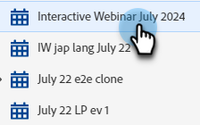

1. 概要で、**[!UICONTROL エンゲージメントダッシュボードを表示]**&#x200B;をクリックします。

   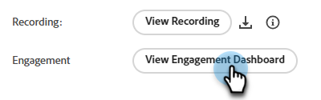

   >[!NOTE]
   >
   >エンゲージメントダッシュボードには、スケジュールされたイベントが終了してから45～120分後にアクセスできます。

## ダッシュボードの詳細 {#dashboard-details}

エンゲージメントダッシュボードでは、次の詳細を確認できます。

<table><tbody>
  <tr>
    <td><b>イベントの概要</td>
    <td>ライブセッションとオンデマンドセッションのパフォーマンスを包括的に把握できます。</td>
  </tr>
  <tr>
    <td><b>エンゲージメント</td>
    <td>ライブセッションのパフォーマンスの概要を説明します。</td>
  </tr>
  <tr>
    <td><b>インタラクション数</td>
    <td>ポッド間の参加者のエンゲージメントの詳細なビューを提供します。</td>
  </tr>
  <tr>
    <td><b>オンデマンド活動</td>
    <td>録音パフォーマンスの概要を表示します。</td>
  </tr>
  <tr>
    <td><b>参加者のアクティビティ</td>
    <td>エンゲージメントの統合ビューを提供します。</td>
  </tr>
  <tr>
    <td><b>レポートを読む</td>
    <td>様々なPodでのエンゲージメントのレポートをダウンロードします。</td>
  </tr>
</tbody>
</table>

### イベントの概要 {#event-summary}

このインターフェイスでは、ライブセッションとオンデマンドセッションのイベントのパフォーマンスを包括的に把握できます。 左側のパネルから、「イベントの概要」を選択して、全体的な指標を表示します。

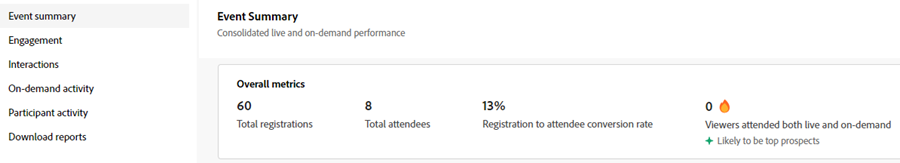

<table><tbody>
  <tr>
    <td><b>総登録数</td>
    <td>これは、イベントに登録した参加者の数を示します。</td>
  </tr>
  <tr>
    <td><b>合計参加者</td>
    <td>これは、イベントに参加した参加者の数を示します。</td>
  </tr>
  <tr>
    <td><b>登録者から参加者へのコンバージョン率</td>
    <td>これは、イベントに登録して参加した参加者の割合を示します。</td>
  </tr>
  <tr>
    <td><b>ライブとオンデマンドの両方に参加した視聴者</td>
    <td>これは、ライブイベントとオンデマンドイベントの両方に参加した参加者の数を示しています。</td>
  </tr>
</tbody>
</table>

### エンゲージメント {#engagement}

ライブセッションのイベントのパフォーマンスの概要を提供します。 主な指標、時間の経過に伴うエンゲージメント、参加者とのインタラクションなどです。 主催者は、イベントの成果を評価し、改善すべき領域を特定することができます。

左側のパネルから「**[!UICONTROL エンゲージメント]**」を選択して、ライブセッションのパフォーマンスを表示します。 **[!UICONTROL エンゲージメントの概要（PDF）]**&#x200B;をクリックして、ライブセッションのパフォーマンス概要をダウンロードします。 概要には、さまざまなセクションのデータが記載されています。

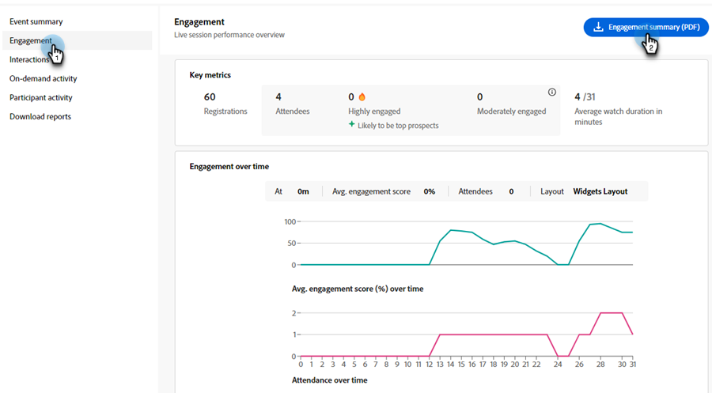

**主要指標**

ライブセッションでの登録数、出席者数、エンゲージメント数を表示します。

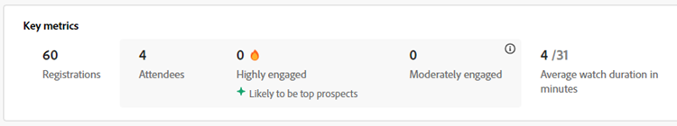

<table><tbody>
  <tr>
    <td><b>登録</td>
    <td>ライブセッションの登録数を表示します。</td>
  </tr>
  <tr>
    <td><b>参加者</td>
    <td>ライブセッションに参加している参加者の数を表示します。</td>
  </tr>
  <tr>
    <td><b>非常にエンゲージ率の高い</td>
    <td>ライブセッション中にエンゲージ率が高く、最も見込み客になりそうな参加者の数を表示します。</td>
  </tr>
  <tr>
    <td><b>中程度のエンゲージメント</td>
    <td>ライブセッション中に適度にエンゲージした参加者の数を表示します。
     <b>注</b>：これらの数値は、セッション中のエンゲージメントとインタラクションに基づいて計算されます。</td>
  </tr>
  <tr>
    <td><b>平均視聴時間（分）</td>
    <td>ライブセッションの平均視聴時間（分）を表示します。</td>
  </tr>
</tbody>
</table>

**エンゲージメントの推移**

エンゲージメントグラフから、ライブセッション中の平均エンゲージメントを時系列で確認できます。 ホストは、エンゲージメントレベルの変動を監視して、インタラクションの多い重要な瞬間や少ない瞬間を特定できます。 エンゲージメントした参加者が異なるレイアウトで獲得した平均エンゲージメントスコアの量を確認できます。

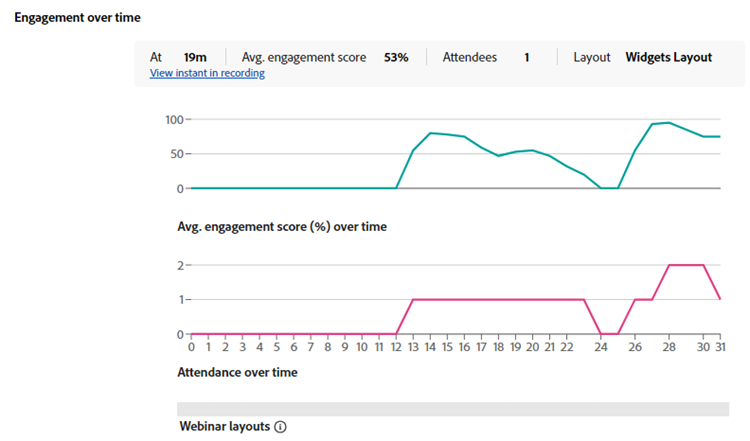

グラフの上にマウスポインターを置くと、次の情報が表示されます。

* エンゲージメントレベルを監視する時間。
* その時点での平均エンゲージメントスコアです。
* その時点でエンゲージされた参加者の数。
* 当時のエンゲージメントのレイアウトです。
* エンゲージメントが高かったり低かったりする録画中のインスタントを表示するには、**[!UICONTROL 録画中のインスタントを表示]**&#x200B;を選択します。
* セッション内の平均エンゲージメントスコア（パーセント）
* セッション中の出席率の推移
* イベント中に部屋の中でさまざまなレイアウトを使用した場合、さまざまなウェビナーレイアウトでのエンゲージメントが表示されます。 様々なレイアウトにおけるエンゲージメントの増減を関連付けるのに役立ちます。

**参加者のインタラクション**

様々なポッドからの参加者のインタラクションを表示できます。 回答された投票、質問された質問、チャットでのやり取り、少なくとも1つのリンクのクリック、少なくとも1つのファイルのダウンロードなどの情報を提供します。

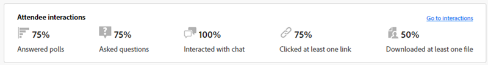

「**[!UICONTROL インタラクションに移動]**」を選択して、投票、QnAの指標、およびセッション中の参加者の反応からの応答を表示します。 インタラクションからポッドをまたいで参加者がどのようにエンゲージしているかを確認し、以下のセクションからインタラクションレポートをダウンロードします。

### インタラクション数 {#interactions}

参加者がどのようにインタラクションを行い、セッションに参加したかをインタラクションから確認できます。 投票への回答、QnA指標、参加者からの反応、各ポッドからのリンクやファイルのドロップなどを追跡できます。 ホストは、これらのポッドのインタラクションレポートをダウンロードして、より優れた分析を実行することもできます。 これらのインタラクションを分析することで、トレンドを特定し、戦略を調整して、よりインタラクティブで魅力的な環境を促進できます。

左側のパネルで「**[!UICONTROL インタラクション]**」を選択して、ポッド間での参加者のエンゲージメントを表示します。

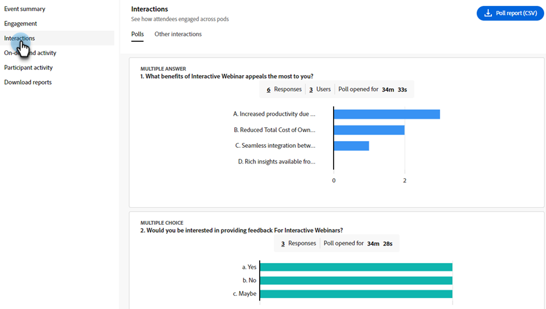

メニューバーから「**[!UICONTROL 投票]**」タブを選択して、投票に追加された質問と回答を表示します。 このタブには、次の情報が表示されます。

* **[!UICONTROL 調査レポート （CSV）]**&#x200B;を選択して、調査ポッドでのインタラクションのレポートをダウンロードします。
* 世論調査とそのタイプ。
* 回答数と、ポッドフォームが開いてエンゲージした期間。
* 「**すべての`<number>`件の回答を表示**&#x200B;する」を選択して、ダイアログウィンドウに表示します。

メニューバーから「**[!UICONTROL その他のインタラクション]**」タブを選択して、他のポッドのエンゲージメントを表示し、レポートをダウンロードします。

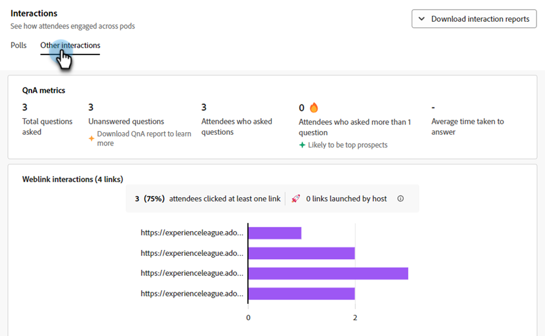

ドロップダウンから「**[!UICONTROL インタラクションレポートをダウンロード]**」を選択して、異なるポッドのレポートをダウンロードします。 より良いトラッキングのために、QnA レポート、リンクとファイルレポート、および反応レポートをここからダウンロードしてください。

ポッド間のエンゲージメント情報は、さまざまなセクションで利用できます。

**QnA指標**

Q&amp;A ポッドの次の属性を表示します。

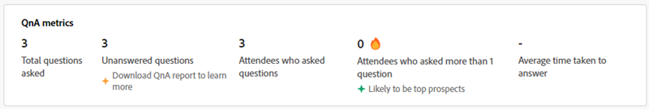

* 合計の質問です。
* 未回答の質問の数。
* 質問した参加者の数。
* 上位の見込み客になる可能性が高い複数の質問をした参加者の数。
* 質問への回答にかかる平均時間。

**反応**

セッション中の同意、不同意、拍手、笑いなどの参加者の反応をここから確認できます。

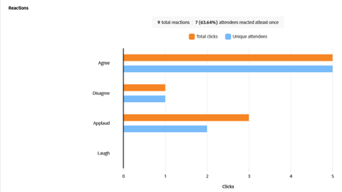

反応グラフから、次の詳細を表示します。

* 合計反応
* 少なくとも1回は反応した参加者の数
* 合計クリック数
* ユニーク参加者
* ユニーク参加者に関するクリック総数に基づく反応のクリック数の傾向。

**Weblinks ポッド**

セッション中にweblinks ポッドに追加されたリンクと、共有リンクのクリック数を表示します。 Weblinks ポッドを使用すると、ウェビナー外のソースからリンクを追加して、エンゲージメントを生成できます。

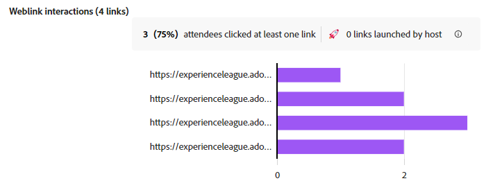

グラフから、次の詳細を表示します。

* Weblinks ポッドに追加されるリンク。
* 少なくとも1つのリンクをクリックした参加者の数。
* ホストによって起動されたリンクの数。
* weblinks ポッドに追加された各リンクのユニーククリックの傾向。

**ファイルポッド**

セッション中にファイルポッドに追加されたファイルと、一意のダウンロード数を表示します。 ファイルポッドを使用すると、ファイルを追加し、エンゲージメントを生成するためのリソースを提供できます。

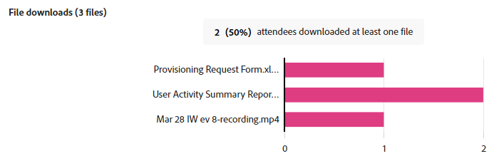

グラフから、次の詳細を表示します。

* ファイルポッドに追加されるファイルの名前。
* 1つ以上のファイルをダウンロードした参加者の数。
* Weblinks ポッドに追加された各ファイルのユニーク ダウンロードのトレンド。

### オンデマンド活動 {#on-demand-activity}

左側のパネルから、**[!UICONTROL オンデマンドアクティビティ]**&#x200B;を選択して、録画の概要を表示します。 オンデマンドアクティビティのレポートをダウンロードすることもできます。

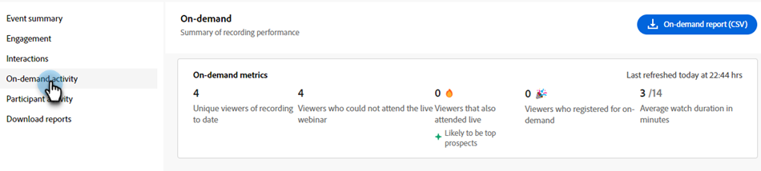

オンデマンドアクティビティで、次の指標を表示します。

* **[!UICONTROL オンデマンドレポート （CSV）]**&#x200B;をクリックして、オンデマンド指標をダウンロードします。
* ダッシュボードが最後に更新されるまでのユニーク視聴者数。
* 録画を閲覧したが、ウェビナーに参加できなかった視聴者の数。
* ウェビナーに参加し、録画を閲覧した視聴者の数。 彼らは見込み客で一番になりそうだ。
* オンデマンドセッションに登録された視聴者数。
* 録画の平均視聴時間（分）。

### 参加者のアクティビティ {#participant-activity}

左側のパネルから、**[!UICONTROL 参加者アクティビティ]**&#x200B;を選択して、各参加者のエンゲージメントレベルに関する統合情報を表示します。 このエンゲージメントが参加者エンゲージメントレベルからレベルでどのように分類されるかを表示します。 **[!UICONTROL ユーザーアクティビティレポート （CSV）]**&#x200B;をクリックしてレポートをダウンロードし、追跡を強化します。

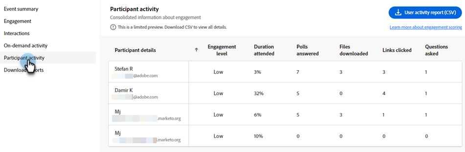

テーブルから次の詳細を表示します。

* 各参加者のエンゲージメントレベル。 高から低、またはその逆にソートすることもできます。
* 参加者が参加したセッションの期間。
* 参加者が回答した世論調査。
* 参加者がファイルポッドからダウンロードしたファイル。
* Weblinks ポッドから参加者がクリックしたリンク。
* QnA ポッドの参加者による質問。

### レポートを読む {#download-reports}

ホストとして一元化されたハブから、様々なアクティビティやポッドに関するレポートをダウンロードします。

1. 左側のパネルから、「**[!UICONTROL レポートをダウンロード]**」を選択します。

1. **[!UICONTROL すべてをダウンロード （.zip）]**&#x200B;を選択すると、すべてのアクティビティとポッドのレポートを一度にダウンロードできます。

   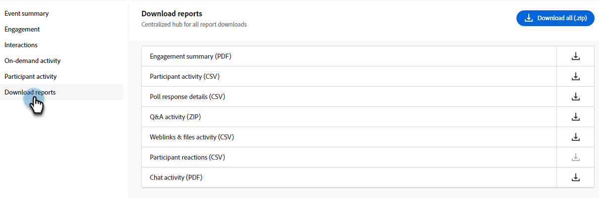

>[!NOTE]
>
>各レポートの横にあるダウンロードアイコンをクリックして、個別にダウンロードします。

## 参加者のエンゲージメントレベル {#participant-engagement-level}

企業はAdobe Connectを使用して、詳細にカスタマイズされた、ブランドに即した、エンゲージメント主導のウェビナーを提供できます。 投票、チャット、Q&amp;A、反応などのインタラクティブツールは、参加者の関心を高め、単なる登録と出席データ以上のものを収集するのに役立ちます。 参加者がこれらのインタラクティブな機能を利用した後では、エンゲージメントデータを使用して、参加者を「高」、「中」、「低」の3つのエンゲージメントレベルに分類します。 エンゲージメントレベルを使用して、オーディエンスセグメントの更新、人物スコアの更新、営業部門へのアラート通知を行うことができます。

各参加者のエンゲージメントレベルを分類するための基準について説明します。

<table><thead>
  <tr>
    <th>エンゲージメントレベル</th>
    <th>分類基準</th>
  </tr></thead>
<tbody>
  <tr>
    <td>高</td>
    <td>以下のすべての基準を満たす参加者：
    <li>参加期間は、イベント合計時間の80%以上です。</li>
    <li>すべての多肢選択質問（MCQ）および複数回答（MA）投票に回答するか、少なくとも1つのファイルをダウンロードするか、投稿されたチャット数が5つ以上です。</li>
    <li>参加者はQ&amp;A ポッドで少なくとも1つの質問をしています。</li></td>
  </tr>
  <tr>
    <td>中</td>
    <td>以下のすべての基準を満たす参加者：
    <li>参加者のエンゲージメントレベルが高いと判断されない。</li>
    <li>参加期間は、イベント合計時間の60%以上です。</li>
    <li>参加者が次のいずれかの操作を実行しました：
    <ul>
    <li>少なくとも1回のアンケートにご回答ください。
    <li>質疑応答ポッドで少なくとも1つの質問をしました。<li>少なくとも1つのファイルをダウンロードしました。
    <li>少なくとも1つのweb リンクをクリックしました（未開始）。<li>3つ以上のチャットを投稿。</ul></li>
    </td>
  </tr>
  <tr>
    <td>低</td>
    <td>すべての参加者は、高または中に分類されていません。</td>
  </tr>
</tbody></table>
