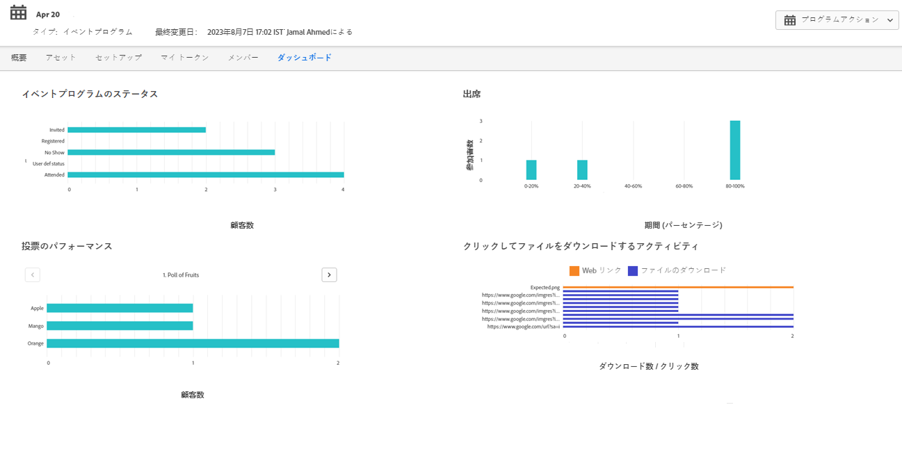
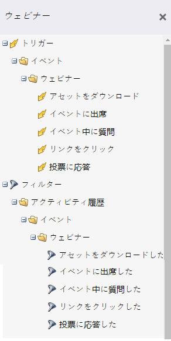
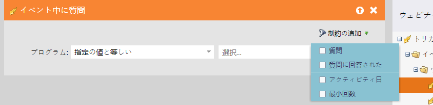
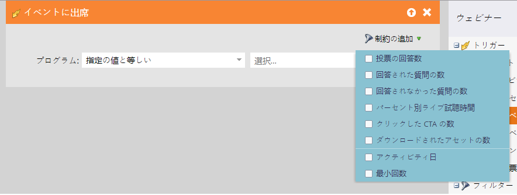
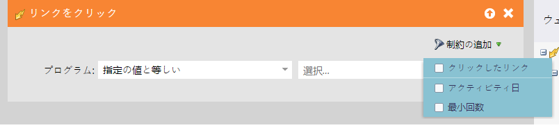
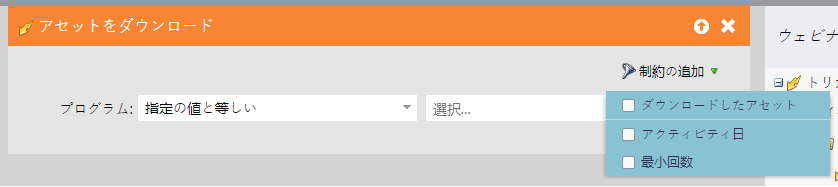
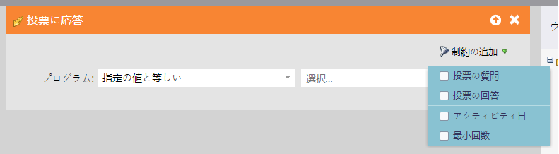

# イベントワークフロー {#event-workflows}

ウェビナーが完了したら、「ダッシュボード」タブに移動して、集計されたパフォーマンスを確認します。

>[!NOTE]
>
>ウェビナーが完了していない場合や、何らかの理由でデータを受け取っていない場合、「ダッシュボード」タブはまだ使用できません。

## ダッシュボードウィジェット {#dashboard-widgets}

ダッシュボードは 4 つのウィジェットで構成されています。

**イベントプログラムステータス**:そのイベントの各種プログラムステータスと、そのプログラムステータス値を現在保持しているプログラムのメンバー数を表示します。

**出席**:ウェビナーに参加した様々なメンバーの出席期間を、全体のウェビナー期間と比較して割合で示します。

**ポールの効果**:Adobe Connectのウェビナー中に開始された様々な投票と、各回答の投票に参加し回答したメンバーの分布を表示します。

**クリックしてファイルをダウンロードアクティビティ**:ウェビナーに参加し、その特定のアクションを実行した様々なメンバーが、Adobe Connectのウェビナー中にクリックしたファイルおよび Web リンクのダウンロード数を提供します。

## トリガーとフィルター {#triggers-and-filters}

インタラクティブなウェビナー関連のトリガーとフィルターを使用して、イベントプログラム内の特定の人々のグループを見つけます。

各トリガー/フィルターには、追加の制約があり、そのグループの焦点を絞ったサブセットをキャプチャできます。

**イベント中に質問** ( フィルターのバージョン：（イベント中に質問がありました）

**イベントに出席** ( フィルターのバージョン：イベントに参加済み )

**リンクのクリック数** ( フィルターのバージョン：リンクをクリック済み )

**アセットをダウンロード** ( フィルターのバージョン：（アセットのダウンロード）

**投票に応答します** ( フィルターのバージョン：投票に回答 )

