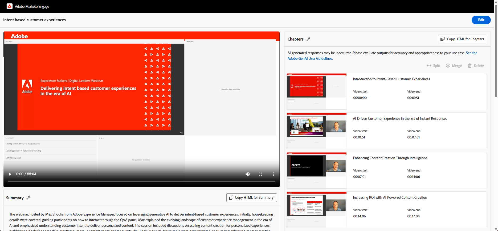

# GenAI の機能 {#gen-ai-features}

録画したウェビナーのチャプターと概要を自動的に生成し、オーディエンスがアクセスしやすく、簡単に移動できるようにします。

* **自動チャプター生成**:AI を利用したテクノロジーが、ウェビナーコンテンツのチャプターを作成します。

* **AI で生成された概要**：ウェビナーの自動テキスト概要を取得します。

* **編集可能なコンテンツ**：手動および AI を利用した編集機能を使用して、生成されたチャプターおよび概要を必要に応じて変更します。

* **容易な統合**:HTML コードを選択した web ページエディターにコピーすることで、ランディングページに章や概要を簡単に追加できます。

## GenAI の有効化 {#enable-genai}

>[!PREREQUISITES]
>
>これらの機能を使用する前に、まずAdobe GenAI の利用条件に同意する必要があります。 詳細については、Adobe アカウントチーム（担当のアカウントマネージャー）にお問い合わせください。

Adobe GenAI の利用条件に同意したら、次に、個々のユーザーに対して有効にします。 これを行うには、**[!UICONTROL 管理者]**/**[!UICONTROL インタラクティブウェビナー]** に移動し、GenAI にアクセスする必要があるユーザーを選択します。

{width="800" zoomable="yes"}

## アクセス方法 {#how-to-access}

1. Marketo Engage インタラクティブウェビナーのウェビナーの概要ページに移動します。

1. オンデマンドウェビナーを実施した後、AI が録画を処理するまで 30～60 分待ちます。 「生成」ボタンが使用可能になったらクリックできるようになります。

1. **[!UICONTROL GenAI コンテンツを表示]** をクリックします。

   {width="800" zoomable="yes"}

1. 新しいタブが開き、AI で生成されたチャプターとテキストの概要が表示されます。

## 生成されたコンテンツを編集 {#edit-generated-content}

1. 生成されたチャプターと概要を確認します。

1. 変更が必要な場合は、「**[!UICONTROL 編集]** ボタンをクリックします。

   変更を加える：

   * 概要やチャプタータイトルのテキストを編集します。

   * 必要に応じてタイムスタンプフィールドの値を編集してタイムスタンプを調整します。

   * 不要なチャプターを選択し、「削除 **[!UICONTROL をクリックして、削除]** します。

   * 連続する 2 つのチャプターを選択して **[!UICONTROL 結合]** をクリックし、結合します。

      * 選択した 2 つのチャプターで構成される複合チャプターが生成されます

      * 複数のチャプターを結合するには、一度に 2 つのチャプターを実行する必要があります

     {width="800" zoomable="yes"}

   >[!NOTE]
   >
   >* 必要に応じて、「_サムズアップ_」アイコンまたは「 アイコンを使用して、生成されたチャプター/概要の品質を評価できます。 また、フラグアイコン  をクリックして、問題のあるコンテンツにフラグを立てることもできます。
   >
   >* 初期概要に満足できない場合は、「**[!UICONTROL 概要を再生成]**」ボタンをクリックすると、別のバージョンが生成されます。

1. 画面の右上にある **[!UICONTROL 保存]** ボタンをクリックして、変更を保存します。

## 生成されたコンテンツを使用 {#use-generated-content}

使用するコンテンツをコピーした後、それを選択したエディター（Marketo Engage ランディングページエディターなど）に貼り付けて、必要な調整を行います。

### 概要 {#summary}

**HTMLをコピー** - 「**[!UICONTROL HTMLをコピー]**」ボタンをクリックすると、HTML コードで書式設定されたテキストがすべてテーブル内に取り込まれます。

**テキストのみ** - テキストのみを表示する場合は、テキストをハイライト表示し、Ctrl/Cmd+C キー（または右クリック）を押してコピーします。

### 章 {#chapters}

**HTMLをコピー** - 「**[!UICONTROL HTMLをコピー]**」ボタンをクリックすると、すべての録画とそのチャプターがビデオプレーヤー内でフォーマットされます。

## オーディエンスのターゲット設定

スマートキャンペーン/リストフィルターやトリガーを活用して、各閲覧者が何を視聴したか、回数などを確認し、パーソナライズされたフォローアップを可能にします。

{width="800" zoomable="yes"}

* **トリガー**: _Web ページ上のクリック数_、_Web ページを訪問_

* **フィルター**:_Web ページ上のクリックされたリンク_、_訪問された Web ページ_

「リンク」はチャプターの名前で、「web ページ」はオンデマンド web セミナーをホストするページです。

>[!TIP]
>
>[ 制約 ](/help/marketo/product-docs/core-marketo-concepts/smart-lists-and-static-lists/using-smart-lists/add-a-constraint-to-a-smart-list-filter.md){target="_blank"} を使用して、ターゲットオーディエンスをさらに絞り込みます。

## 注意事項 {#things-to-note}

* チャプターの削除または結合は、ビデオコンテンツそのものではなく、チャプタースタックにのみ影響します。 これらのアクションは永続的です。

* GenAI 機能は柔軟で、Marketo Engageの機能だけでなく、様々な web ページエディターで使用できます。

* 常に変更内容をプレビューして、必要な機能と外観を確保します。

* ウェビナーを削除すると、GenAI コンテンツも削除されます。

* ウェビナーを削除せずに GenAI コンテンツを削除する場合は、Adobe アカウントチーム（アカウントマネージャー）に問い合わせるか、`marketo-webinar-genai-alerts@adobe.com` にデータ削除リクエストを送信します。
