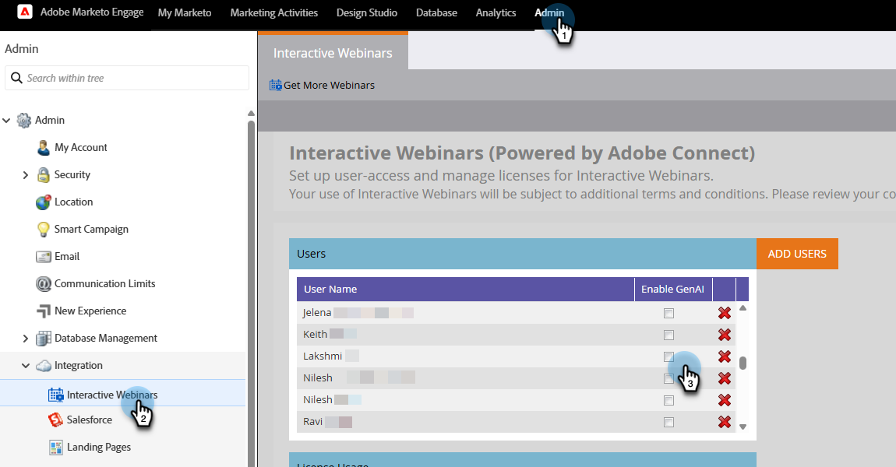
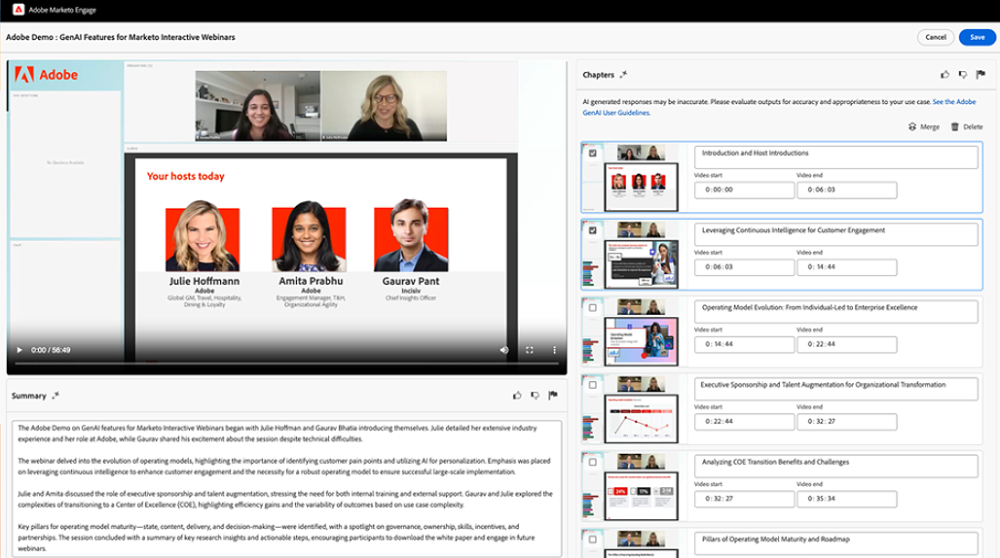
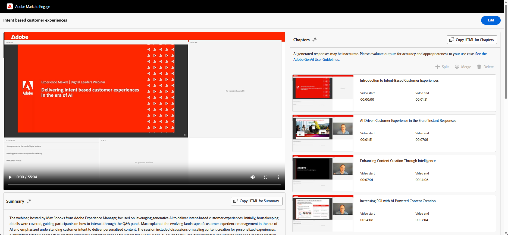
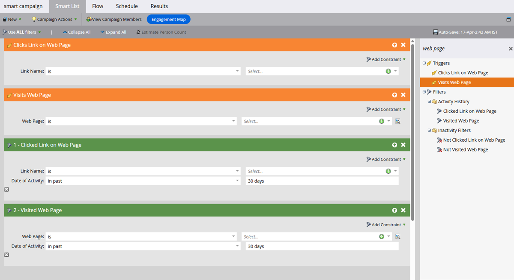

# 生成AIの機能 {#gen-ai-features}

録画したウェビナーの章や要約を自動的に生成し、オーディエンスがよりアクセスしやすく、簡単に操作できるようにします。

* **チャプターの自動生成**:AIを活用したテクノロジーにより、ウェビナーコンテンツにチャプターが作成されます。

* **AIが生成した概要**：ウェビナーの自動テキスト概要を取得します。

* **AI ベースのブログ生成**: ウェビナーからブランドに即したブログコンテンツを自動的に生成できます。

* **編集可能なコンテンツ**：手動およびAIを活用した編集機能を使用して、必要に応じて生成されたチャプターと概要を変更します。

* **シームレスな統合**: HTML コードを任意のweb ページエディターにコピーして、ランディングページに章と概要を追加します。

## 生成AIを有効にする {#enable-genai}

>[!PREREQUISITES]
>
>これらの機能を使用する前に、まずAdobe GenAIの利用条件に同意する必要があります。 まだの場合は、Adobe アカウントチーム（アカウントマネージャー）にお問い合わせください。

Adobe GenAIの利用条件に同意したら、次のステップは個々のユーザーが利用できるようにすることです。 これを行うには、**[!UICONTROL 管理者]**/**[!UICONTROL インタラクティブウェビナー]**&#x200B;に移動し、生成AIにアクセスする必要があるユーザーを選択します。

{width="800" zoomable="yes"}

## アクセス方法 {#how-to-access}

1. Marketo Engage インタラクティブウェビナーのウェビナーの概要ページに移動します。

1. オンデマンドウェビナーを実施した後、AIが録画を処理するのに30～60分待ちます。 「生成」ボタンは、使用可能になるとクリックできるようになります。

1. 「**[!UICONTROL 生成AI コンテンツを表示]**」をクリックします。

   {width="800" zoomable="yes"}

1. AIが生成した章とテキストの要約が表示された新しいタブが開きます。

## 生成コンテンツを編集 {#edit-generated-content}

1. 生成された章と概要を確認します。

1. 変更が必要な場合は、「**[!UICONTROL 編集]**」ボタンをクリックします。

   修正を行う：

   * 概要や章タイトル内のテキストを編集します。

   * タイムスタンプフィールドの値を編集して、必要に応じてタイムスタンプを調整します。

   * 不要なチャプターを選択し、**[!UICONTROL 削除]**&#x200B;をクリックして削除します。

   * 2つの連続したチャプターを選択し、**[!UICONTROL 結合]**&#x200B;をクリックして結合します。

      * AIは、選択した2つのチャプターで構成される複合チャプターを生成します

      * 複数の章を結合するには、一度に2つの章を結合する必要があります

     {width="800" zoomable="yes"}

   >[!NOTE]
   >
   >* 必要に応じて、生成されたチャプター/概要の品質を&#x200B;_サムズアップ_ または&#x200B;_サムズダウン_  アイコンで評価できます。 また、フラグアイコン をクリックすると、問題のあるコンテンツにフラグを付けることもできます。
   >
   >* 最初の要約に満足しない場合は、「**[!UICONTROL 要約を再生成]**」ボタンをクリックすると、別のバージョンが生成されます。

1. 画面の右上にある「**[!UICONTROL 保存]**」ボタンをクリックして、変更を保存します。

## 生成コンテンツの使用 {#use-generated-content}

使用するコンテンツをコピーしたら、任意のエディター（Marketo Engage ランディングページエディターなど）に貼り付け、必要な調整を行います。

### 概要 {#summary}

**HTMLをコピー** – 「**[!UICONTROL HTMLをコピー]**」ボタンをクリックして、すべてのテキストを取得し、HTML コードで表内に書式設定します。

**テキストのみ** - テキストのみをコピーする場合は、テキストをハイライト表示し、Ctrl/Cmd+C （または右クリック）を選択します。

### 章 {#chapters}

**HTMLをコピー** - **[!UICONTROL HTMLをコピー]** ボタンをクリックすると、ビデオプレーヤー内ですべてのレコーディングとそのチャプターがフォーマットされます。

## オーディエンスのターゲティング

スマートキャンペーン/リストフィルターやトリガーを活用して、各視聴者が何を閲覧したか、何回閲覧したかなどを確認し、パーソナライズされたフォローアップを可能にします。

{width="800" zoomable="yes"}

* **トリガー**: _Web ページのリンクをクリック_、_Web ページへの訪問_

* **フィルター**: _Web ページのリンクをクリック_、_訪問したWeb ページ_

「リンク」は章の名前、「web ページ」はオンデマンドウェビナーをホストするページです。

>[!TIP]
>
>[制約](/help/marketo/product-docs/core-marketo-concepts/smart-lists-and-static-lists/using-smart-lists/add-a-constraint-to-a-smart-list-filter.md){target="_blank"}を使用して、ターゲットオーディエンスをさらに絞り込みます。

## 注意事項 {#things-to-note}

* チャプターの削除または結合は、チャプタースタックにのみ影響し、ビデオコンテンツ自体には影響しません。 これらのアクションは永続的です。

* 生成AI機能は柔軟性が高く、Marketo Engageの機能だけでなく、さまざまなweb ページエディターでも使用できます。

* セミナー室で開催されるセッションのみがブログの作成が可能です。 セミナールームは、イベントモジュールまたはセミナー（共有ルーム/イベント）ライセンスを持つアカウントでのみ利用できます。

* 必要な機能と外観を確保するために、常に変更をプレビューしてください。

* また、ウェビナーを削除すると、生成AIのコンテンツも削除されます。

* ウェビナーを削除せずにGenAI コンテンツを削除する場合は、Adobe アカウントチーム（アカウントマネージャー）にお問い合わせいただくか、データ削除リクエストを`marketo-webinar-genai-alerts@adobe.com`に送信してください。
