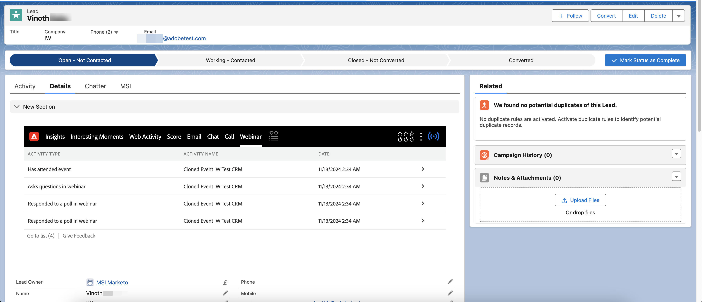

# Marketo セールスインサイトのインタラクティブウェビナー {#interactive-webinars-in-marketo-sales-insight}

Marketo Sales Insightのインタラクティブウェビナーを使用すると、SalesforceのMarketo Sales Insight（MSI）プラグインでウェビナーのアクティビティを利用できます。

>[!PREREQUISITES]
>
>この機能は、[Marketo Sales Insight](https://business.adobe.com/jp/products/marketo/sales-intelligence-engagement.html) アドオンを購入したユーザーのみがサポートされています。

アクティビティがMarketo Engageに登録されると（ウェビナーがAdobe Connectで完了した後）、MSI プラグインを介してリアルタイムでSalesforceに同期されます。

Marketo Engageで使用できるようになったすべてのアクティビティが同期されます。 それらの活動は次のとおりです。

* イベントへの参加
* 投票に参加
* 質問の回答
* リンクをクリック
* アセットをダウンロード

また、これらのアクティビティに関連するあらゆる属性が、セールス担当者が個々のリードを確認して対応するために利用できます。 アクティビティ情報は、汎用インサイト セクションと個別のウェビナータブで入手できます。

「インサイト」セクションでは、リードタイムラインのグラフに、過去90日間に同期したアクティビティを週ごとにハイライトするウェビナー用の別のスイムレーンが含まれています。 特定の週を選択する場合、アクティビティは1日ごとに別のセクションに表示されます。 個々のアクティビティを拡大して、詳細を表示できます。

{width="800" zoomable="yes"}

別の「ウェビナー」タブでは、すべてのアクティビティ（およびその日付）も表形式で一覧表示されます。

{width="800" zoomable="yes"}
