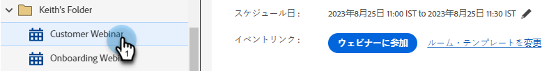
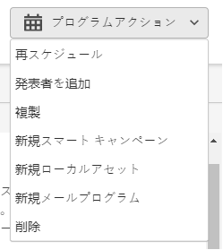
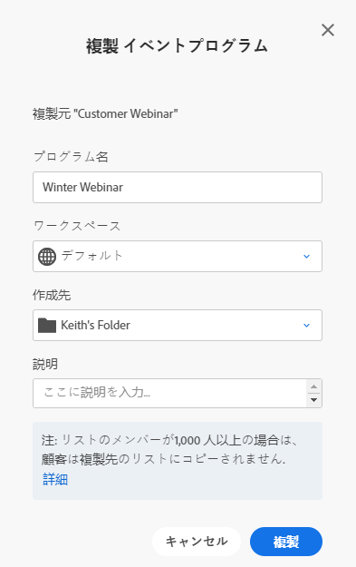
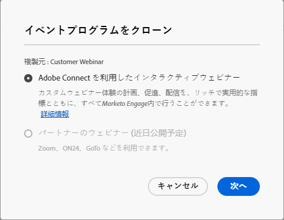

# インタラクティブ Web セミナーの変更または削除 {#modify-or-delete-an-interactive-webinar}

はじめに.

## インタラクティブ Web セミナーの変更 {#modify-an-interactive-webinar}

1. 目的のイベントプログラムを選択し、 **部屋/テンプレートを変更**.

   

1. テキスト

PICC

## インタラクティブなウェビナーの再スケジュール {#reschedule-an-interactive-webinar}

1. 目的のイベントプログラムを選択し、現在スケジュールされている日時の横にある鉛筆アイコンをクリックします。

   

1. カレンダーアイコンをクリックし、新しい日時を選択して、 **保存**.

   

## インタラクティブなウェビナーの複製 {#clone-an-interactive-webinar}

1. 目的のイベントプログラムを選択します。

   

1. プログラムアクションドロップダウンをクリックし、「 」を選択します。 **複製**.

   

   >[!TIP]
   >
   >ツリー内のイベントプログラムを右クリックし、「 」を選択することもできます。 **複製** そこから

## インタラクティブなウェビナーの削除 {#delete-an-interactive-webinar}

1. 目的のイベントプログラムを選択します。

   

1. プログラムアクションドロップダウンをクリックし、「 」を選択します。 **削除**.

   

   >[!TIP]
   >
   >ツリー内のイベントプログラムを右クリックし、「 」を選択することもできます。 **削除** そこから
