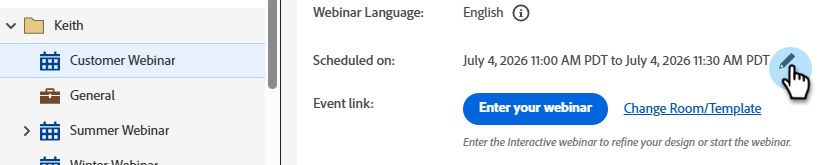

# インタラクティブウェビナーの変更または削除 {#modify-or-delete-an-interactive-webinar}

インタラクティブウェビナーに変更を加える方法を説明します。

## インタラクティブウェビナーの変更 {#modify-an-interactive-webinar}

1. 目的のイベントプログラムを選択して、「**ルーム / テンプレートを変更**」をクリックします。

   

1. ルームがロードされます。ルームを変更するには、ルームドロップダウンからルームを選択します。単にテンプレートを更新するには、「**ルームを使用**」をクリックします。

   

>[!NOTE]
>
>ルームの変更はオプションであり、テンプレートを更新する必要はありません。

1. 「**今すぐウェビナーを調整**」をクリックします。

   

1. オーディオ／ビデオ環境設定を選択して、「**ルームに入る**」をクリックしします。

   

1. 修正を完了したら、「**ルームから退出**」をクリックします。

   

## インタラクティブウェビナーの再スケジュール {#reschedule-an-interactive-webinar}

1. 目的のイベントプログラムを選択して、現在スケジュールされている日時の横にある鉛筆アイコンをクリックします。

   

1. カレンダーアイコンをクリックし、新しい日時を選択して、「**保存**」をクリックします。

   

## インタラクティブウェビナーの複製 {#clone-an-interactive-webinar}

1. 目的のイベントプログラムを選択します。

   

1. プログラムアクションドロップダウンをクリックして、**複製**&#x200B;を選択します。

   

   >[!TIP]
   >
   >また、ツリーのイベントプログラムを右クリックして、そこから「**複製**」を選択することもできます。

1. 複製したプログラムに名前を付けて、ワークスペースおよび宛先（プログラムを別の場所で実行したい場合）を設定し、「**保存**」をクリックします。

   

1. 「**次へ**」をクリックします。

   

   >[!NOTE]
   >
   >現時点では、複製したインタラクティブウェビナーをインタラクティブウェビナーとしてのみ保存できます。複製したウェビナーのパートナーウェビナー（例えば、Zoom、ON24 など）としての保存は、まもなく利用できます。

1. 複製したウェビナー用の設定を選択して、「**複製**」をクリックします。

   

## インタラクティブウェビナーの削除 {#delete-an-interactive-webinar}

>[!NOTE]
>
>テストウェビナーを作成する場合は、そのウェビナーのライセンスが利用されないように、開始時間より前に削除する必要があります。

1. 目的のイベントプログラムを選択します。

   

1. プログラムアクションドロップダウンをクリックして、**削除**&#x200B;を選択します。

   

   >[!TIP]
   >
   >また、ツリーのイベントプログラムを右クリックして、そこから「**削除**」を選択することもできます。

1. 「**削除**」をクリックします。

   

   >[!IMPORTANT]
   >
   >プログラムにローカルアセットがある場合は、それらも削除されます。
