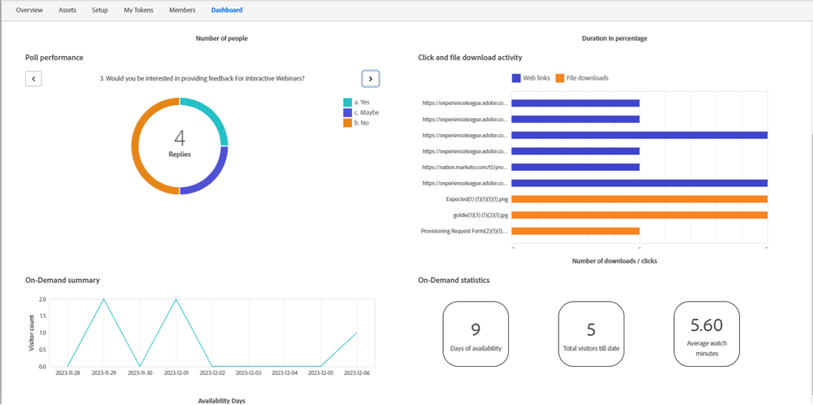

# オンデマンドウェビナー {#on-demand-webinars}

オンデマンド Web セミナーは、イベントに登録して出席しなかったリードをキャプチャおよび絞り込みますが、レコーディングを見てイベントに関する情報を取得したいと考えています。 名前、電子メール ID、監視日/期間などの情報をMarketo Engageで取り込み、これらの番組なしのリードをターゲットにするために使用できます。

イベント前に登録者と共有されたウェビナー参加 URL を使用して、オンデマンド録画を視聴できます。 ライブイベントに参加しなかった登録者（プログラムステータスが「番組なし」のリードなど）がウェビナー参加 URL をクリックすると、そのリードのプログラムステータスが「番組なし」から「オンデマンドで出席」に変わります。 イベントをライブで視聴し、ステータスが「出席」のリードのプログラムステータスは、参加 URL にアクセスしてオンデマンド録画を視聴した場合には影響を受けません。

Adobe Connectは、インタラクティブ Web セミナーを強化する技術で、録画を視聴するリードに関する訪問と視聴期間を追跡し、毎日Marketoに情報を報告します。 録画は、イベント後 30 日間、参加 URL で利用できます。 期間は変更できません。

Marketoは、以下のウィジェットを利用して、「ダッシュボード」タブに On-Demand Webinars の監視統計を表示します。

* オンデマンド概要：指定した日のイベント後に録画を視聴した訪問者数の概要（番組なし）を表示します

* オンデマンドの統計：このウィジェットは次の情報を提供します。
   * オンデマンド録画を表示できる日数 — 30 日間の録画可能期間の終わり近くに電子メールキャンペーンを実行するなどのアクションをマーケターが実行するのに役立ちます。
   * オンデマンドウェビナーの全体的な訪問者数 — オンデマンド録画をこれまで視聴したすべての No-Show 登録者の数。
   * すべての訪問者の平均視聴時間（分） — マーケターは、録画の視聴量と、特定の視聴時間を超えるリードをターゲティングするために使用できるスマートキャンペーンを把握できます。

インタラクティブ Web セミナーのフィルターとトリガーは、オンデマンド Web セミナーに対応するように変更されました。 「イベントに出席」トリガーとフィルター「出席済みイベントがある」に制約が追加されます（「イベントモード」）。マーケターは、ターゲットがライブオーディエンスかオンデマンドオーディエンスかを選択できます。 「イベントモード」の制約が選択されていない場合、ライブオーディエンスとオンデマンドオーディエンスの両方がターゲットになります。 その他の制約（「監視日」や「監視期間」など）は、「オンデマンド」イベントモードで使用できます。 無操作状態フィルター「イベントに参加していません」は、「オンデマンド」イベントモードの On-Demand Web セミナーにも使用できます。
