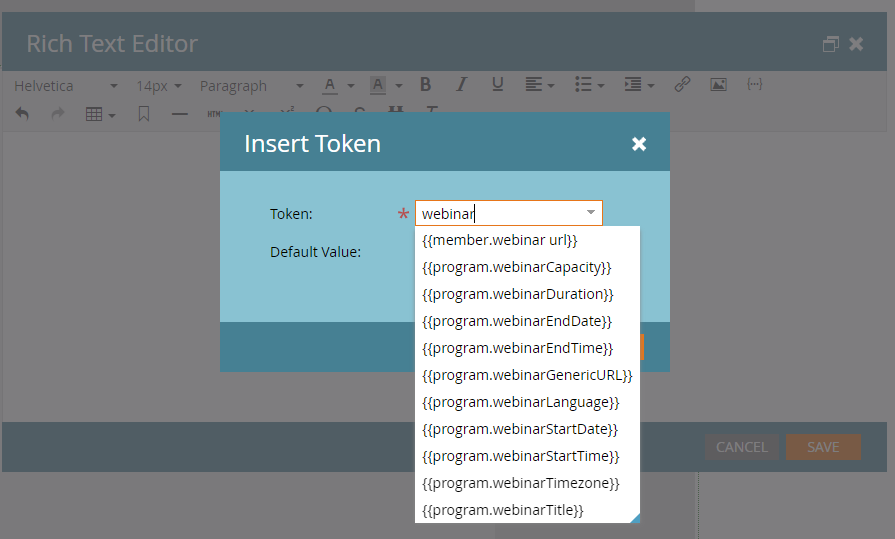

# インタラクティブウェビナーのプロモーション {#promoting-an-interactive-webinar}

インタラクティブウェビナーのプロモーションは、Launchpoint を使用したパートナーウェビナーのプロモーションに似ています。インタラクティブなウェビナーイベントプログラムを作成する際に、キャンペーンを実行するか、プログラムにメンバーをインポートすることでメンバーを追加できます。 インタラクティブウェビナーイベントプログラムに追加されたメンバーを確認するには、「**メンバー**」タブをクリックします。

メンバーの追加またはインポートが完了したら、インタラクティブウェビナーイベントプログラム内でメールキャンペーンを作成してすべてのプログラムメンバーに招待状を送信し、電子メールが配信されたらステータスを「招待済み」に変更できます。

>[!NOTE]
>
>共同主催者またはプレゼンターをオーディエンスメンバーとしてインタラクティブウェビナーイベントプログラムに追加する場合は、別のメール ID を使用する必要があります。そうしないと、「このメールは既に登録されています」というエラーが表示されます。

このメールには、プログラムの特定の詳細を含めることができます。また、ウェビナーに関する詳細情報（コンテンツ、発表者の情報など）を追加できる特定のページに受信者をリダイレクトするランディングページ URL を含めることができます。 このランディングページは、インタラクティブウェビナーイベントプログラムのローカルアセットとして作成できます。

このウェビナーへの登録を促すには、ランディングページでフォームを有効にし、フォームのクリック数をインタラクティブウェビナーイベントプログラムの有効な登録にリンクします。次に、フォームの送信をトリガーとして使用し、プログラムのステータスを「招待済み」から「登録済み」に変更するキャンペーンを作成できます。

>[!NOTE]
>
>インタラクティブウェビナーでは、複数のトリガーがトランジションを作成する場合があるので、「招待済み」から「登録済み」へのトランジションは自動的には行われません。

インタラクティブなウェビナーイベントプログラムでメンバーが「登録済み」プログラムステータスになると、Adobe Connect で作成されたウェビナーへの登録が自動的に行われます。その後、登録データ（名、姓およびメール ID など）が Adobe Connect に転送されます。つまり、ユーザーが参加者としてウェビナーに参加すると、ウェビナー中にプレゼンターまたはホストが情報を利用できるようになります。

登録から数分以内に、メンバーのウェビナー URL が「メンバー」タブに入力されます。ウェビナー URL の列が見つからない場合は、その列がビューに追加されていることを確認します。これは登録メンバーごとにパーソナライズされた URL で、認証を必要とせずにスケジュールされた時間にウェビナーにエントリできるようになります。内部で交換されるトークンは、メンバーの認証を処理します。

`{{member.webinar url}}` [ トークン ](/help/marketo/product-docs/demand-generation/landing-pages/personalizing-landing-pages/tokens-overview.md){target="_blank"} を使用して、ウェビナー URL をメールキャンペーンに含めることで、メンバーがイベントに登録されたことを伝えたり、参加 URL を使用してスケジュールした時間にウェビナーに参加したりできます。 カレンダートークンを同じメールキャンペーンで使用すると、ウェビナースケジュールをメンバーのカレンダーに確実に追加できます。

イベントプログラムの「概要」タブの右側にあるリンクを使用して、ランディングページやメールキャンペーンを作成できます。イベントに関連する残りのプロモーションは、Launchpoint 統合を使用したパートナーウェビナーと同じです。

インタラクティブウェビナーでは、ウェビナー前、ウェビナー中またはウェビナー後に登録を促すことができます。いずれの場合も、リードとウェビナー URL を共有するだけです。ウェビナーの開始前にリンクをクリックすると、ウェビナー前のランディングページに移動します。ウェビナー中にクリックすると、進行中のウェビナーに移動します。ウェビナーの終了後にクリックすると、ウェビナーの録画に移動します。

## インタラクティブウェビナートークン {#interactive-webinars-tokens}

トークンを使用すると、ウェビナーの詳細を手動で追加しなくても、メールやランディングページでインタラクティブウェビナーを促進できます。 ウェビナーのメタデータ（ウェビナーのタイトル、開始日など）に加えられた変更がアセットに自動的に反映されるため、全体的な効率が向上します。

**トークンのリスト**

* program.webinarCapacity
* program.webinarDuration
* program.webinarEndDate
* program.webinarEndTime
* program.webinarGenericURL
* program.webinarLanguage
* program.webinarStartDate
* program.webinarStartTime
* program.webinarTimezone
* program.webinarTitle
