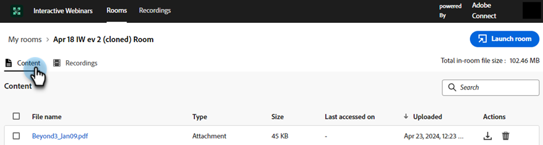

# ルーム管理 {#room-management}

Adobe Connectを活用したインタラクティブウェビナールームは、魅力的で共同作業が可能なオンラインイベントを促進するように設計されています。 これらのウェビナーでは、ウェビナー中に作成および使用されたコンテンツと録画を保存します。 部屋を作成する権限を持つメンバーは、中央の場所から部屋にアクセスして管理できます。

>[!NOTE]
>
>ウェビナー用に作成したルームにのみアクセスでき、組織内の他のメンバーのルームにはアクセスできません。

## ルームとレコーディングの管理とアクセス {#manage-and-access-rooms-and-recordings}

1. **[!UICONTROL Design Studio]** に移動します。

   

1. **[!UICONTROL インタラクティブウェビナー]** を選択し、**[!UICONTROL ルームを管理]** を選択します。

   

### 部屋 {#rooms}

インタラクティブなウェビナールームは、参加者がプレゼンターや他の参加者とやり取りできる、ライブで魅力的なオンラインイベントをホストするために設計された仮想空間です。 これらのルームでは、アップロードされたコンテンツや録画をウェビナーから検索できます。

すべての部屋のリストを表示するには、上部のメニューバーから **[!UICONTROL 部屋]** を選択します。 作成したすべてのルームと、アップロードしたコンテンツおよび録画を、これらのルームで検索できます。 また、録画の数、室内ファイルのサイズ、各部屋の最終アクセス日も表示できます。

<table><tbody>
  <tr>
    <td><b>録画</td>
    <td>1 つのルームで利用できる録画の数を表示します。</td>
  </tr>
  <tr>
    <td><b>インルームのファイルサイズ</td>
    <td>ルーム内で使用可能なコンテンツと録画の合計ファイル サイズを表示します。</td>
  </tr>
  <tr>
    <td><b>最終アクセス日時</td>
    <td>部屋が最後にアクセスされた日付を表示します。 タイムラインに基づいて情報を並べ替えることができます。</td>
  </tr>
</tbody>
</table>

この一元化されたインターフェイスから次のアクションを実行できます。

* 「ルームを起動」アイコンをクリックしてルームを起動し、ルームに入ります。
* 検索バーを使用して、探している部屋を検索します（作成した部屋のみを検索します）。
* ルームを削除するには、ルーム削除アイコンをクリックします。 これにより、ルームに関連するすべての録画とファイルが削除されます。

ルームを選択すると、そのルームで使用できるコンテンツや録画を表示できます。 この画面では、「**コンテンツ**」タブと「**録画** タブの 2 つのタブで情報を使用できます。

**「コンテンツ」タブ**

「コンテンツ」タブでは、アップロードされたファイル、そのタイプ、サイズ、最終アクセス日およびアップロードされた日付を表示できます。

<table><tbody>
  <tr>
    <td><b>タイプ</td>
    <td>PDF、JPG、PNG などのファイルタイプが表示されます。</td>
  </tr>
  <tr>
    <td><b>サイズ</td>
    <td>使用可能なファイルのサイズを表示します。</td>
  </tr>
  <tr>
    <td><b>最終アクセス日時</td>
    <td>部屋が最後にアクセスされた日付を表示します。 タイムラインに基づいて情報を並べ替えることができます。</td>
  </tr>
  <tr>
    <td><b>アップロード済み</td>
    <td>ファイルがアップロードされた日時を表示します。</td>
  </tr>
</tbody>
</table>

「コンテンツ」タブでは、次のアクションを実行できます。

* 「**[!UICONTROL ルームを起動]** ボタンをクリックしてルームを起動し、ルームに入ります。
* 検索バーを使用して、探しているファイルを見つけます。
* 「ファイルをダウンロード」アイコンをクリックして、デバイスにファイルをダウンロードします。 一括ダウンロードするファイルを 2 つ以上選択します。
* ルームを削除するには、ルーム削除アイコンをクリックします。 ファイルを削除すると、取得できません。
* リストされたコンテンツから任意のファイルを選択して、デバイス上で表示します。

**「録画」タブ**

[ 録画 ] タブでは、このルームで利用可能なすべての録画を表示できます。 各録画には、サイズ、録画の日時、期間などの詳細が表示されます。

この一元化されたハブから次のアクションを実行できます。

* 「**[!UICONTROL ルームを起動]** ボタンをクリックしてルームを起動し、ルームに入ります。
* 検索バーを使用して、探している録画を検索します。
* 「ファイルをダウンロード」アイコンをクリックして、デバイスにファイルをダウンロードします。 一括ダウンロードするファイルを 2 つ以上選択します。
* 「録画リンクをコピー」アイコンをクリックして、録画 URL をコピーします。
* 「録画を編集」アイコンをクリックして、録画に変更を加えます。
* 「削除」アイコンをクリックして、録画を削除します。 記録を削除すると、取得できなくなります。
* デバイスで再生する録画を選択してください。

## 録画の管理と録画へのアクセス {#manage-and-access-recordings}

録画は、ライブディスカッション、プレゼンテーション、Q&amp;A セッションの本質を捉える、非常に貴重なリソースです。 これにより、参加者は、主要なインサイト、欠落した詳細または複雑な概念を自分のペースで再検討できます。

「**[!UICONTROL 録画]**」タブをクリックして、アップロードしたすべての録画のリストを表示します。

**[!UICONTROL マイ録画]** の下には、作成した部屋で利用できるすべての録画が表示されます。 また、それぞれのサイズ、日時、録画の期間も表示できます。

この一元化されたハブから次のアクションを実行できます。

* 検索バーを使用して、探している録画を検索します。 また、日付範囲を選択して、タイムライン内を検索することもできます。
* 「録画リンクをコピー」アイコンをクリックして、録画 URL をコピーします。
* 「録画を編集」アイコンをクリックして、録画に変更を加えます。
* 「リンクされたページを表示」アイコンをクリックすると、選択した録画が使用可能な部屋に関する情報が表示されます。
* 「削除」アイコンをクリックして、録画を削除します。 記録を削除すると、取得できなくなります。
* デバイスで再生する録画を選択してください。
