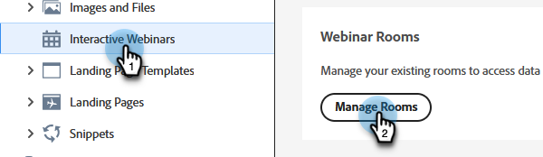
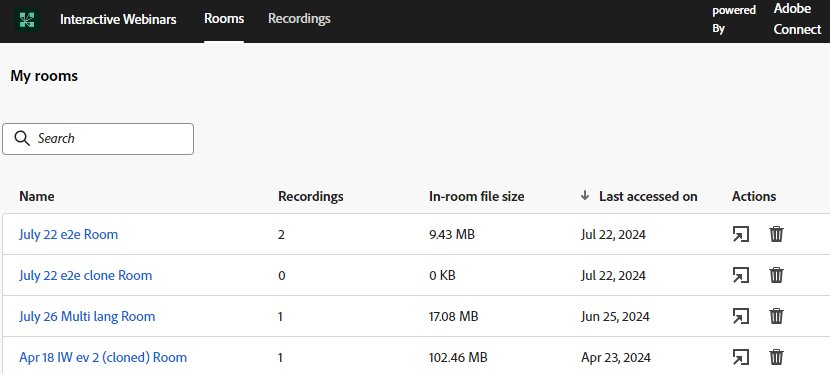
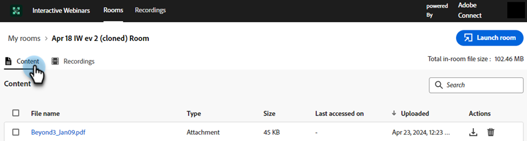
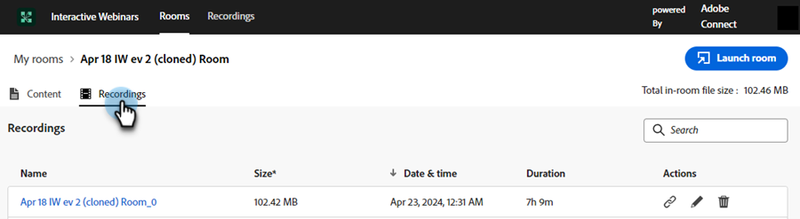
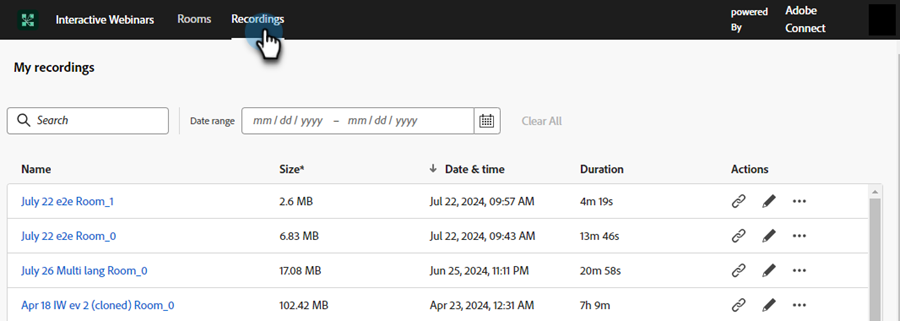

# ルーム管理 {#room-management}

Adobe Connectのインタラクティブなウェビナールームは、魅力的で協力的なオンラインイベントを促進するように設計されています。 これらのウェビナーには、ウェビナー中に作成および使用されたコンテンツと録画が保存されます。 部屋を作成する権利を持つメンバーは、一元的な場所から部屋にアクセスして管理できます。

>[!NOTE]
>
>ウェビナー用に作成したルームにのみアクセスでき、組織内の他のメンバーのルームにはアクセスできません。

## ルームとレコーディングの管理とアクセス {#manage-and-access-rooms-and-recordings}

1. **[!UICONTROL Design Studio]** に移動します。

   

1. 「**[!UICONTROL インタラクティブウェビナー]**」、「**[!UICONTROL ルームの管理]**」の順に選択します。

   

### ルームズ {#rooms}

インタラクティブウェビナールームとは、参加者がプレゼンターや他の参加者と交流できる、魅力的なライブイベントを開催するために設計された仮想空間です。 これらの部屋では、ウェビナーからアップロードされたコンテンツと録画を見つけることができます。

すべての部屋のリストを表示するには、上部のメニューバーから「**[!UICONTROL 部屋]**」を選択します。 アップロードしたコンテンツや録画を含め、作成したすべての部屋をこれらの部屋で見つけることができます。 また、各部屋の録音数、室内ファイルサイズ、最終アクセス日を表示することもできます。

<table><tbody>
  <tr>
    <td><b>録音</td>
    <td>部屋で利用可能な録音数を表示します。</td>
  </tr>
  <tr>
    <td><b>室内のファイルサイズ</td>
    <td>部屋で利用可能なコンテンツと録音の結合ファイルサイズを表示します。</td>
  </tr>
  <tr>
    <td><b>最終アクセス日</td>
    <td>部屋が最後にアクセスされた日付を表示します。 タイムラインに基づいて情報を並べ替えることができます。</td>
  </tr>
</tbody>
</table>

この一元化されたインターフェイスから次のアクションを実行できます。

* Launch room アイコンをクリックして起動し、部屋に入ります。
* 検索バーを使用して、探している部屋を検索します（作成した部屋のみが検索されます）。
* 部屋を削除アイコンをクリックして、部屋を削除します。 そうすると、部屋に関連するすべての録音とファイルが削除されます。

部屋を選択すると、その部屋で利用可能なコンテンツや録音を表示できます。 この画面では、「**コンテンツ**」タブと「**録画**」タブの2つのタブで情報を利用できます。

**コンテンツタブ**

「コンテンツ」タブでは、アップロードされたファイルの種類、サイズ、最終アクセス日、アップロード日を表示できます。

<table><tbody>
  <tr>
    <td><b>タイプ</td>
    <td>PDF、JPG、PNGなどのファイル形式を表示します。</td>
  </tr>
  <tr>
    <td><b>サイズ</td>
    <td>使用可能なファイルのサイズを表示します。</td>
  </tr>
  <tr>
    <td><b>最終アクセス日</td>
    <td>部屋が最後にアクセスされた日付を表示します。 タイムラインに基づいて情報を並べ替えることができます。</td>
  </tr>
  <tr>
    <td><b>アップロード済み</td>
    <td>ファイルがいつアップロードされたかを示します。</td>
  </tr>
</tbody>
</table>

「コンテンツ」タブでは、次のアクションを実行できます。

* 「**[!UICONTROL Launch room]**」ボタンをクリックして起動し、部屋に入ります。
* 検索バーを使用して、探しているファイルを見つけます。
* 「ファイルをダウンロード」アイコンをクリックして、デバイスにファイルをダウンロードします。 2つ以上のファイルを選択して一括でダウンロードします。
* 部屋を削除アイコンをクリックして、部屋を削除します。 ファイルを削除すると、そのファイルを取得できません。
* リストされたコンテンツから任意のファイルを選択して、デバイスで表示します。

**録音タブ**

「録音」タブでは、この部屋で利用可能なすべての録音を表示できます。 各録音は、サイズ、録音日時、期間などの詳細とともに表示されます。

この一元化されたハブから次のアクションを実行できます。

* 「**[!UICONTROL Launch room]**」ボタンをクリックして起動し、部屋に入ります。
* 検索バーを使用して、探している録音を見つけます。
* 「ファイルをダウンロード」アイコンをクリックして、デバイスにファイルをダウンロードします。 2つ以上のファイルを選択して一括でダウンロードします。
* 録音リンクをコピーのアイコンをクリックして、録音URLをコピーします。
* 録音を編集アイコンをクリックして、録音を変更します。
* 「削除」アイコンをクリックして、録音を削除します。 録画を削除すると、その録画を取得できません。
* 録画を選択してデバイスで再生します。

## レコーディングの管理とアクセス {#manage-and-access-recordings}

録画は貴重なリソースであり、ライブディスカッション、プレゼンテーション、Q&amp;A セッションの本質を捉えています。 チームメンバーは、重要なインサイト、詳細の遅延、複雑な概念などを自分のペースで見直すことができます。

「**[!UICONTROL 録音]**」タブをクリックすると、アップロードしたすべての録音のリストが表示されます。

**[!UICONTROL 自分の録音]**&#x200B;で、作成した部屋で利用可能なすべての録音を見つけることができます。 また、記録のサイズ、日付と時間、および期間を表示することもできます。

この一元化されたハブから次のアクションを実行できます。

* 検索バーを使用して、探している録音を見つけます。 日付範囲を選択して、タイムライン内で検索することもできます。
* 録音リンクをコピーのアイコンをクリックして、録音URLをコピーします。
* 録音を編集アイコンをクリックして、録音を変更します。
* リンクされたページを表示アイコンをクリックして、選択した録画が利用可能な部屋に関する情報を表示します。
* 「削除」アイコンをクリックして、録音を削除します。 録画を削除すると、その録画を取得できません。
* 録画を選択してデバイスで再生します。
