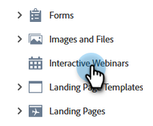

# インタラクティブウェビナーのテンプレート {#templates-for-interactive-webinars}

インタラクティブウェビナーで使いやすいテンプレートを作成して、コンテンツをより迅速に作成し、チームで作業する際にブランドガイドラインに準拠できるようにします。

## 権限の付与 {#grant-permissions}

組織内の任意のユーザーがインタラクティブウェビナーのテンプレートにアクセスできるようにする前に、Marketo Engage管理者は目的の役割へのアクセス権を追加する必要があります。

1. Marketo Engage で、「**[!UICONTROL 管理者]**」をクリックします。

   

1. **[!UICONTROL ユーザーと役割]** をクリックし、「**[!UICONTROL 役割]**」タブをクリックします。

   

1. 権限を追加する役割をダブルクリックします。

   

1. クリックして **[!UICONTROL Design Studio にアクセス]** を開きます。

   

1. 「**[!UICONTROL インタラクティブウェビナーテンプレートにアクセス]**」チェックボックスを選択します。

   

## テンプレートの作成 {#create-a-template}

1. Marketo Engageで、「**[!UICONTROL Design Studio]**」をクリックします。

   

1. 「**[!UICONTROL インタラクティブウェビナー]**」をクリックします。

   

1. **[!UICONTROL テンプレートを管理]** をクリックします。

   

1. 新しいタブが開きます。「**新規作成**」をクリックします。

   

1. 「標準テンプレート」タブで目的のテンプレートを選択し、「**次へ**」をクリックします。

   

   >[!NOTE]
   >
   >組織テンプレートは、自分または自分のチームが既に作成したテンプレートです。

1. 名前と説明を入力します。 **保存して開く** をクリックします。

   

1. 新しいタブが開きます。テンプレートを編集/保存するには、部屋に入る必要があります。 これは実際のウェビナールームではないため、オーディオやビデオを選択する必要はありません。 **部屋を入力** をクリックします。

   

1. 既存のテンプレートに必要な変更を加えます。

   

1. 右上の出口メニューで、「**すべてのセッションを終了**」を選択します。

   

1. **今すぐ終了** をクリックします。

   

テンプレートは自動的に保存されます。

## テンプレートの編集 {#edit-a-template}

既存のテンプレートを編集するには、次の手順に従います。

1. Marketo Engageで、「**[!UICONTROL Design Studio]**」をクリックします。

   

1. 「**[!UICONTROL インタラクティブウェビナー]**」をクリックします。

   

1. **[!UICONTROL テンプレートを管理]** をクリックします。

   

1. 新しいタブが開きます。編集するテンプレートを見つけて、「開く」アイコンをクリックします。

   

1. 新しいタブが開きます。テンプレートを編集するには、部屋に入る必要があります。 これは実際のウェビナールームではないため、オーディオやビデオを選択する必要はありません。 **部屋を入力** をクリックします。

   

1. テンプレートに必要な変更を加えます。

   

1. 右上の出口メニューで、「**すべてのセッションを終了**」を選択します。

   

1. **今すぐ終了** をクリックします。

   

変更内容は自動的に保存されます。
