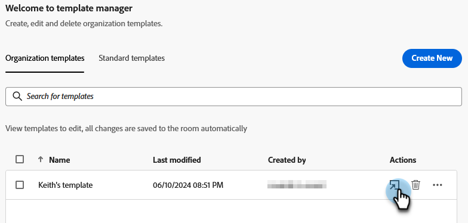

# インタラクティブウェビナーのテンプレート {#templates-for-interactive-webinars}

インタラクティブなウェビナーで再利用可能なテンプレートを作成することで、コンテンツをより迅速に制作し、チームで作業する際にブランドガイドラインを遵守できます。

## 権限の付与 {#grant-permissions}

組織内のユーザーがインタラクティブウェビナーのテンプレートにアクセスする前に、Marketo Engage管理者が最初に目的の役割へのアクセスを追加する必要があります。

1. Marketo Engage で、「**[!UICONTROL 管理者]**」をクリックします。

   

1. 「**[!UICONTROL ユーザーと役割]**」をクリックし、「**[!UICONTROL 役割]**」タブをクリックします。

   

1. 権限を追加する役割をダブルクリックします。

   

1. クリックして&#x200B;**[!UICONTROL Access Design Studio]**&#x200B;を開きます。

   

1. 「**[!UICONTROL インタラクティブウェビナーテンプレートにアクセス]**」チェックボックスを選択します。

   

## テンプレートの作成 {#create-a-template}

1. Marketo Engageで、**[!UICONTROL Design Studio]**&#x200B;をクリックします。

   

1. 「**[!UICONTROL インタラクティブウェビナー]**」をクリックします。

   

1. 「**[!UICONTROL テンプレートを管理]**」をクリックします。

   

1. 新しいタブが開きます。 「**新規作成**」をクリックします。

   

1. 「標準テンプレート」タブで、目的のテンプレートを選択し、**次へ**&#x200B;をクリックします。

   

   >[!NOTE]
   >
   >組織テンプレートとは、チームで既に作成されているテンプレートです。

1. 名前と説明を入力 「**保存して**&#x200B;を開く」をクリックします。

   

1. 新しいタブが開きます。 テンプレートを編集または保存するには、部屋に入る必要があります。 これは実際のウェビナールームではないため、オーディオやビデオを選択する必要はありません。 「**Enter Room**」をクリックします。

   

1. 既存のテンプレートに変更を加えます。

   

1. 右上の終了メニューで、**すべてのセッションを終了**&#x200B;を選択します。

   

1. 「**今すぐ終了**」をクリックします。

   

テンプレートは自動的に保存されます。

## テンプレートの編集 {#edit-a-template}

既存のテンプレートを編集するには、次の手順に従います。

1. Marketo Engageで、**[!UICONTROL Design Studio]**&#x200B;をクリックします。

   

1. 「**[!UICONTROL インタラクティブウェビナー]**」をクリックします。

   

1. 「**[!UICONTROL テンプレートを管理]**」をクリックします。

   

1. 新しいタブが開きます。 編集するテンプレートを見つけ、開くアイコンをクリックします。

   

1. 新しいタブが開きます。 テンプレートを編集するには、部屋に入る必要があります。 これは実際のウェビナールームではないため、オーディオやビデオを選択する必要はありません。 「**Enter Room**」をクリックします。

   

1. テンプレートに必要な変更を加えます。

   

1. 右上の終了メニューで、**すべてのセッションを終了**&#x200B;を選択します。

   

1. 「**今すぐ終了**」をクリックします。

   

変更内容は自動的に保存されます。
