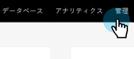

# ユーザーとライセンスの管理 {#user-and-license-management}

はじめに.

## ユーザの追加 {#add-a-user}

1. 「**管理者**」領域に移動します。

   

1. クリック **インタラクティブ Web セミナー**.

   

1. クリック **ユーザーの追加/削除**.

   

1. 利用可能なユーザードロップダウンをクリックし、追加するユーザーを選択して、 **OK**.

   

## ユーザの削除 {#remove-a-user}

1. 「**管理者**」領域に移動します。

   

1. クリック **インタラクティブ Web セミナー**.

   

1. クリック **ユーザーの追加/削除**.

   

1. 削除するユーザーをハイライトし、キーボードの Delete キーを押します。 終了したら「**OK**」をクリックします。

   

## ライセンスの使用状況 {#license-usage}

ライセンスが追加されるたびに、新しいライセンス使用状況ボックスが表示されます。

1. 「**管理者**」領域に移動します。

   

1. クリック **インタラクティブ Web セミナー**.

   

1. 情報

PICC
