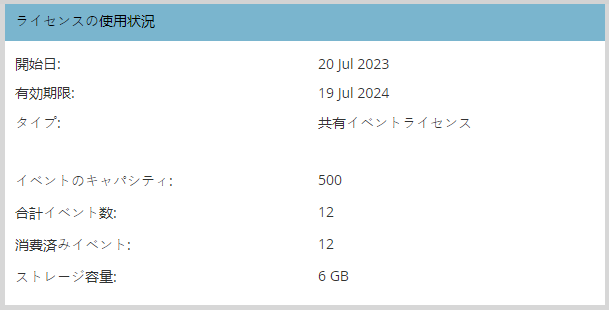

# ユーザーとライセンスの管理 {#user-and-license-management}

ユーザーの追加と削除の方法、および現在のライセンスの表示について説明します。

## ユーザの追加 {#add-a-user}

1. 「**管理者**」領域に移動します。

   

1. クリック **インタラクティブ Web セミナー**.

   

1. クリック **ユーザーの追加/削除**.

   

1. 利用可能なユーザードロップダウンをクリックし、追加するユーザーを選択して、 **OK**.

   

## ユーザの削除 {#remove-a-user}

1. 「**管理者**」領域に移動します。

   

1. クリック **インタラクティブ Web セミナー**.

   

1. クリック **ユーザーの追加/削除**.

   

1. 削除するユーザーをハイライトし、キーボードの Delete キーを押します。 終了したら「**OK**」をクリックします。

   

## ライセンスの使用状況 {#license-usage}

インタラクティブウェビナーには、Adobe Connectイベントを作成するための特定のライセンスが用意されています。 ライセンスが追加されるたびに、新しいライセンス使用状況ボックスが表示されます。 Marketo管理者は、以下の手順に従ってライセンスを表示（編集ではなく）できます。 追加のライセンスを取得するには、Adobeアカウントチーム（担当のアカウントマネージャー）にお問い合わせください。

1. 「**管理者**」領域に移動します。

   

1. クリック **インタラクティブ Web セミナー**.

   

1. 下にスクロールしてライセンス使用状況カードを表示します。

   

<table> 
  <tr> 
   <td><b>開始日</b></td>
   <td>ライセンスが開始される日付。</td>
  </tr>
  <tr> 
   <td><b>有効期限</b></td>
   <td>ライセンスの有効期限日。</td>
  </tr>
  <tr> 
   <td><b>タイプ</b></td>
   <td>購入したライセンスのタイプ。 次の 3 つのタイプを使用できます。共有イベントライセンス、共有ルームライセンス、追加のストレージライセンス。</td>
  </tr>
  <tr> 
   <td><b>イベントの処理能力</b></td>
   <td>イベントに対応できる最大参加者数。</td>
  </tr>
  <tr> 
   <td><b>合計イベント数</b></td>
   <td>このライセンスでプロビジョニングされたイベントの合計数です。</td>
  </tr>
  <tr> 
   <td><b>消費されたイベント</b></td>
   <td>完了したイベントの合計数。</td>
  </tr>
  <tr> 
   <td><b>ストレージ容量</b></td>
   <td>記録、関連資料、hero images、ドキュメント、その他のアセットの保存に使用できるストレージの量。</td>
  </tr>
  </tbody>
</table>

**注意事項**

* 「Additional Storage License」というタイプの場合は、ストレージが提供されるので、すべてのフィールドに値が表示されます _indes_ ストレージ容量は、単に「 — 」と表示されます。

* 「Shared Room License」には無制限のイベントがあり、「Additional Storage License」にはストレージが提供されるだけなので、これらのライセンスの「Total Events」フィールドは単に「 — 」と表示されます。

* イベントが作成されるたびに、それぞれのライセンスから「消費済み」としてカウントされます（Shared Room ライセンスの場合を除く）。 同じ容量の「共有イベントライセンス」と「共有ルームライセンス」の両方がある場合、「共有イベントライセンス」が優先されます。 イベントが配信されておらず、予定時間より前にイベントプログラムが削除された場合、消費済みイベントからイベントを引くことで、イベント数が補充されます。

* ライセンスを使い果たすと、そのタイルは管理のインタラクティブウェビナー画面に表示され、合計イベント数と消費されたイベント数は同じ値になります。 ライセンスの有効期限が切れた場合にのみ、ライセンスは画面から削除されます。
