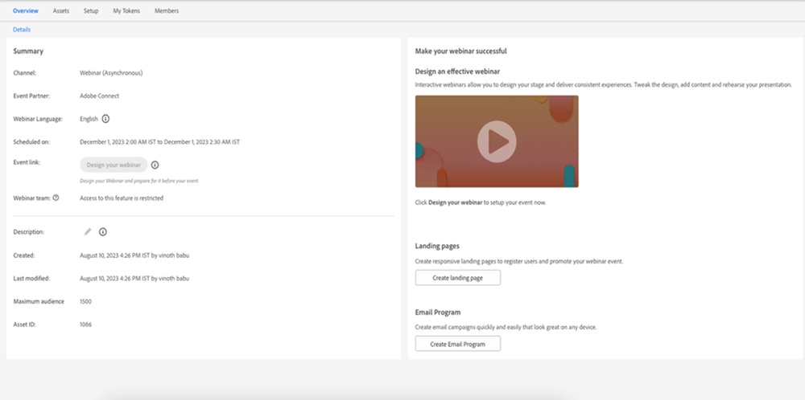

# ユーザーとライセンスの管理 {#user-and-license-management}

ユーザーを追加および削除したり現在のライセンスを表示したりする方法を説明します。

## ユーザーの追加 {#add-a-user}

1. 「**管理者**」領域に移動します。

   

1. 「**インタラクティブウェビナー**」をクリックします。

   

1. 「**ユーザーを追加 / 削除**」をクリックします。

   

1. 使用可能なユーザードロップダウンをクリックし、追加するユーザーを選択して、「**OK**」をクリックします。

   

## ユーザーの削除 {#remove-a-user}

1. 「**管理者**」領域に移動します。

   

1. 「**インタラクティブウェビナー**」をクリックします。

   

1. 「**ユーザーを追加 / 削除**」をクリックします。

   

1. 削除するユーザーをハイライト表示し、キーボードの Delete キーを押します。終了したら、「**OK**」をクリックします。

   

## ライセンス使用状況 {#license-usage}

インタラクティブウェビナーでは、Adobe Connect を活用してイベントを作成するための特定のライセンスを提供します。ライセンスが追加されるたびに、新しいライセンス使用状況ボックスが表示されます。Marketo 管理者は、以下の手順に従って、ライセンスを表示（編集ではなく）できます。アドビのアカウントチーム（担当のアカウントマネージャー）に問い合わせて、追加のライセンスを取得します。

1. 「**管理者**」領域に移動します。

   

1. 「**インタラクティブウェビナー**」をクリックします。

   

1. ライセンス使用状況カードまでスクロールします。

   

<table>
  <tr>
   <td width="20%"><b>開始日</b></td>
   <td width="80%">ライセンスが開始する日付。</td>
  </tr>
  <tr>
   <td width="20%"><b>有効期限</b></td>
   <td width="80%">ライセンスの期限が切れる日付。</td>
  </tr>
  <tr>
   <td width="20%"><b>タイプ</b></td>
   <td width="80%">購入したライセンスのタイプ。共有イベントライセンス、共有ルームライセンス、追加のストレージライセンスの 3 つのタイプを使用できます。</td>
  </tr>
  <tr>
   <td width="20%"><b>イベントのキャパシティ</b></td>
   <td width="80%">イベントに参加できる参加者の最大数。</td>
  </tr>
  <tr>
   <td width="20%"><b>合計イベント数</b></td>
   <td width="80%">このライセンスでプロビジョニングされたイベントの合計数。</td>
  </tr>
  <tr>
   <td width="20%"><b>消費済みイベント</b></td>
   <td width="80%">完了したイベントの合計数。</td>
  </tr>
  <tr>
   <td width="20%"><b>ストレージ容量</b></td>
   <td width="80%">記録、資料、ヒーロー画像、ドキュメントおよびその他のアセットの格納に使用できるストレージ容量。</td>
  </tr>
  </tbody>
</table>

**注意事項**

* 「追加のストレージライセンス」タイプはストレージを提供するだけなので、ストレージ容量&#x200B;_以外の_&#x200B;各フィールドの値は、シンプルに「-」としてリストされます。

* 「共有ルームライセンス」タイプには無制限のイベントがあり、「追加のストレージライセンス」はストレージを提供するだけなので、これらのライセンスの「合計イベント数」フィールドは、シンプルに「-」としてリストされます。

* イベントが作成されるといつでも、それぞれのライセンスから「消費済み」としてカウントされます（共有ルームライセンスの場合を除く）。同じ容量の「共有イベントライセンス」と「共有ルームライセンス」がある場合、環境設定は「共有イベントライセンス」に対して適用されます。 イベントが配信されず、スケジュールされた時間より前にイベントプログラムが削除される場合、イベント数は、消費済みイベントからイベントを差し引くことで補充されます。

* ライセンスを使い果たしたら、そのタイルは、管理者セクションのインタラクティブウェビナー画面上に残り、同じ値の「合計イベント数」および「消費済みイベント」が表示されます。ライセンスの期限が切れた場合のみ、画面から削除されます。

## ユーザアクセス {#user-access}

インタラクティブウェビナーには、Marketo Engage ユーザにインタラクティブウェビナーを作成および配信するための権限を付与して、使用を規制する機能があります。ただし、インタラクティブウェビナーユーザ（またはユーザ以外）は、他のユーザが作成したインタラクティブウェビナーイベントプログラムへの読み取り／編集アクセス権を引き続き持つことができます。

インタラクティブウェビナーの権限が付与され、特定のインタラクティブウェビナーイベントプログラムの所有者である Marketo ユーザは、このプログラムに関連するすべてのインタラクティブウェビナー機能を実行できます。これには、プログラムの作成、アクセス、クローン作製、移動、削除が含まれます。ただし、そのユーザがインタラクティブウェビナーユーザでなくなった場合、プログラムの所有者はプログラムにアクセスして移動することはできますが、他の機能は実行できません。

インタラクティブウェビナーの権限を付与された、特定のインタラクティブウェビナーイベントプログラムの所有者では&#x200B;_ない_ Marketo ユーザは、それらのプログラムに対して限定的な機能を実行できます。Marketo 管理者以外のユーザはプログラムにアクセスしてクローンを作成できますが、インタラクティブウェビナーに関する権限を持っている場合は、他の機能を実行できません。ただし、Marketo 管理者ユーザは、プログラムのアクセス、変更、クローン作成、移動、削除などのすべての機能を実行できる&#x200B;_ようになります_（インタラクティブウェビナーに関する権限を持っている場合）。Marketo 管理者および管理者以外のユーザに対してこの権限が取り消されると、それらのユーザはインタラクティブウェビナーイベントプログラムにのみアクセス可能となり、他の機能は実行できなくなります。

アクションにつながる機能の制限は、グレー表示のアクションボタンとホバーメッセージで示されます。グレー表示されているアクションボタンの例には、「ウェビナーをデザイン」や「ウェビナーを開始」などがあります。アクションにつながらない機能の場合は、制限を強調表示するメッセージが表示されます。以下の例を参照してください。

