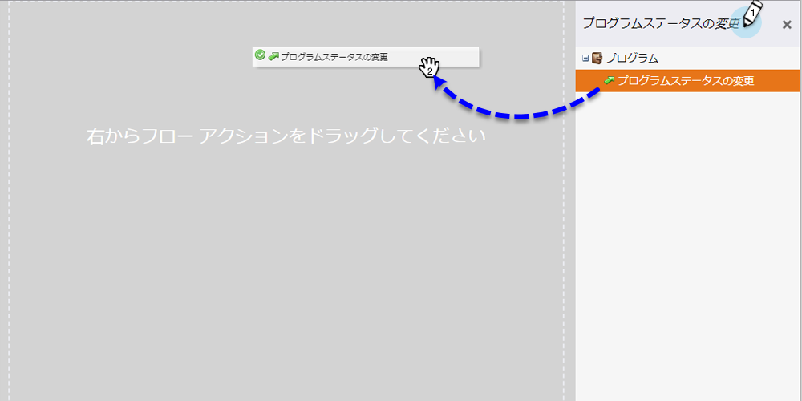
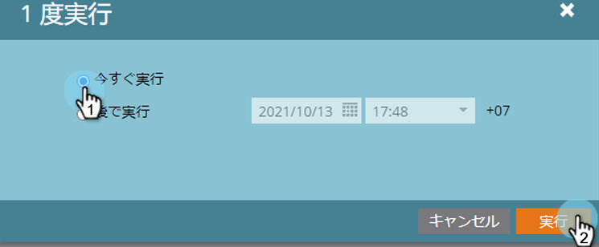

# イベントプログラムへのメンバーの追加 {#adding-members-to-an-event-program}

この記事は、イベント上限またはイベントゴールを利用するユーザーにのみ適用されます。

>[!CAUTION]
>
>イベントプログラムにユーザーのリストを直接インポートすると、これらのレコードがゴールトラッキングレポートおよびイベント上限進行状況レポートの実際の登録でカウントされなくなります。以下の手順に従って、レコードが確実にカウントされるようにします。

1. リードを作成し、[静的リストに追加](/help/marketo/product-docs/core-marketo-concepts/smart-lists-and-static-lists/static-lists/create-a-static-list.md)します。

1. [スマートキャンペーンの作成](/help/marketo/product-docs/core-marketo-concepts/smart-campaigns/creating-a-smart-campaign/create-a-new-smart-campaign.md)。

1. 手順 2 で作成したスマートキャンペーンのスマートリストで、**リストのメンバー**&#x200B;フィルターを探して追加します。

   

1. 手順 1 で作成したリストを見つけて選択します。

   

1. フローで、**プログラムステータスの変更**&#x200B;フローステップを探して追加します。

   

1. イベントプログラムを見つけて選択します。

   

1. 目的のステータスを選択します。

   

1. 「スケジュール」タブで、「**1 回実行**」をクリックします。

   

1. 「**今すぐ実行**」を選択し、「**実行**」をクリックします。

   

1. スマートキャンペーンの実行後に、メンバーがプログラムに追加されます。ゴールトラッキングやイベント上限進行状況が正しく計測されるようになります。
