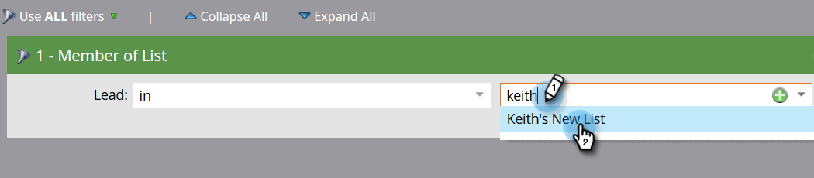
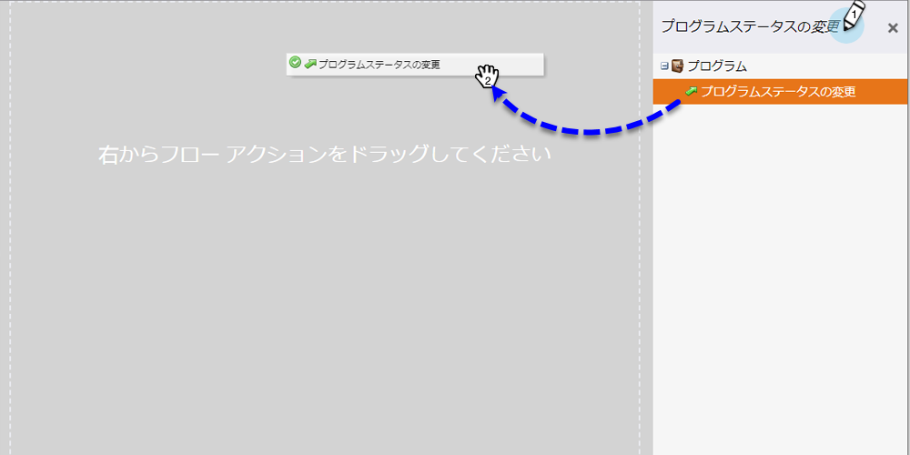
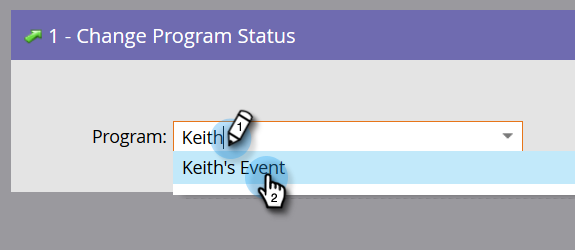
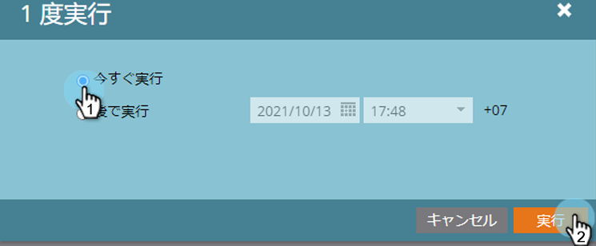

# イベントプログラムへのメンバーの追加 {#adding-members-to-an-event-program}

この記事は、イベントキャップまたはイベントゴールを利用するユーザーにのみ適用されます。

>[!CAUTION]
>
>イベントプログラムにユーザーのリストを直接インポートすると、これらのレコードがゴールトラッキングレポートおよびイベントキャップ進行状況レポートの実際の登録でカウントされなくなります。以下の手順に従って、レコードが確実にカウントされるようにします。

1. リードを作成し、[静的リストに追加](/help/marketo/product-docs/core-marketo-concepts/smart-lists-and-static-lists/static-lists/create-a-static-list.md)します。

1. [スマートキャンペーンの作成](/help/marketo/product-docs/core-marketo-concepts/smart-campaigns/creating-a-smart-campaign/create-a-new-smart-campaign.md)。

1. 手順 2 で作成したスマートキャンペーンのスマートリストで、**[!UICONTROL リストのメンバー]**&#x200B;フィルターを探して追加します。

   

1. 手順 1 で作成したリストを見つけて選択します。

   

1. フローで、**[!UICONTROL プログラムステータスの変更]**&#x200B;フローステップを探して追加します。

   

1. イベントプログラムを見つけて選択します。

   

1. 目的のステータスを選択します。

   

1. 「[!UICONTROL スケジュール]」タブで、「**[!UICONTROL 1 回実行]**」をクリックします。

   

1. 「**[!UICONTROL 今すぐ実行]**」を選択し、「**[!UICONTROL 実行]**」をクリックします。

   

1. スマートキャンペーンの実行後に、メンバーがプログラムに追加されます。ゴールトラッキングやイベントキャップ進行状況が正しく計測されるようになります。
