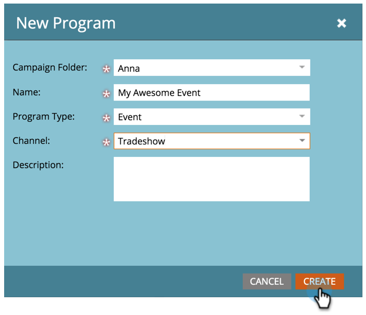

# 新しいイベントプログラムの作成{#create-a-new-event-program}

イベントを使用すると、オンラインおよびオフラインのイベントを自動化できます。 様々な段階を進む人々のステータスを把握し、マーケティングイニシアチブのROIに関する正確な指標を得ます。

1. **マーケティングアクティビティ**&#x200B;に移動します。

   

1. 新しいプログラムのフォルダを選択します。 「**新規**」を選択し、「**新規プログラム**」をクリックします。

   

1. イベントの名前を選択します。 次に、「**プログラムタイプ**」で、「**イベント**」を選択します。

   

1. **チャネル**&#x200B;を選択します。

   >[!NOTE]
   >
   >チャネルは、プログラム内で個人が持つことのできる様々なステータスを定義します。 [プログラムメンバーシップ](/help/marketo/product-docs/core-marketo-concepts/programs/creating-programs/understanding-program-membership.md)の詳細については、こちらを参照してください。

   

1. 「**作成**」をクリックします。

   

   おい！ 新しいイベントがツリーに表示されます。

   

1. イベントのスケジュールを設定するには、「**スケジュール表示**」を選択し、カレンダー内でクリックしてポップアップを開きます。 日付と時間を入力します。

   

1. 終了したら、バーを&#x200B;**確認済み**&#x200B;にスライドさせます。

   

イベントを作成したら、[ランディングページ](/help/marketo/product-docs/demand-generation/landing-pages/free-form-landing-pages/create-a-free-form-landing-page.md)、[フォーム](/help/marketo/product-docs/demand-generation/forms/creating-a-form/create-a-form.md)、[電子メール](/help/marketo/product-docs/email-marketing/email-programs/creating-an-email-program/create-an-email-program.md)を作成して、ゲストを招待します。 また、[プログラムスケジュール表示](http://docs.marketo.com/display/docs/program+schedule+view)についても詳しく知りたいでしょう。

>[!MORELIKETHIS]
>
>* [マーケティングカレンダー](/help/marketo/product-docs/core-marketo-concepts/marketing-calendar/understanding-the-calendar/navigating-the-marketing-calendar.md)
>* [プログラムでの期間原価の使用](/help/marketo/product-docs/core-marketo-concepts/programs/working-with-programs/using-period-costs-in-a-program.md)

