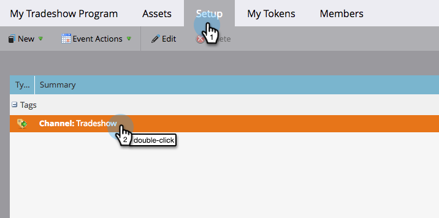

# イベントチャネルの編集 {#edit-an-event-channel}

チャネルタイプは、イベントの「**概要**」タブまたはイベントの「**設定**」タブから編集できます。

>[!NOTE]
>
>このオプションは、メンバーが関連付けられていないイベントでのみ使用できます。イベントにメンバーが含まれると、チャネルタイプを変更できなくなります。

>[!NOTE]
>
>プログラムは、特定のマーケティング施策の 1 つです。**チャネル**&#x200B;は、ウェビナー、展示会、オンライン広告などの配信メカニズムを意図しています。独自のインスタンスで使用可能なチャネルに応じて、ドロップダウンに異なるチャネルオプションが表示される場合があります。[独自のチャネルを作成する](/help/marketo/product-docs/administration/tags/create-a-program-channel.md)こともできます。

## 「概要」タブから {#from-the-summary-tab}

1. 「**マーケティングアクティビティ**」で、ツリーからイベントを選択します。

   

1. **概要**&#x200B;ビューに移動します。

   

1. 「**設定**」カテゴリで、ハイパーリンクとして表示されている現在の「**チャネル**」を選択します。

   

1. ドロップダウンリストから、新しいチャネルを選択します。

   

1. 「**保存**」をクリックします。

   

## 「設定」タブから {#from-the-setup-tab}

新しいチャネルタイプは、イベントの「**設定**」タブからも割り当てることができます。

1. ツリーからイベントを選択します。

   

1. 「**設定**」タブに移動します。現在の&#x200B;**チャネル**&#x200B;をダブルクリックします。

   

1. 新しい&#x200B;**チャネル**&#x200B;を選択します。

   

1. 「**保存**」をクリックします。

   

これで完了です。チャネルを編集しました。
