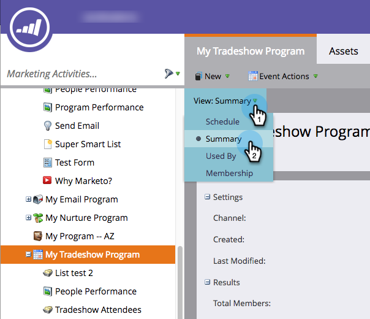
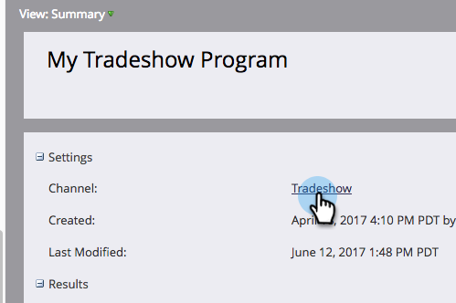
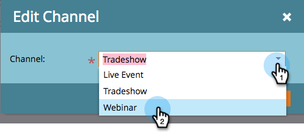
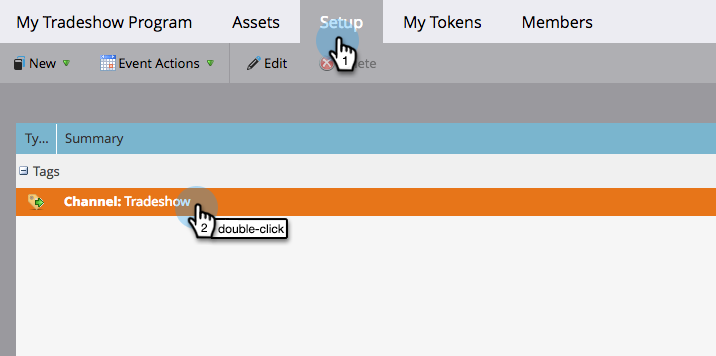

# イベントチャネルの編集 {#edit-an-event-channel}

チャネルタイプは、イベントの「**概要**」タブまたはイベントの「**設定**」タブから編集できます。

>[!NOTE]
>
>このオプションは、メンバーが関連付けられていないイベントでのみ使用できます。 イベントにメンバーが含まれると、チャネルの種類を変更できなくなります。

>[!NOTE]
>
>プログラムは、特定のマーケティング施策の 1 つです。 **チャネル**&#x200B;は、ウェビナー、展示会、オンライン広告などの配信メカニズムを意図しています。 独自のインスタンスで使用可能なチャネルに応じて、ドロップダウンに異なるチャネルオプションが表示される場合があります。 [独自のチャネルを作成する](/help/marketo/product-docs/administration/tags/create-a-program-channel.md)こともできます。

## 「概要」タブから {#from-the-summary-tab}

1. 「**[!UICONTROL マーケティングアクティビティ]**」で、ツリーからイベントを選択します。

   

1. **[!UICONTROL 概要]**&#x200B;ビューに移動します。

   

1. 「**[!UICONTROL 設定]**」カテゴリで、ハイパーリンクとして表示されている現在の「**[!UICONTROL チャネル]**」を選択します。

   

1. ドロップダウンリストから、新しい&#x200B;**[!UICONTROL チャネル]**&#x200B;を選択します。

   

1. 「**[!UICONTROL 保存]**」をクリックします。

   

## 「設定」タブから {#from-the-setup-tab}

新しいチャネルタイプは、イベントの「**[!UICONTROL 設定]**」タブからも割り当てることができます。

1. ツリーからイベントを選択します。

   

1. 「**[!UICONTROL 設定]**」タブに移動します。 現在の&#x200B;**チャネル**&#x200B;をダブルクリックします。

   

1. 新しい&#x200B;**[!UICONTROL チャネル]**&#x200B;を選択します。

   

1. 「**[!UICONTROL 保存]**」をクリックします。

   

チャンネルが編集されました。
