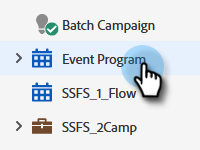
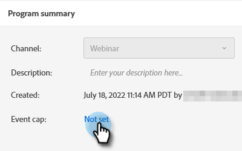
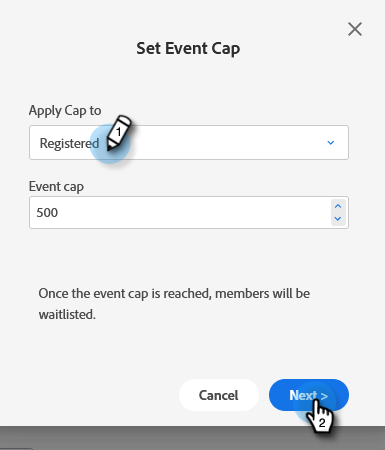
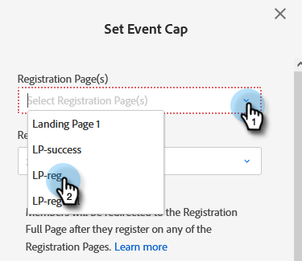
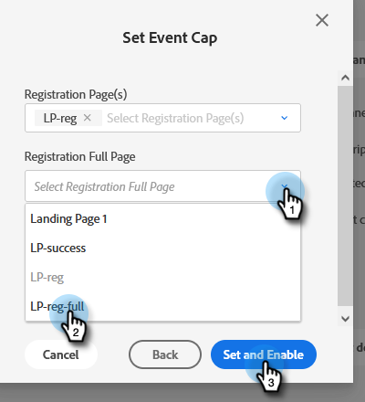
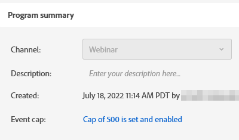

# イベントキャップの設定 {#setting-an-event-cap}

イベントキャップを使用してイベントに登録できる人数を制限します。

>[!NOTE]
>
>必ずしもすべてのお客様がこの機能を購入済みとは限りません。 詳しくは、アドビアカウントチーム（担当のアカウントマネージャー）にお問い合わせください。

>[!IMPORTANT]
>イベントキャップを設定する前に、プログラム内に承認済みのランディングページ（登録ページと登録満員ページ）が少なくとも 2 つある必要があります。

>[!NOTE]
>
>イベントの空きを確保するには、プログラムメンバーを削除する必要があります（ステータスを「プログラム未参加」に更新することで削除できます）。

1. イベントプログラムを選択します。

   

1. 概要で、「[!UICONTROL イベントキャップ]」を見つけて、「**[!UICONTROL 未設定]**」をクリックします。

   

1. イベントに登録する最大人数を入力し、「**[!UICONTROL 次へ]**」をクリックします。

   

1. 「[!UICONTROL 登録ページ]」ドロップダウンリストをクリックして、登録ページとして機能するランディングページを選択します。

   

1. 「**[!UICONTROL 登録締め切りページ]**」ドロップダウンリストをクリックして、登録締め切りページとして機能するランディングページを選択します。 完了したら、「**[!UICONTROL 設定して有効にする]**」をクリックします。

   

   準備完了です。 イベントキャップの詳細を編集する場合は、「[!UICONTROL イベントキャップ]」の横の青いテキストをクリックします。

   
