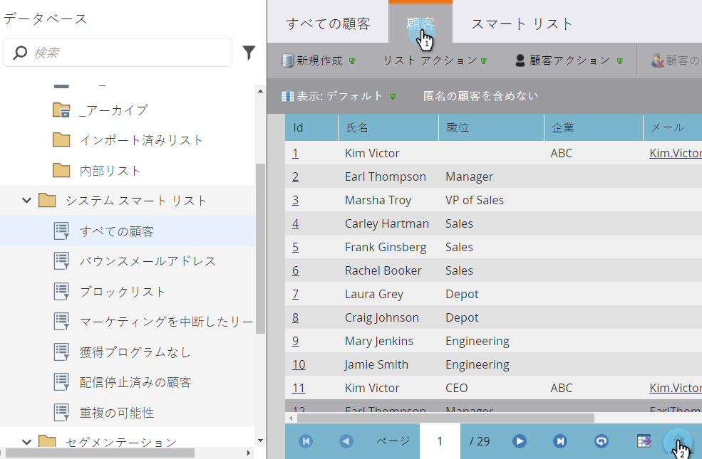

# Facebookでのカスタムオーディエンスの作成 {#create-a-custom-audience-in-facebook}

>[!NOTE]
>
>**前提条件**
>
>* [「追加管理」セクションの「LaunchPointサービス](../../../product-docs/demand-generation/ad-network-integrations/add-facebook-custom-audiences-as-a-launchpoint-service.md) 」としてのFacebookカスタムオーディエンス。
>* [Facebookアカウント内でFacebookのカスタムオーディエンス条件に同意します](https://www.facebook.com/ads/manage/customaudiences/tos.php) 。

>

>[!TIP]
>
>Facebookの [カスタムオーディエンスについて詳しくは](https://www.facebook.com/help/341425252616329)、

1. オーディエンスの作成元となるリードを含むスマートまたは静的なリストを探して選択します。

   

1. 「 **リード** 」タブを選択し、下部の「**Send Via Ad Bridge **」アイコンをクリックします。

   

1. 「**Facebook **」を選択し、「 **次へ**」をクリックします。

   

1. 「 **オーディエンス** 」ドロップダウンをクリックし、「 **+新規オーディエンス**」を選択します。

   

1. 「 **オーディエンス名**」に入力します。 「 **更新**」をクリックします。

   

   >[!NOTE]
   >
   >複数のFacebook広告アカウントを持っている場合は、追加のドロップダウンが表示され、このオーディエンスを作成する広告アカウントを選択できます。

   >[!TIP]
   >
   >新しいオーディエンスを、広告セットまたはグループに現在関連付けられている既存の広告と入れ替えますか？ 「既存のオーディエンスを **置き換え** 」チェックボックスをオンにします。 この操作を行っても **** 、置き換えられるオーディエンスは削除されません。

1. 完了すると、ステータスダイアログが更新されます。

   

   それだ！ Facebookでは、 **広告マネージャー/オーディエンスで新しいオーディエンスが表示されます**。

   

   >[!NOTE]
   >
   >Facebookにプッシュしたすべてのリストは静的になります。 Marketorのスマートリストは、Facebookのオーディエンスリストを自動更新せず、転送後に行われた変更を反映しません。

   >[!TIP]
   >
   >Marketorのお客様向けの [Facebook学習パスを参照してください](https://facebook.exceedlms.com/student/enrollments/create_enrollment_from_token/BF9TqSaCvM73PP4ScjhCm4fi)。 Facebookページの作成から、マーケティングの広告ネットワーク統合を使用したFacebook広告のターゲット設定まで、知る必要のあるすべてをカバーします。

   >[!NOTE]
   >
   >**関連記事**
   >
   >    
   >    
   >    * [Facebook追加でカスタムオーディエンスが発生](add-leads-to-a-custom-audience-in-facebook.md)

