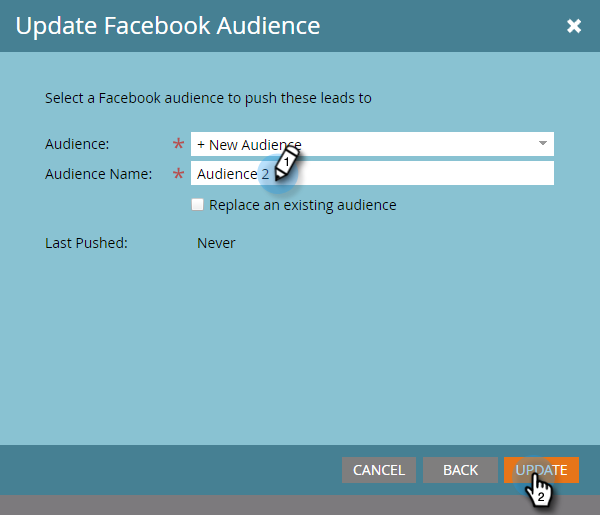

# [!DNL Facebook] でのカスタムオーディエンスの作成 {#create-a-custom-audience-in-facebook}

>[!PREREQUISITES]
>
>* 管理者セクションで、[ [!DNL Facebook]  カスタムオーディエンスを LaunchPoint サービスとして追加](/help/marketo/product-docs/demand-generation/ad-network-integrations/add-facebook-custom-audiences-as-a-launchpoint-service.md){target="_blank"}します。
>* [!DNL Facebook] アカウント内で [ [!DNL Facebook] のカスタムオーディエンスの条件に同意](https://www.facebook.com/ads/manage/customaudiences/tos.php){target="_blank"}します。

>[!TIP]
>
>詳しくは、[ [!DNL Facebook] でのカスタムオーディエンス](https://www.facebook.com/help/341425252616329){target="_blank"}を参照してください。

1. オーディエンスを作成するリードを含むスマートリストまたは静的リストを探して選択します。

   

1. 「**[!UICONTROL リード]**」タブを選択し、下部にある「**Ad Bridge を介して送信**」アイコンをクリックします。

   

1. 「**[!UICONTROL Facebook]**」を選択し、「**[!UICONTROL 次へ]**」をクリックします。

   

1. 「**[!UICONTROL オーディエンス]**」ドロップダウンをクリックし、「**[!UICONTROL + 新規オーディエンス]**」を選択します。

   

   >[!IMPORTANT]
   >
   >Facebook API を使用すると、Facebook 広告アカウントあたり最大 500 個のカスタムオーディエンスを利用できます。

1. 「**[!UICONTROL オーディエンス名]**」を入力します。「**[!UICONTROL 更新]**」をクリックします。

   

   >[!NOTE]
   >
   >複数の [!DNL Facebook] 広告アカウントがある場合は、追加のドロップダウンが表示され、このオーディエンスを作成する広告アカウントを選択できます。

   >[!TIP]
   >
   >広告セットまたはグループと現在関連付けられている既存のオーディエンスを、新しいオーディエンスに入れ替える場合は、「**[!UICONTROL 既存のオーディエンスを置換]**」チェックボックスを選択します。これを行っても、置換されるオーディエンスは&#x200B;**削除されません**。

1. 完了すると、ステータスダイアログが更新されます。

   

   これで完了です。Facebook では、**広告マネージャ**／**オーディエンス**&#x200B;に新しいオーディエンスが表示されます。

   

   >[!NOTE]
   >
   >[!DNL Facebook] にプッシュしたすべてのリストは静的になります。Marketo のスマートリストは、[!DNL Facebook] のオーディエンスリストを自動更新しないので、転送後に行われた変更は反映されません。

   >[!MORELIKETHIS]
   >
   >[ [!DNL Facebook]](/help/marketo/product-docs/demand-generation/facebook/add-leads-to-a-custom-audience-in-facebook.md) でのカスタムオーディエンスへのリードの追加
