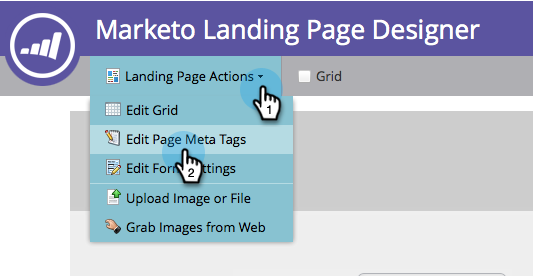
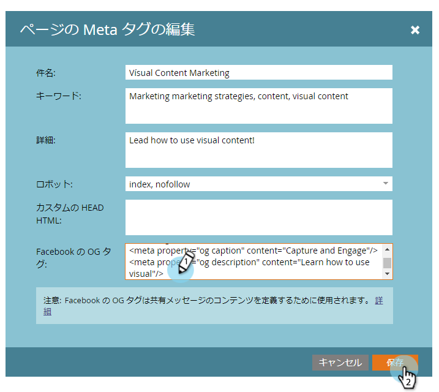

# Facebook リッチ投稿設定の編集 {#edit-facebook-rich-post-settings}

ユーザーが Facebook で自社の情報を共有するときの投稿をカスタマイズします。

>[!AVAILABILITY]
>
>すべてのお客様がこの機能を購入しているわけではありません。詳細は、セールス担当者にお問い合わせください。

Marketo の[ソーシャルアプリ](/help/marketo/product-docs/demand-generation/social/social-functions/add-a-social-button-on-a-landing-page.md)を使用すると、リードが Facebook や Twitter などのソーシャルネットワーク上のつながりを利用して、ランディングページを共有できるようになります。Facebook の OpenGraph タグ（OG タグ）を指定すると、ランディングページのどの情報を Facebook の投稿に含めるかを指定できます。

## リッチ投稿オプションの選択 {#select-rich-post-options}

ランディングページからの共有によって生成される Facebook リッチ投稿について、使用するページ情報のタイプを指定できます。

1. **YouTube** 動画またはソーシャルボタン用のエディターで、「**Facebook メッセージ**」を選択します。

   

1. Facebook メッセージについて、以下のオプションを選択します。

   * 静的コンテンツの追加：タイトル、キャプション、説明を手動で入力するには、このオプションを選択します。

   

   * 動的コンテンツの追加：ソーシャルアプリでは、ランディングページの `<TITLE>`、`<CAPTION>` および `<DESCRIPTION>` タグを使用して、リッチ投稿を生成できます。

   

   >[!NOTE]
   >
   >これらのタグは、ページのソースにあらかじめ存在している必要がありますが、より厳密に制御するために、特定の Facebook OG タグをランディングページに追加することができます。

   * リッチコンテンツを追加しない：ランディングページからの Facebook 投稿を、メインのメッセージとリンクだけに制限します。

   

## ランディングページへの Facebook OG タグの追加 {#add-facebook-og-tags-to-a-landing-page}

ランディングページから Facebook 共有に含まれるページ要素を制御するには、ランディングページにタイトル、キャプションおよび説明用の Facebook OG（Open Graph）タグを追加します。

1. **YouTube ビデオ**&#x200B;またはソーシャルボタンを含むランディングページを開きます。

   

   **ランディングページデザイナー**&#x200B;が新しいウィンドウで開きます。

1. **ランディングページのアクション**／**ページメタタグを編集**&#x200B;を選択します。

   

1. og:title、og:caption、og:description を定義する HTML を追加します。次の行をコピー＆ペーストして、プレースホルダーテキストを置き換えます。

   `<meta property="og:title" content="My Post Title"/>`

   `<meta property="og:caption" content="My Post Caption"/>`

   `<meta property="og:description" content="This text appears in the post description"/>`

   

>[!NOTE]
>
>OG タグを追加する際は、適切な HTML 構文を使用するように注意してください。
