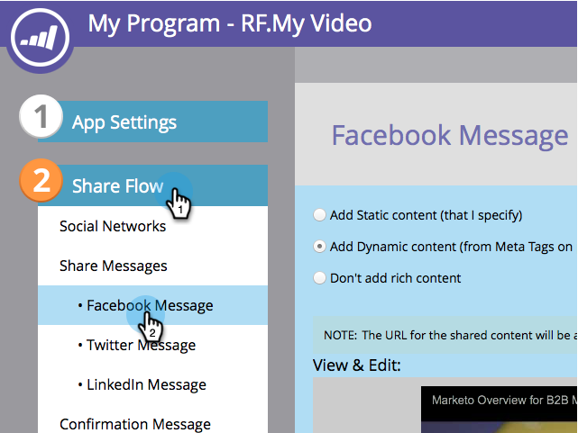
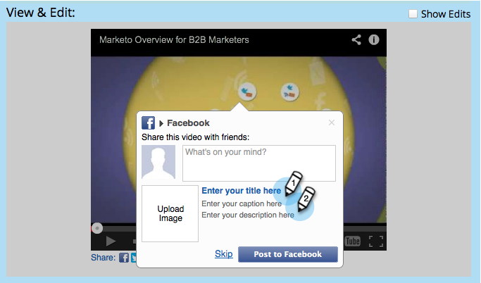
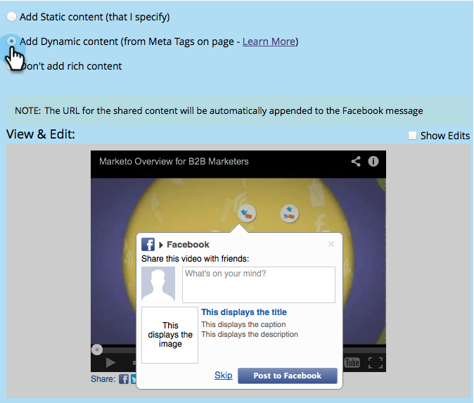
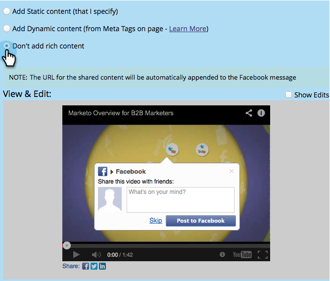
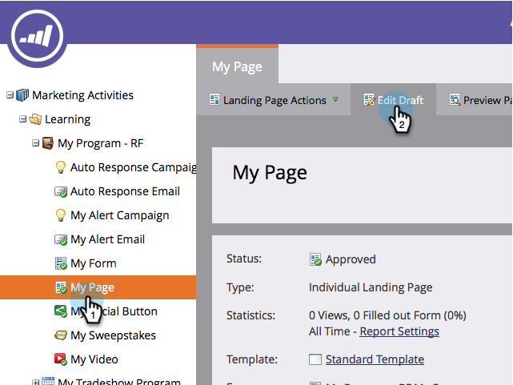
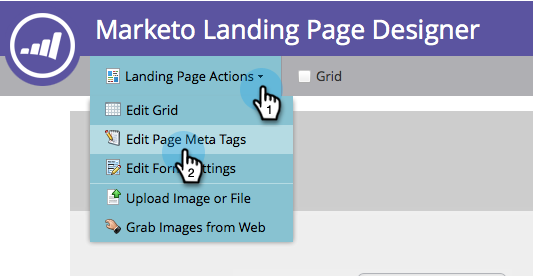
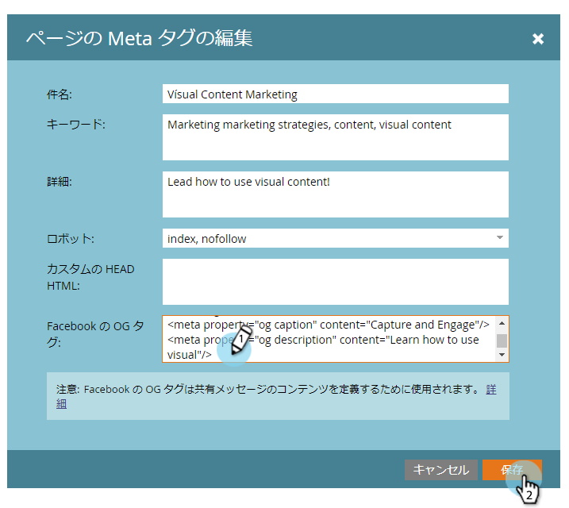

# [!DNL Facebook] リッチ投稿設定の編集 {#edit-facebook-rich-post-settings}

ユーザが [!DNL Facebook] で自社の情報を共有するときの投稿をカスタマイズします。

>[!AVAILABILITY]
>
>すべての Marketo Engage ユーザがこの機能を購入しているわけではありません。 詳しくは、アドビのアカウントチーム（担当のアカウントマネージャー）にお問い合わせください。

Marketo _ソーシャルアプリ_&#x200B;を使用すると、リードはFacebook、Twitterなどのソーシャルネットワーク上でランディングページを共有できます。Facebook OpenGraph タグ（OG タグ）を使用すると、ランディングページのどの情報をFacebookの投稿に含めるかを指定できます。

## リッチ投稿オプションの選択 {#select-rich-post-options}

ランディングページからの共有によって生成される [!DNL Facebook] リッチ投稿について、使用するページ情報のタイプを指定できます。

1. _&#x200B;_[!DNL YouTube_]_&#x200B;動画またはソーシャルボタンのエディターで&#x200B;**[!UICONTROL Facebook メッセージ]**&#x200B;を選択します。

   

1. [!DNL Facebook] メッセージについて、以下のオプションを選択します。

   * 静的コンテンツの追加：タイトル、キャプション、説明を手動で入力するには、このオプションを選択します。

   

   * 動的コンテンツの追加：ソーシャルアプリでは、ランディングページの `<TITLE>`、`<CAPTION>` および `<DESCRIPTION>` タグを使用して、リッチ投稿を生成できます。

   

   >[!NOTE]
   >
   >これらのタグは、ページのソースにあらかじめ存在している必要がありますが、より厳密に制御するために、特定の [!DNL Facebook] OG タグをランディングページに追加することができます。

   * リッチコンテンツを追加しない：ランディングページからの [!DNL Facebook] 投稿を、メインのメッセージとリンクだけに制限します。

   

## ランディングページへの [!DNL Facebook] OG タグの追加 {#add-facebook-og-tags-to-a-landing-page}

ランディングページから [!DNL Facebook] 共有に含まれるページ要素を制御するには、ランディングページにタイトル、キャプションおよび説明用の [!DNL Facebook] OG（Open Graph）タグを追加します。

1. **[!DNL YouTube]ビデオ**&#x200B;またはソーシャルボタンを含むランディングページを開きます。

   

   **[!UICONTROL ランディングページデザイナー]**&#x200B;が新しいウィンドウで開きます。

1. **[!UICONTROL ランディングページのアクション]**／**[!UICONTROL ページメタタグを編集]**&#x200B;を選択します。

   

1. og:title、og:caption、og:description を定義する HTML を追加します。 次の行をコピー＆ペーストして、プレースホルダーテキストを置き換えます。

   `<meta property="og:title" content="My Post Title"/>`

   `<meta property="og:caption" content="My Post Caption"/>`

   `<meta property="og:description" content="This text appears in the post description"/>`

   

>[!NOTE]
>
>OG タグを追加する際は、適切な HTML 構文を使用するように注意してください。
