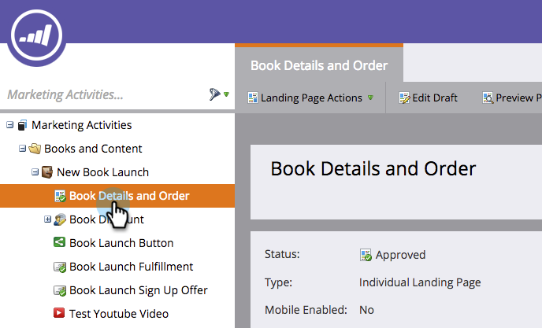
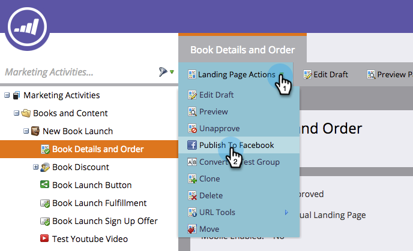

# ランディングページをFacebookに投稿{#publish-landing-pages-to-facebook}

ランディングページをFacebookに投稿して、既に電話が切れている場所にオーディエンスに会い、プログラムへのトラフィックを増やすことができます。

>[!NOTE]
>
>**可用性**
>
>SMB Spark、Standard、Select。 個別にライセンスされた機能を持つEnterprise。

>[!PREREQUISITES]
>
>Facebookに投稿するには、ページに2,000人以上の「いいね！」が含まれている必要があります。

新しい本を開始するとします。電子メールやWebサイトでオーディエンスの一部にアクセスできる場合があります。 Facebookブランドページに追加してマーケティングランディングページを公開すると、より大きなオーディエンスに到達し、オファーの共有を推奨します。

1. 承認済みランディングページを選択します。

   

1. 「ランディングページの操作」で、「Facebookに投稿&#x200B;**」を選択します。**

   

   >[!NOTE]
   >
   >この方法では、ランディングページをFacebookアプリ（旧称Facebookタブ）に公開します。 Facebookアプリはモバイルでは利用できないので、この手法は、訪問者がモバイルデバイス上のFacebookアプリに投稿されたランディングページにアクセスしようとする場合には機能しません。

1. Facebookページに投稿するようにマーケティングを承認します。

   

1. Facebookの資格情報を入力します。

   

   >[!NOTE]
   >
   >Marketorランディングページを公開するFacebookページの管理者権限を持つアカウントを使用する必要があります。

1. ランディングページの投稿先の&#x200B;**Facebookページ**&#x200B;を選択し、Marketorランディングページの名前を入力します。

   

   >[!NOTE]
   >
   >以前にFacebookに投稿したMarketoランディングページを置き換えるには、「**既存のタブを置き換え**」を選択し、ドロップダウンリストから置換するタブを選択します。 これは、「マーケティング」以外のタブを置き換えません。

1. リードはFacebookページで直接ランディングページを訪問できるようになりました。 カバー画像の下のタブ名をクリックするだけです。

   

   >[!NOTE]
   >
   >**Reminder**
   >
   >
   >ランディングページをFacebookから削除するには、Marketorで承認を取り消し、プロンプトが表示されたら、「Facebook」タブを削除するオプションを選択します。

