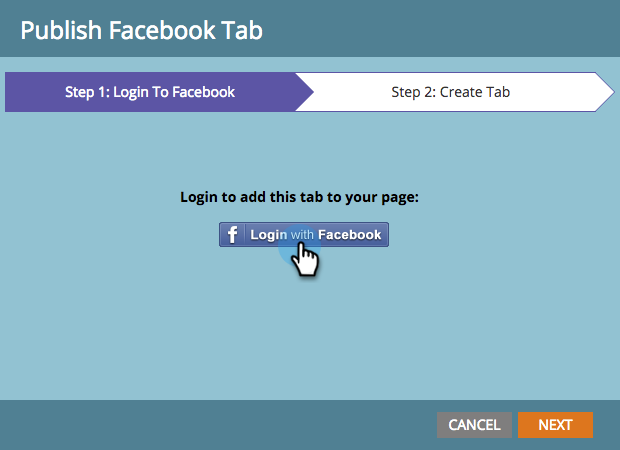
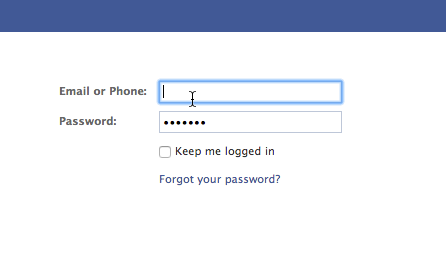
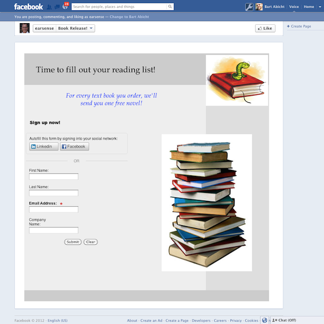

# ランディングページの [!DNL Facebook] への公開 {#publish-landing-pages-to-facebook}

ランディングページを [!DNL Facebook] に公開すると、既にそこにいるオーディエンスに会い、プログラムに対するトラフィックを増やすことができます。

>[!AVAILABILITY]
>
>SMB Spark（Standard および Select） 個別にライセンスされる機能を持つ企業。

>[!PREREQUISITES]
>
>[!DNL Facebook]に公開するには、ページに2,000件以上の「いいね！」が必要です。

新しい本を発売するとします。たとえば、電子メールやweb サイトを通じて、オーディエンスの一部にリーチするかもしれません。 [!DNL Facebook] のランディングページに加えて Marketo のランディングページを公開すると、オーディエンスが増え、オファーの共有が促されます。

1. 承認済みのランディングページを選択します。

   

1. ランディングページのアクションから「**[!UICONTROL Facebook に公開]**」を選択します。

   

   >[!NOTE]
   >
   >この方法では、ランディングページが [!DNL Facebook] アプリ（旧称：[!DNL Facebook] Tab）に公開されます。 [!DNL Facebook] アプリはモバイルでは使用できないので、この方法は、訪問者がモバイルデバイスで [!DNL Facebook] アプリに公開されたランディングページにアクセスしようとした場合は機能しません。

1. Marketo に [!DNL Facebook] ページへの公開を認証します。

   

1. [!DNL Facebook] の資格情報を入力します。

   

   >[!NOTE]
   >
   >Marketo ランディングページを公開する [!DNL Facebook] ページの管理者権限を持つアカウントを使用する必要があります。

1. ランディングページを公開する **[!UICONTROL Facebook ページ]**&#x200B;を選択し、そこに表示される Marketo ランディングページの名前を入力します。

   

   >[!NOTE]
   >
   >以前に [!DNL Facebook] に公開した Marketo ランディングページを置き換えるには、「**[!UICONTROL 既存タブを置換]**」を選択し、ドロップダウンリストから置き換えるタブを選択します。 Marketo 以外のタブは置き換えられません。

1. リードは [!DNL Facebook] ページで直接ランディングページにアクセスできるようになります。 カバー画像の下のタブ名をクリックします。

   

   >[!NOTE]
   >
   >[!DNL Facebook] からランディングページを削除するには、Marketo で承認を取り消し、プロンプトが表示されたら、[!DNL Facebook] タブを削除するオプションを選択します。
