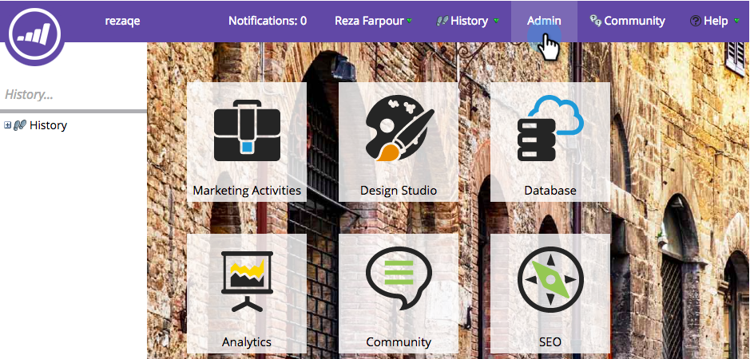

# facebook Lead Adsの設定 {#set-up-facebook-lead-ads}

[Facebookリード広告](https://www.facebook.com/business/a/lead-ads)を使用して、Facebookで広告キャンペーンを実行し、Marketoのリードを生成します。

>[!NOTE]
>
>**管理者権限が必要です**

>[!AVAILABILITY]
>
>facebook Lead Adsをインスタンスに追加するには、カスタマーサクセスマネージャーにお問い合わせください。

1. Marketo **管理**&#x200B;に移動します。

   

1. **LaunchPoint**&#x200B;に移動し、**新規**&#x200B;をクリックして、「**新しいサービス**」を選択します。

   

1. サービスの&#x200B;**表示名**&#x200B;を入力し、ドロップダウンから&#x200B;**Facebook Lead Ads**&#x200B;サービスを選択して、「**作成**」をクリックします。

   

1. 同じブラウザーで新しいタブを開き、[facebook.com](https://www.facebook.com)に移動します。 統合に使用するアカウントを使用してFacebookにログインします。

   >[!NOTE]
   >
   >facebookアカウントは、リード広告を取り込むFacebookのすべてのビジネスページにアクセスする必要があります。

   

1. facebookにログインしたら、Marketoに戻り、「****&#x200B;を許可」をクリックします。

   

1. プロンプトが表示されたら、「**OK**」をクリックして、FacebookへのMarketoアプリのインストールを受け入れます。

   

1. これで、権限が与えられたことに気がつきます。 「**次へ**」をクリックします。

   

1. MarketoでFacebookリード広告を取り込むページを選択し、「**次へ**」をクリックします。

   >[!TIP]
   >
   >想定しているページが表示されない場合は、認証に使用されたFacebookアカウントがFacebookのページに追加されていることを確認して、もう一度お試しください。

   

1. デフォルトのFacebookとMarketoのフィールドマッピングを受け入れるには、「**作成**」をクリックします。

   >[!TIP]
   >
   >マッピングを変更することで、Marketo内のリード広告データの保存場所をカスタマイズできます。 リード広告のカスタム質問から[データを取り込むこともできます](/help/marketo/product-docs/demand-generation/facebook/set-up-facebook-lead-ads/map-custom-fields-to-marketo.md)。

   >[!CAUTION]
   >
   >Marketoでは、2つのFacebookフィールドを1つのMarketoフィールドにマッピングする機能はサポートされていません。1対1のみです。 2を1にマッピングすると、リードはMarketoシステムに入らない場合があります。

   

   うまくいきました。facebook Lead Adsキャンペーンを成功させると、Marketoにリードが流れ始めます。

   

>[!MORELIKETHIS]
>
>* [Leads Access Manager(Facebook)での権限の割り当て/削除](https://www.facebook.com/business/help/540596413257598?id=735435806665862)
>* [スマートキャンペーンでのリード広告のフィルターとトリガーの使用](/help/marketo/product-docs/demand-generation/facebook/use-lead-ads-filters-and-triggers-in-a-smart-campaign.md)
>* [カスタムフィールドのMarketoへのマッピング](/help/marketo/product-docs/demand-generation/facebook/set-up-facebook-lead-ads/map-custom-fields-to-marketo.md)

