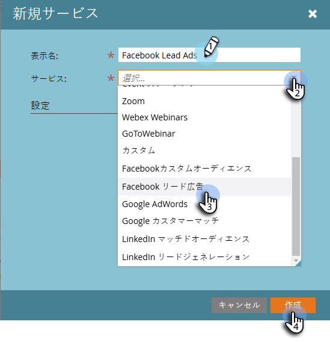

# Facebook リード広告の設定 {#set-up-facebook-lead-ads}

[Facebook リード広告](https://www.facebook.com/business/ads/ad-objectives/lead-generation){target="_blank"}を使用して、Facebook で広告キャンペーンを実行し、Marketo のリードを生成します。

>[!NOTE]
>
>**管理者権限が必要**

>[!AVAILABILITY]
>
>Facebook リード広告をインスタンスに追加するには、アドビアカウントチーム（担当のアカウントマネージャー）にお問い合わせください。

1. Marketo Engage で、**管理**&#x200B;エリアに移動します。

   

1. 「**LaunchPoint**」に移動します。「**新規**」をクリックして、「**新規サービス**」を選択します。

   

1. サービスの&#x200B;**[!UICONTROL 表示名]**&#x200B;を入力します。ドロップダウンから「**[!UICONTROL Facebook リード広告]**」サービスを選択し、「**[!UICONTROL 作成]**」をクリックします。

   

1. 同じブラウザーで新しいタブを開き、[facebook.com](https://www.facebook.com){target="_blank"}.に移動します。統合に使用するアカウントを使用して Facebook にログインします。

   >[!NOTE]
   >
   >[!DNL Facebook] アカウントは、リード広告を取り込むすべての [!DNL Facebook] ビジネスページにアクセスする必要があります。

   

1. [!DNL Facebook] にログインしたら、Marketoに戻って「**[!UICONTROL 認証]**」をクリックします。

   

1. プロンプトが表示されたら、「**[!UICONTROL OK]**」をクリックして、[!DNL Facebook] へのMarketo アプリケーションのインストールを承認します。

   

1. これで、権限が与えられたことに気が付くでしょう。「**[!UICONTROL 次へ]**」をクリックします。

   

1. Marketoに [!UICONTROL Facebook リード広告 &#x200B;] を取り込ませるページを選択し、「**[!UICONTROL 次へ]**」をクリックします。

   >[!TIP]
   >
   >期待するページが表示されない場合は、認証に使用する [!DNL Facebook] アカウントが [!DNL Facebook] のページに追加されていることを確認して、もう一度試してください。

   

1. Marketoのフィールドマッピングに対するデフォルトの [!DNL Facebook] 定を受け入れるには、**[!UICONTROL 作成]** をクリックするだけです。

   >[!TIP]
   >
   >マッピングを変更することで、リード広告データが Marketo 内のどこに保存されるかをカスタマイズできます。また、[リード広告カスタム質問からデータを取り込む](/help/marketo/product-docs/demand-generation/facebook/set-up-facebook-lead-ads/map-custom-fields-to-marketo.md){target="_blank"}こともできます。

   >[!CAUTION]
   >
   >Marketoは、2 つの [!DNL Facebook] フィールドを 1 つのMarketo フィールドにマッピングすること（1 から 1 のみ）をサポートしていません。 2 対 1 のマッピングをおこなうと、リードを Marketo システムに配置できない場合があります。

   

   これで完了です。リード広告キャンペーンで成功を収めると、リードがMarketoに送 [!DNL Facebook] れ始めます。

   

>[!MORELIKETHIS]
>
>* [リードアクセスマネージャー（Facebook）での権限の割り当て／削除](https://www.facebook.com/business/help/540596413257598?id=735435806665862){target="_blank"}
>* [スマートキャンペーンでのリード広告のフィルターとトリガーの使用](/help/marketo/product-docs/demand-generation/facebook/use-lead-ads-filters-and-triggers-in-a-smart-campaign.md){target="_blank"}
>* [カスタムフィールドの Marketo へのマッピング](/help/marketo/product-docs/demand-generation/facebook/set-up-facebook-lead-ads/map-custom-fields-to-marketo.md){target="_blank"}
