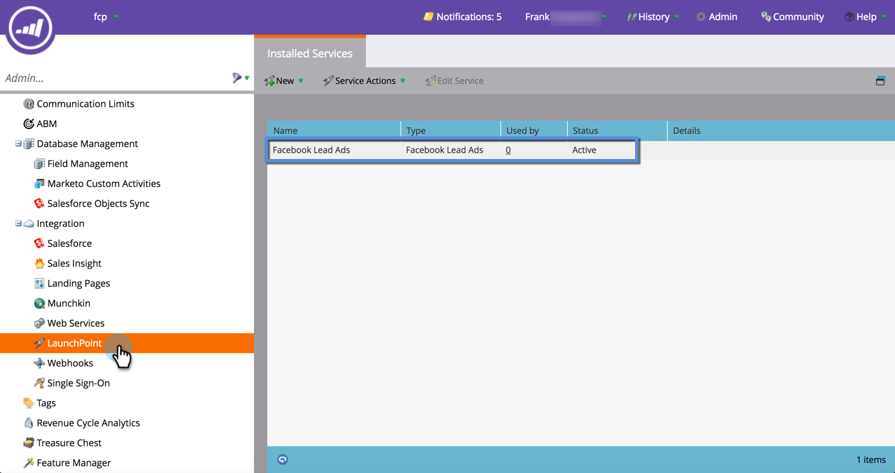

# カスタムフィールドの Marketo へのマッピング {#map-custom-fields-to-marketo}

オンライン配信サービスの利用頻度など、[!DNL Facebook] がデフォルトで保存する標準的な情報よりも多くの情報を収集したい場合があります。 これは、[!DNL Facebook] リード広告で[カスタムの質問を作成](https://ja-jp.facebook.com/business/help/774623835981457?&helpref=uf_permalink)することで実現できます。

ただし、**Marketo は、このデータの収集を自動的に開始しません**。 Marketo でカスタムフィールド値の取得を開始するには、それらのカスタムフィールドを Marketo のフィールドに&#x200B;**マッピングする必要があります**。

AdminのLaunchPoint エリアで設定するには、次の手順に従います。

>[!NOTE]
>
>**管理者権限が必要**

1. 管理領域に移動して、**[!UICONTROL LaunchPoint]** をクリックします。 「インストール済みのサービス」で、「**[!UICONTROL Facebook リード広告]**」を探して編集します。

   

1. 「**[!UICONTROL 次へ]**」をクリックします。

   

1. 承認済みアカウントをそのままにしておきます。**は**&#x200B;に変更を加えません。 「**[!UICONTROL 次へ]**」をクリックします。

   

1. 以前と同様に、選択したページをそのまま残し、**は**&#x200B;変更を行いません。 「**[!UICONTROL 次へ]**」をクリックします。

   

1. カスタム [!DNL Facebook] フィールドをMarketo フィールドにマッピングします。 「**[!UICONTROL 追加]」をクリックします。**

   

1. 新しい行に、[!DNL Facebook] カスタムフィールドの名前を入力します。

   

   >[!NOTE]
   >
   >ここには、[!DNL Facebook] のフォームテンプレートに保存されたフィールドのみがオプションとして表示されます。

1. 「**[!UICONTROL Marketo フィールド]**」列をクリックします。 マッピングしたいフィールドを入力して検索します。 フィールドを選択したら、**[!UICONTROL 保存]**&#x200B;をクリックします。

   

   >[!NOTE]
   >
   >[!DNL Facebook] フィールドのマッピング先のフィールドが Marketo にまだない場合は、[カスタムフィールドを作成](/help/marketo/product-docs/administration/field-management/create-a-custom-field-in-marketo.md)する方法を参照してください。

>[!CAUTION]
>
>Marketo でデータを収集するには、新しい [!DNL Facebook] フィールドに対してこの処理を実行する&#x200B;**必要があります**。
