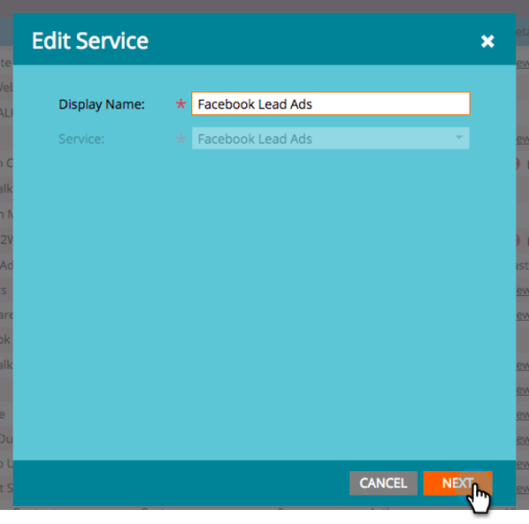

# カスタムフィールドの Marketo へのマッピング {#map-custom-fields-to-marketo}

オンライン配信サービスの利用頻度など、Facebook がデフォルトで保存する標準的な情報よりも多くの情報を収集したい場合があります。これは、Facebook リード広告で[カスタムの質問を作成](https://ja-jp.facebook.com/business/help/774623835981457?&amp;helpref=uf_permalink)することで実現できます。

ただし、**Marketo は、このデータの収集を自動的に開始しません**。Marketo でカスタムフィールド値の取得を開始するには、それらのカスタムフィールドを Marketo のフィールドに&#x200B;**マッピングする必要があります**。

次に、管理の LaunchPoint 領域でこれを設定する方法を示します。

>[!NOTE]
>
>**管理者権限が必要**

1. 管理領域に移動して、**LaunchPoint** をクリックします。「インストール済みのサービス」で、「**Facebook リード広告**」を探して編集します。

   

1. 「**次へ**」をクリックします。

   

1. 許可されたアカウントはそのままにします。**変更を加えないでください**。「**次へ**」をクリックします。

   

1. 先ほどと同様に、選択されたページはそのままにします。**変更を加えないでください**。「**次へ**」をクリックします。

   

1. ここで、カスタム Facebook フィールドを Marketo フィールドにマッピングします。「**追加**」をクリックします。

   

1. 新しい行に、Facebook カスタムフィールドの名前を入力します。

   

   >[!NOTE]
   >
   >ここには、Facebook のフォームテンプレートに保存されたフィールドのみがオプションとして表示されます。

1. 「**Marketo フィールド**」列をクリックします。マッピングしたいフィールドを入力して検索します。フィールドを選択したら、「**保存**」をクリックします。

   

   >[!NOTE]
   >
   >Facebook フィールドのマッピング先のフィールドが Marketo にまだない場合は、[カスタムフィールドを作成](/help/marketo/product-docs/administration/field-management/create-a-custom-field-in-marketo.md)する方法を学習します。

>[!CAUTION]
>
>Marketo がデータを収集するには、新しい Facebook フィールドに対して&#x200B;**この処理を実行する必要があります**。
