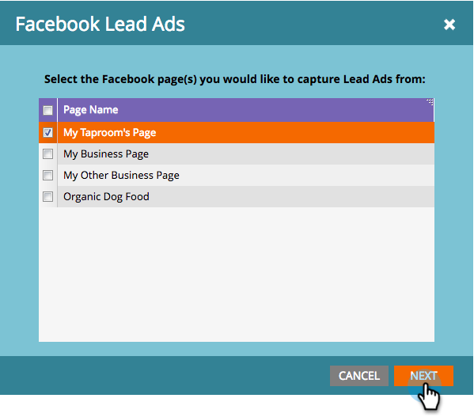
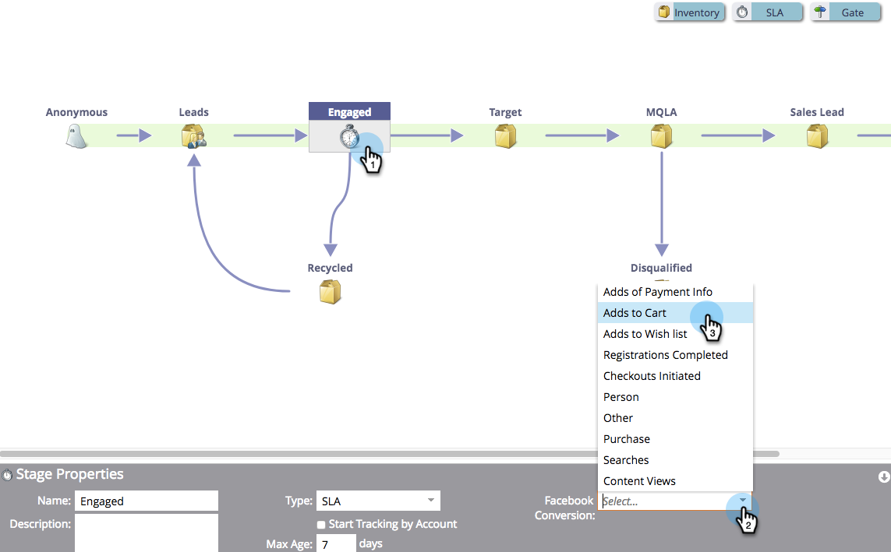
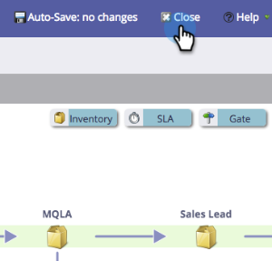

# facebookオフライン変換の設定 {#set-up-facebook-offline-conversions}

リード広告を通じて作成されたユーザーのオフラインコンバージョンデータをFacebookに送り返すことで、広告チームは広告費用をこれまで以上に最適化できます。 その設定方法を説明しましょう。

>[!PREREQUISITES]
>
>* 必ず [facebook Lead Ads の設定](/help/marketo/product-docs/demand-generation/facebook/set-up-facebook-lead-ads.md).
>* に承認済みモデルが必要です。 [収益サイクルモデラー](/help/marketo/product-docs/reporting/revenue-cycle-analytics/revenue-cycle-models/understanding-revenue-models.md).

## 管理設定 {#admin-configuration}

1. Marketo **管理者**.

   

1. に移動します。 **LaunchPoint** をクリックし、前に作成したFacebook Lead Ads サービスをダブルクリックします。

   >[!NOTE]
   >
   >まだおこなっていない場合は、 [facebook Lead Ads の設定](/help/marketo/product-docs/demand-generation/facebook/set-up-facebook-lead-ads.md)じゃあこっちに戻ってこい。

   

1. 必要に応じて、 **表示名** を追加しました。 「**次へ**」をクリックします。

   

1. チェック **オフライン変換の有効化** をクリックします。 **次へ**.

   

1. 「**次へ**」をクリックします。

   

1. 「**保存**」をクリックします。

   

   できましたね。facebookオフライン変換の有効化の途中で完了しました。 次に、Revenue Cycle Modeler に移動して、ステージをマッピングします。

   

## 収益サイクルモデラーの構成 {#revenue-cycle-modeler-configuration}

1. **分析**&#x200B;に移動します。

   

1. モデルを選択し、 **ドラフトを編集**.

   

   >[!NOTE]
   >
   >現在、売上高サイクルステージをマッピングできるFacebookイベントは 10 件です。
   >
   >* 支払情報の追加
   >* カートに追加
   >* ウィッシュリストに追加
   >* 登録が完了しました
   >* チェックアウトが開始されました
   >* 顧客
   >* その他
   >* 購入
   >* 検索
   >* コンテンツビュー

1. マッピングするステージを選択し、 **Facebook Conversion** ドロップダウンで、マッピング先のFacebookイベントを選択します。 この手順を繰り返して、RCM のすべてのステージをFacebookのオフラインコンバージョンステージにマッピングします。

   

1. マッピングが完了したら、モデルを閉じます。

   

1. モデルを承認すると完了です。

   

   次に、リード広告がマッピングしたステージに到達すると、コンバージョンはレポート用にFacebookに送信されます。

   >[!CAUTION]
   >
   >facebookアカウントを確認し、 [広告は関連付けられている](https://www.facebook.com/business/url/?href=%2Fbusiness%2Fhelp%2Fwww%2F1776828022605281&amp;cmsid&amp;creative=link&amp;creative_detail=advertiser-help-center&amp;create_type&amp;destination_cms_id&amp;orig_http_referrer) を「 Marketo Offline Conversions 」イベントセットに追加します。 そうでない場合、広告アトリビューションは機能しない可能性があります。

   >[!NOTE]
   >
   >オフラインコンバージョンデータは、MarketoからFacebookに 1 日に数回送信されます。

>[!MORELIKETHIS]
>
>[Facebook のオフラインコンバージョンについて](/help/marketo/product-docs/demand-generation/facebook/understanding-facebook-offline-conversions.md)
