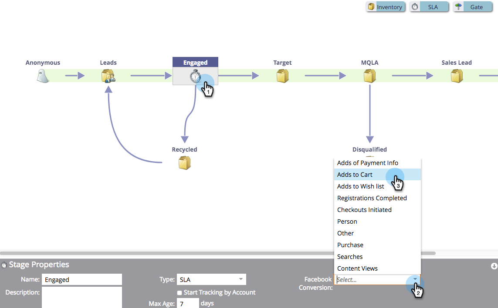

# [!DNL Facebook] オフラインコンバージョンの設定 {#set-up-facebook-offline-conversions}

リード広告を通じて作成されたユーザのオフラインコンバージョンデータを [!DNL Facebook] に送り返すことで、広告チームは広告費用をこれまで以上に最適化できます。 次の手順に従って設定します。

>[!PREREQUISITES]
>
>[Facebook リード広告の統合を設定](/help/marketo/product-docs/demand-generation/facebook/set-up-facebook-lead-ads.md)する必要があります。

## 管理設定 {#admin-configuration}

1. Marketo の「**[!UICONTROL 管理]**」に移動します。

   

1. **[!UICONTROL LaunchPoint]** に移動して、前に作成した Facebook リード広告サービスをダブルクリックします。

   >[!NOTE]
   >
   >まだ行っていない場合は、[続行する前に [!UICONTROL Facebook リード広告]](/help/marketo/product-docs/demand-generation/facebook/set-up-facebook-lead-ads.md)を設定します。

   

1. 必要に応じて、**[!UICONTROL 表示名]**&#x200B;を編集してオフラインコンバージョンを含めます。 「**[!UICONTROL 次へ]**」をクリックします。

   

1. 「**[!UICONTROL オフラインコンバージョンを有効にする]**」のチェックをオンにして、「**[!UICONTROL 次へ]**」をクリックします。

   

1. 「**[!UICONTROL 次へ]**」をクリックします。

   

1. 「**[!UICONTROL 保存]**」をクリックします。

   

   [!DNL Facebook]個のオフラインコンバージョンの有効化が途中で完了しました。 「収益サイクル」Modelerに進んで、ステージをマッピングします。

   

## 収益サイクルモデラーの設定 {#revenue-cycle-modeler-configuration}

1. **[!UICONTROL 分析]**&#x200B;に移動します。

   

1. モデルを選択して、「**[!UICONTROL ドラフトを編集]**」をクリックします。

   

   >[!NOTE]
   >
   >現在、収益サイクルステージをマッピングできる [!DNL Facebook] イベントは 10 件あります。
   >
   >* 支払情報の追加
   >* 買い物かごに追加
   >* ウィッシュリストに追加
   >* 登録が完了しました
   >* チェックアウトが開始されました
   >* 顧客
   >* その他
   >* 購入
   >* 検索
   >* コンテンツビュー

1. マッピングするステージを選択し、**[!UICONTROL Facebook コンバージョン]**&#x200B;ドロップダウンで、マッピング先の [!DNL Facebook] イベントを選択します。 この手順を繰り返して、RCM のすべてのステージを [!DNL Facebook] のオフラインコンバージョンステージにマッピングします。

   

1. マッピングが完了したら、モデルを閉じます。

   

1. モデルを承認すれば完了です。

   

   これで、リード広告のリードがマッピングしたステージに到達すると、コンバージョンがレポート用に [!DNL Facebook] に送信されます。

   >[!CAUTION]
   >
   >[!DNL Facebook] アカウントで、Marketo オフラインコンバージョンイベントセットにすべての[広告が関連付けられている](https://www.facebook.com/business/url/?href=%2Fbusiness%2Fhelp%2Fwww%2F1776828022605281&cmsid&creative=link&creative_detail=advertiser-help-center&create_type&destination_cms_id&orig_http_referrer)ことを確認します。 そうでない場合、広告アトリビューションは機能しない可能性があります。

   >[!NOTE]
   >
   >オフラインコンバージョンデータは、Marketo から [!DNL Facebook] に 1 日に数回送信されます。

>[!MORELIKETHIS]
>
>[&#x200B; [!DNL Facebook]  オフラインコンバージョンについて](/help/marketo/product-docs/demand-generation/facebook/understanding-facebook-offline-conversions.md)
