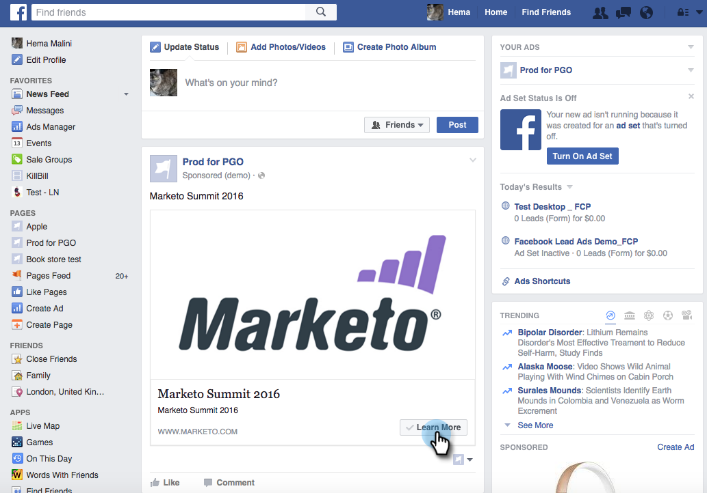

# Marketo とのデスクトップ統合に向けた [!DNL Facebook] リード広告のテスト {#test-facebook-lead-ads-for-desktop-integration-with-marketo}

リード広告を作成した後、テストする必要があります。デスクトップでの実行方法を次に示します。

>[!PREREQUISITES]
>
>[[!UICONTROL Facebook リード広告]の統合を設定](/help/marketo/product-docs/demand-generation/facebook/set-up-facebook-lead-ads.md)する必要があります。

1. Facebook Power Editor で、キャンペーンと広告を選択し、「**[!UICONTROL 編集]**」をクリックします。

1. **[!UICONTROL リンク]**&#x200B;の下で、「**[!UICONTROL ニュースフィードで表示]**」リンクをクリックします。

   

1. ブラウザーの新しいタブで [!DNL Facebook] に移動します。[!DNL Facebook] リード広告ユニットの「[!UICONTROL コールトゥアクション]」をクリックします。

   

   >[!NOTE]
   >
   >これは、「詳細コールトゥアクション」を使用する一例です。リード広告ユニットのコールトゥアクションは異なる可能性があります。

1. デスクトップのフォームに入力して、テスト用リード広告ユニットを送信します。「**[!UICONTROL 送信]**」をクリックします。

   

1. おめでとうございます。リード広告フォームの送信が完了しました。

   

1. 魔法が起こるのはここです。フォームを送信したら、「[!DNL Facebook] リード広告フォームに入力済み」フィルターを使用するプログラムの一部またはデータベース内で [Marketo のスマートリストを作成](/help/marketo/product-docs/core-marketo-concepts/smart-lists-and-static-lists/creating-a-smart-list/create-a-smart-list.md)します。先ほど送信したフォームのリード広告フォーム名を挿入します。

   

1. 次に、「**[!UICONTROL ユーザー]**」タブをクリックして、同期が正しく動作していることを確認します。

   

   凄いでしょう。

>[!MORELIKETHIS]
>
>[[!UICONTROL Facebook リード広告]](/help/marketo/product-docs/demand-generation/facebook/set-up-facebook-lead-ads.md)の設定
