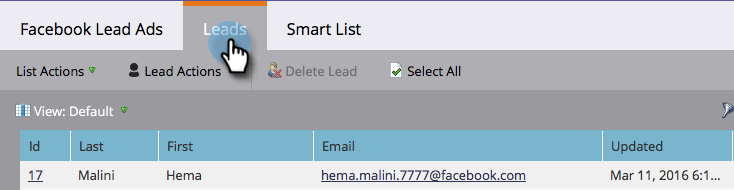

# Facebookのリード広告をテストして、マーケティング担当者{#test-facebook-lead-ads-for-mobile-integration-with-marketo}とモバイルの統合を実現

リード広告を作成した後、テストする必要があります。

>[!PREREQUISITES]
>
>[Facebookリード広告統合](/help/marketo/product-docs/demand-generation/facebook/set-up-facebook-lead-ads.md)を設定する必要があります。

1. Facebookパワーエディターで、キャンペーン、広告を選択し、「**編集**」をクリックします。

1. 「**リンク**」の下の「**モバイルアプリ**」リンクの表示をクリックします。

   

1. 新しい通知がFacebookアカウントに送信され、認証済みアカウントを使用してモバイルデバイスでアクセスできるようになります。 「**OK**」をクリックします。

   

1. モバイルデバイス上で、Facebookモバイルアプリの&#x200B;**通知**&#x200B;をタップします。

   

1. 「通知」で、**広告をプレビューする準備ができたことを確認します。**

   

1. 誘い文句（CTA：コールトゥアクション）をタップし、作成したフォームに入力して、テスト用リード広告ユニットを送信します。

   

   >[!NOTE]
   >
   >これは、「詳細なアクションの呼び物」を使用した一例に過ぎません。 リード広告の単位による誘い文句（CTA：コールトゥアクション）が異なる場合があります。

1. ここが魔法が起こる場所だ！ フォームを送信したら、[プログラムの一部として、または&#x200B;**入力済みFacebookリード広告フォーム**&#x200B;フィルターを使用するリードリストをMarketor](/help/marketo/product-docs/core-marketo-concepts/smart-lists-and-static-lists/creating-a-smart-list/create-a-smart-list.md)に作成します。 先ほど提出したフォームのリード広告フォーム名を挿入します。

   

1. 次に、「Leads」タブをクリックして、同期が正しく動作していることを検証します。

   

それは涼しいですか？

>[!NOTE]
>
>[Facebookリード広告の有効化/無効化](/help/marketo/product-docs/demand-generation/facebook/set-up-facebook-lead-ads.md)
